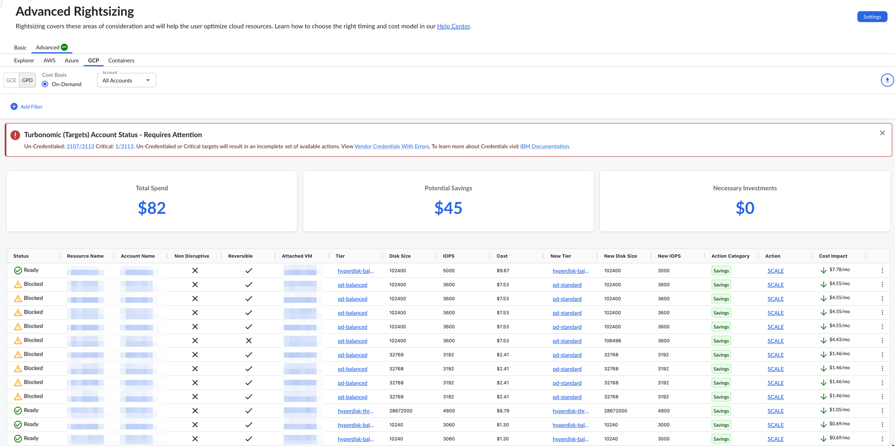
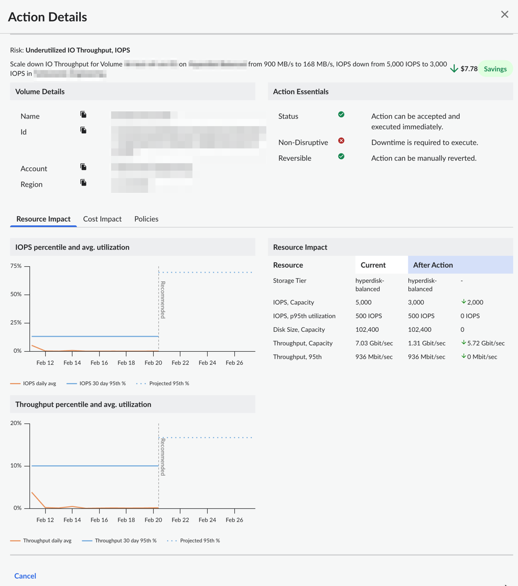

# GCP Google Persistent Disk (GPD)

You can use the Advanced Rightsizing dashboard to view the resource optimization recommendations
for Google Persistent Disk (GPD). The dashboard shows optimization recommendations for both savings
and investments powered by Turbonomic engine. You can view the recommendations across multiple GCP
accounts from a single dashboard.

[Advanced Rightsizing in Cloudability
Premium](advanced-rightsizing-powered-by-turbonomic.html)

Before you begin

To view the Azure Disk dashboard, make sure that you have connected Cloudability to the correct
GCP accounts.

Note: You need to ensure all your existing vendor credentials have relevant Turbonomic required
permissions granted without which Turbonomic engine may not be able to generate right set of
actions. If you were a Cloudability customer prior to Cloudability Premium upgrade, you still need
to re-credential every single vendor credential to grant additional set of permissions.

Access the Azure Disk dashboard

To access the GPD dashboard, open the Cloudability home page, and from the left navigation menu,
select  Optimize > Rightsizing > Advanced. On the Rightsizing page, select the
GCP tab, and then select the GPD subtab.

Customize the dashboard

You can set the following options to customize your dashboard.

Note:

Only the On-Demand Cost Basis is supported for GPD.

The On-Demand cost basis provides a direct comparison between the resource listed in the
**Tier**
column and the resource recommended in the **New Tier**
column based purely on On-Demand Pricing. It does not include any potential impact
from Committed Use Discounts.

Select Account

By default, the dashboard shows recommendations for all accounts. To view recommendations for a
particular account, select the account name from the Account drop-down.

Apply Filters

You can add filters to include or exclude data based on one or more conditions.

Add a filter

To add a filter:

1. Select Add Filter from the toolbar.
2. In the Add Filter menu, choose a Dimension.
3. Select an Operator to provide a logical condition.
4. Choose a value to refine your filter.
5. Select Add Filter to apply the new filter to the page.

Apply filters with links

You can also add filters by selecting the blue hyperlinked values in the main table. The filter
rule is automatically applied to the Filters field. You can select only one
value or parameter from each column at a time.

Remove a filter

To remove a filter:

1. Select the filter icon  .
2. Select  X  next to the filter that you want to remove.

Key Performance Indicators

You can view the following Key Performance Indicators (KPIs) on your Advanced Rightsizing
dashboard:

- Total Spend : Shows the total current allocated spend
- Potential Savings : Shows the estimated total potential savings
  achievable for all optimizationrecommendations with lower cost impact than
  the current cost
- Necessary Investments : Shows the estimated total potential investments
  across all optimizationrecommendations with higher cost impact than the
  current cost

Rightsizing recommendations table

The dashboard contains a rightsizing recommendations table, which provides an overview of GPD
resources for which optimization recommendations have been identified. The table includes the
following columns:

Note:

By default, the data is sorted by the Cost Impact column. To change the
sort order, just select the column name.

- Status :  Status indicating readiness of action execution
- Resource Name : The GPD resource name
- Account Name : The account name
- Non Disruptive : Indication if the action presented is
  non-disruptive
- Reversible : Indication if the action presented is reversible or not
- Attached VM : GCE VM to which this GPD is attached to
- Tier : The current GPD storage tier
- Disk Size : Current GPD disk size
- IOPS : Current GPD IOPS
- **Cost** : The current GPD storage cost
- New Tier : The recommended GPD storage tier
- New Disk Size : The recommended GPD storage size
- New IOPS : The recommend GPD IOPS
- Action Category : The category of the action recommended. Current
  supported ones are "Performance" or "Savings"
- Action : The action recommended. Table below lists various supported
  actions
- Cost Impact : Cost impact of implementing this action

| Recommendation | Description |
| --- | --- |
| Scale | Resize to the resource type specified in the New Tier column. This can be "Scale up" or "Scale down" action based on the policies configured |
| Delete | Delete your resource |

Export optimization recommendations to an Excel file

To export the recommended actions to an excel file, select Export. Note
that the excel file will include several additional columns, such as region, operating system, unit
price, and others.

Recommendation details

To view the recommended action details for a particular resource, select View Details
from the More Options (3 dots) menu.

The following figure shows a sample action details panel.

**Parent topic:** [Advanced Rightsizing](../product/advanced-rightsizing-powered-by-turbonomic.html)
