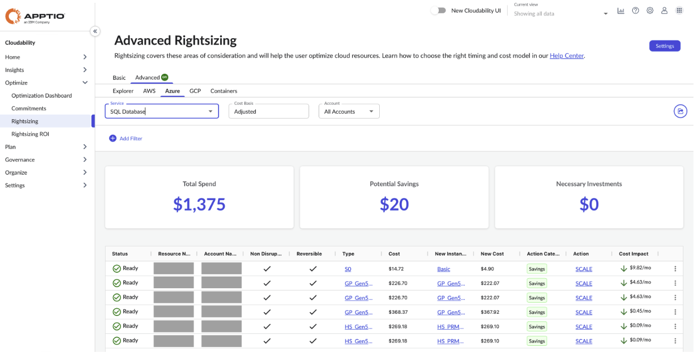

# Azure SQL

You can use the Advanced Rightsizing dashboard to view the resource optimization
recommendations for Amazon Web Services (AWS) Relational Database Service (RDS). The dashboard shows
optimization recommendations for both savings and investments powered by Turbonomic engine. You can
view the recommendations across multiple AWS accounts from a single dashboard.

[Advanced
Rightsizing in Cloudability Premium](advanced-rightsizing-powered-by-turbonomic.dita "(Opens in a new tab or window)")

**Before you begin**

To view the AWS RDS dashboard, make sure that you have connected Cloudability to the correct
AWS accounts.

[Connect Microsoft Azure](../admin/azure-cm-setup-premium.dita "(Opens in a new tab or window)")

Note: You need to ensure all your existing vendor credentials have relevant Turbonomic required
permissions granted without which Turbonomic engine may not be able to generate right set of
actions. If you were a Cloudability customer prior to Cloudability Premium upgrade, you still need
to re-credential every single vendor credential to grant additional set of
permissions.

**Access the AZURE SQL dashboard**

To access the AZURE SQL dashboard, open the Cloudability home page, and from the left
navigation menu, select Optimize > Rightsizing > Advanced. On the Rightsizing page, select
the AZURE tab, and then select **SQL Database** from the dropdown.

**Specify Cost Basis**

Cost Basis determines how recommendations are calculated and savings or investments are
projected. Cost basis can be **Adjusted** or **Adjusted Amortized**, which reflect both the
underlying calculations of both source and target resource costs.

**Adjusted** -
calculated using the cash cost of a given resource inclusive of your private rates where available
(where commitment cost is treated as $0) and compares to future state projected Cash cost and the
expected coverage of the commitments that applied to this resource over the lookback period. This
calculation is called "On Demand" in the Cloudability Premium: Workload Optimization UI and
Turbonomic documentation.

**Adjusted Amortized** - calculated using the amortized cost of
a given resource and the associated commitments that applied to it during the lookback period
(including private rates where available). The future state cost is calculated based on how those
commitments are expected to apply, what portions are expected to remain on-demand, and what (if any)
commitment is freed up to apply elsewhere. This calculation is called "Effective" in the
Cloudability Premium: Workload Optimization UI and Turbonomic documentation.

**Key
Performance Indicators**

You can view the following Key Performance Indicators (KPIs) on your Advanced Rightsizing
dashboard:

- **Total Spend**: Shows the total current allocated spend
- **Potential Savings**: Shows the estimated total potential savings achievable for all
  optimization recommendations with lower cost impact than the current cost
- **Necessary Investments** : Shows the estimated total potential investments across all
  optimization recommendations with higher cost impact than the current cost

Note: For SQL, spend is determined by instance usage.

**Rightsizing recommendations
table**

The dashboard contains a rightsizing recommendations table, which provides an overview of EDS
resources for which recommendations have been identified. The table includes the following columns:

Note: By default, the data is sorted by the **Cost Impact**column. To change the sort order,
just select the column name.

- **Status :**Status indicating readiness of action execution
- **Resource Name**: The SQL resource name
- **Account Name**: The account name where the SQL resource is running
- **Non Disruptive :** Indication if the action presented is non-disruptive
- **Reversible** : Indication if the action presented is reversible or not
- **Type** : The current SQL instance type
- **Cost** : The current SQL instance cost
- **New Instance Type**: The recommended SQL instance type
- **New Cost**: The projected cost of the new SQL instance type recommended
- **Action Category**: The category of the action recommended. Current supported ones are
  "Performance" or "Savings"
- **Action**: The action recommended. Table below lists various supported actions
- **Cost Impact**: Cost impact of implementing this action \

|  |  |
| --- | --- |
| **Recommendation** | **Description** |
| **Scale** | Resize to the resource type specified in the **New Instance Type**column. This can be "Scale up" or "Scale down" action based on the policies configured |
| **Deactivate** | Terminate your resource because it is predominantly idle |

**Export optimization recommendations to an Excel file**

To export the recommended actions to an excel file, select **Export**. Note that the excel
file will include several additional columns, such as region, operating system, unit price, and
others.

**Recommendation details**

To view the recommended action details for a particular resource, select **View
Details**from the More Options (3 dots) menu.

The following figure shows a sample action
details panel.

**Parent topic:** [Advanced Rightsizing](../product/advanced-rightsizing-powered-by-turbonomic.html)
