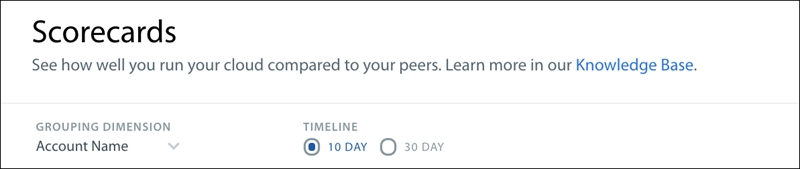
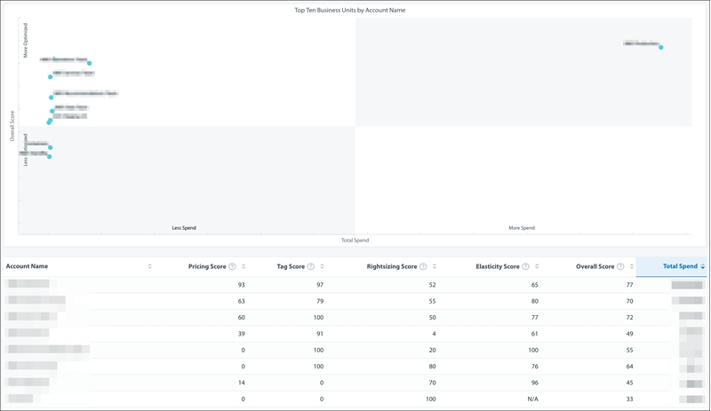
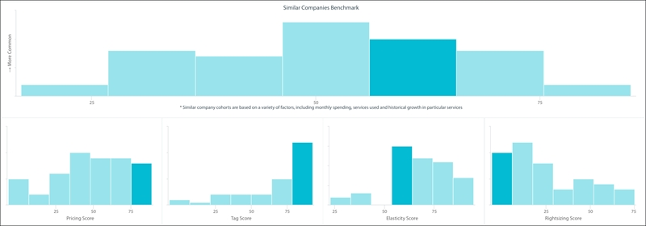

# Scorecards dashboard in Cloudability

Scorecards help you understand how well you are running your cloud by benchmarking your usage relative to your peers. Peers are companies that use cloud resources in a similar manner to you. In addition, Scorecards makes it easy to compare different business units within your organization so that you can identify teams that are leading the charge to adopt cloud-native practices.

Scoring metrics

We have identified three components of a well-architected cloud that end-users can easily implement. These are all scored on a scale of 0 to 100, with higher values indicating increasing optimization:

Rightsizing Score
- Measures how well you've matched the size of a resource to the workload. Note that this excludes spot resources, where there isn't necessarily any penalty for over provisioning.

Elasticity Score
- Measures how well you are turning resources on and off in response to changing demand.

Pricing Score
- Measures how well you are taking advantage of different purchasing options to pay the best possible price for a given resource.

Tagging Score
- Measures how well your teams are tagging their cloud resources.

The Overall Score combines these three components to give you a single metric that measures your overall cloud efficiency.

The first step is to identify the grouping dimension and the timeline. The grouping dimension is what you will use to compare different business units within your company. Scorecards provide benchmarking metrics based on either the past 10-day or past 30-day timeline.

The cohort visualization gives you a quick triage to identify teams that are inexpensive and less optimized (bottom left) versus teams that are relatively more expensive and more optimized (top right).

One particular challenge with optimizing your cloud architecture is that there are diminishing marginal returns to optimization. Addressing the most egregiously mid-sized instances will often save our customers 20 percent of their overall bill, but if you reach the point where you're looking at an individual m4.xlarge box and debating between moving to a t3 and an m5a, you might have reached (or long since crossed) the point of diminishing returns.

We show how your cloud usage compares to the distribution of other organizations that use the cloud similarly. We base these cohorts of other organizations on a variety of factors, including monthly spending, services used, historical growth in particular services, etc.

Frequently asked questions

What dimensions can I use to group business units?

Scorecards support tags, business mappings, account groups, and account IDs.

What cloud resources do Scorecards support?

We currently support AWS EC2, Azure Compute, and GCP Compute Engine. We will be adding support for other cloud resources in the future.

What if I don't use certain features, such as Rightsizing?

Things for which we don't have data will not affect your score. For example, if you haven't provided credentials to collect utilization metrics, then scores for Rightsizing and Elasticity will show up as N/A and will not be factored in during scoring.
