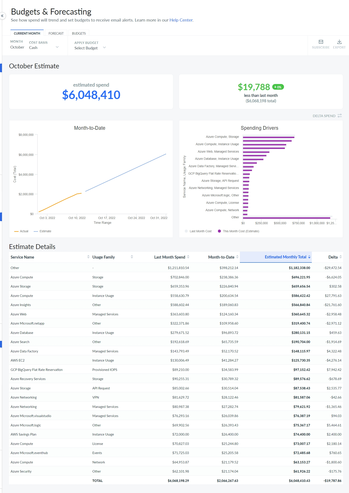

# Current Month

The parameters  Service Name  and  Usage Family  are used to identify Spending
Drivers, making it easy for technical and business users to understand what is driving any changes.
You can view your Spending Drivers in terms of the largest spend as well as the largest change
relative to the previous month. However, in the online application, the miscellaneous Spending
Drivers are grouped under  Other  .

Use Case

Many vendors systematically back-date certain types of charges. When you notice this pattern in
your historical spending, you can adjust the total for the previous month to reflect these
late-breaking charges. You can tell this has happened by the yellow info bubble.
With the
availability of Cost basis, you can put your current month into context, using the
previous month as well as any budget you have selected.
Using the Month-to-Date chart, you can also
see approximately when you are projected to exceed your budget for the month.

Customize the Current Month Dashboard

Navigate to  Plan  >  Current Month

Select appropriate values for  Cost Basis  and  Apply Budget  parameters, to see
the updated dashboard.

You can perform the following actions:

- Subscribe to periodic updates on your total monthly spending.
- Setup interval preference to receive emails daily or weekly.
- Toggle between Total Spend and Delta Spend to view their respective details.

**Parent topic:** [Budgets and Forecasts](../product/plan-and-manage-your-budgets-and-forecasts.html)
