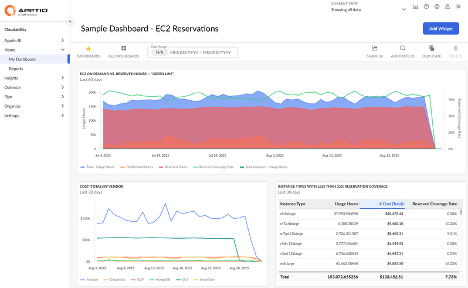

# Cloudability Dashboards

Cloudability Dashboards is a simple, self-service tool that can be used to create fully
customizable dashboards, using the data available in Cloudability. Users can choose from a variety
of Widgets to visualize the information and adjust the visualization options to tailor the
Dashboards to individual needs, ensuring that insights are exposed quickly and in the right context.

Dashboards can be shared with other team members to improve collaboration and visibility. Widget
annotations can ensure shared understanding of Cloud Cost and Spend, without the need for external
collaboration tools. Applying Cloudability Views in a Dashboard can be used to narrow down the scope
of each Dashboard to drill down into the details and see the data from a more focused perspective.

- **[Dashboards' List](../product/dashboards-list.html)**
- **[View and configure Dashboards](../product/view-and-configure-dashboards.html)**
