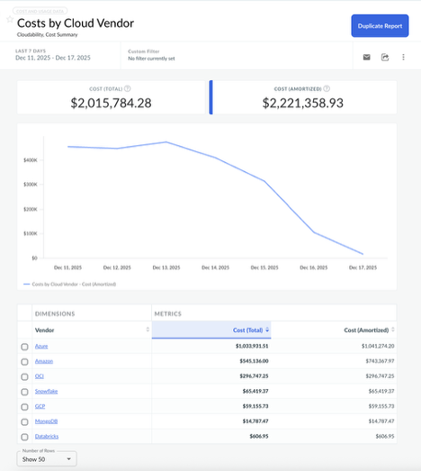

# Cloudability Reports

Cloudability Reports is self-service tool that allows users to access their Cost and Utilization
data to answer ad-hoc questions, schedule Reports to send on a given cadence or export the raw data
for a given set of Dimensions, Metrics and Filters.

- **[Reports List](../product/reports-list.html)**
- **[Create or Edit a Report](../product/create-or-edit-a-report.html)**
