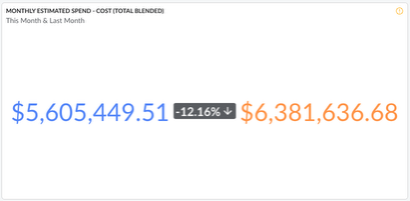

# Estimate Widget

Cloudability Dashboards have an option to visualize the data from the “Estimate” data source.

Currently, the Estimate Widget can only display the KPI difference between “This Month” and “Last
Month” using one of the following Cost metrics:

- Cost (Total Blended)
- Cost (Amortized)
- Cost (Adjusted)
- Cost (Adjusted Amortized)
- Cost (List)

Charges that are yet to appear in the billing file will be forcasted for the purpose of
displaying the Estimate Widget KPI.

**Parent topic:** [Create or Edit a Widget in a Dashboard](../product/create-or-edit-a-widget-in-a-dashboard.html)
