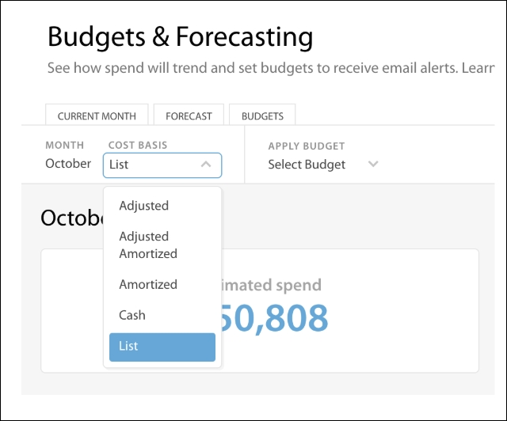
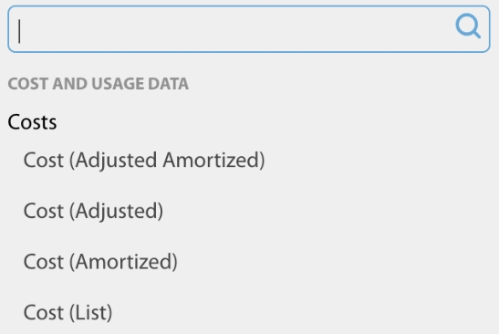
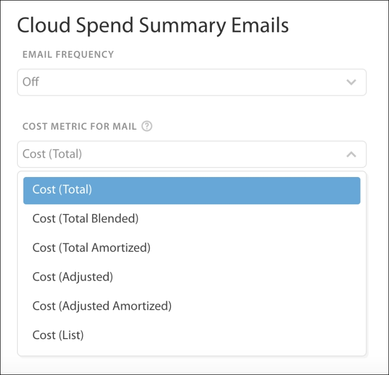

# Budgets and Forecasts

Budgets and Forecasts helps you understand and predict your cloud spends by:

- Creating  [forecasts](bf-forecast.html)  based
  on historical spending patterns.
- Using forecasts to create  [budgets](bf-budgets.html).
- Monitor and notify spending related to budgets.

These tools are all based around views, allowing you to separate individual Business Units
and manage them independently. If you are currently on a Pro plan, you can only use these features
at the organization level. See  [Views API](https://developers.cloudability.com/v1.0/ "(Opens in a new tab or window)")  for more information on creating views programmatically.

Some of the features of these tools are:

- Support for multiple accounting options, including  Cash  (recommended),
   Amortized  (helpful if your organization buys Partial/All-Upfront RIs),
   Adjusted  (reflecting any Custom Pricing agreements you have calibrated) and
   Adjusted Amortized  .
- Set up periodic alerts to receive notifications and spendings for the current month.
- Simple views to analyze your budget,
- Paired with
   [Anomaly
  Detection](identify-unusual-spending-patterns-with-anomaly-detection.html)  service.

Using the Cost (List) metric for budgeting and forecasting

Cost (List) allows you to budget and forecast your cloud spend using consistent cost
metrics.

If an instance usage has been covered by an all-upfront reservation, the Cost
(Total) will show $0 while the Cost (List) will show the on-demand cost for that particular usage.
On the other hand, for recurring monthly fees and occasional one-time fees, Cost (List) will show $0
as these are likely the charges to be excluded for budget and forecasting exercises. For spot
instances, the Cost (Total) displays the actual deeply discounted cost while Cost (List) shows the
on-demand cost for that particular usage.

The  [FAQ](#plan-and-manage-your-budgets-and-forecasts__FAQ) explains how
Cloudability generates Cost (List) values. The difference between Cost (List) and Cost (Total) or
Cost (Adjusted) shows the overall benefits of reservations and custom pricing.

If specific cost metrics are not exposed, use Cost (List) to provide chargeback to consumers (or
business units, account groups, etc.).

You can set up daily email notifications.

FAQ

**Which  Public Cloud Vendors does Cost (List) support?**

Cost (List) supports AWS and GCP.

Why does Cost (List) sometimes show a lower value than the other cost metrics do?

The primary use case of the Cost (List) metric is around Budgets and Forecasting.
Cloudability zeroes out the values of certain line items depending on transaction types and lease
types to help reduce the noise in Budget and Forecasting work. The line items that Cloudability
zeroes out include:

- Recurring RI Upfront Fees
- One-time RI Upfront Fees
- Custom Pricing Credits

**Which items does Cloudability report as is for Cost (List)**?

Cloudability reports the
extraordinary credits (ex. Billing error correction) as is for Cost (List). In the case of GCP,
Cloudability zeroes out the credits for Committed Usage Discounts. The credits for Sustained Usage
Discounts, however, get reported as is. Again, it’s all about the primary use case of the Cost
(List) — Budget and Forecasting. The items being reported as-is for Cost (List) are the ones that
consumers (or business units, account groups) need to account for Budget and Forecasting works.

- **[Current Month](../product/bf-current-month.html)**
- **[Forecast](../product/bf-forecast.html)**
- **[Budgets](../product/bf-budgets.html)**
