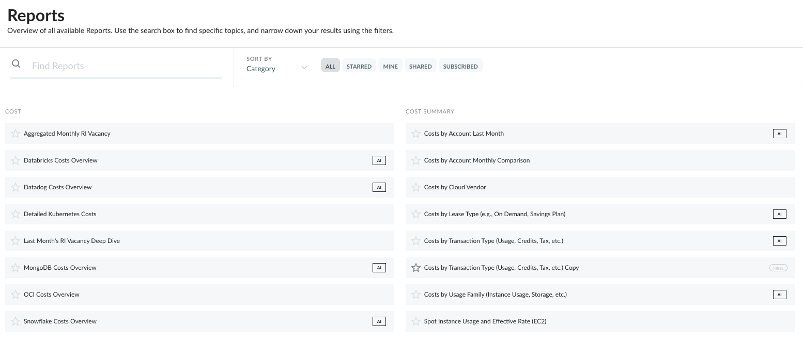
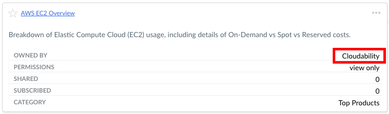

# Reports List

When navigating to "Home" => "Reports" users are presented with a list of all Reports accessible
to them. The list of Reports can be further narrowed down to focus only on Reports in a certain
category:

- Starred - displays only reports labeled as "Starred" by the user
- Mine - displays only reports created by the current user
- Shared - displays only reports that are shared with the current user
- Subscribed - displays only reports that the current user is currently subscribed to

The list of Reports in Cloudability is automatically populated with the default (out of the box)
reports, created by Cloudability, that address most common use cases and can be further modified to
customize them by including additional Dimensions, Filters and other changes. All out-of-the-box
Reports are owned by "Cloudability" and can not be directly modified. Instead, users can create
their copy and include any required changes.

Below is the list of out-of-the-box Reports available in Cloudability:

- AWS CloudFront Distributions
- AWS CloudWatch Overview
- AWS Data Transfer Detail
- AWS DynamoDB Tables
- AWS EBS Overview
- AWS EBS Volumes and Snapshots
- AWS EC2 Instances
- AWS EC2 Overview
- AWS EMR Overview
- AWS ElastiCache Clusters
- AWS Elasticsearch Domains
- AWS Elasticsearch Overview
- AWS Fargate Overview
- AWS Invoice - All Services and Support Last Month
- AWS Invoice - CloudFront and Direct Connect Last Month
- AWS Invoice - Data Transfer Last Month
- AWS Invoice - RI Purchases Last Month
- AWS Kinesis Overview
- AWS Kinesis Streams
- AWS Lambda Functions
- AWS Lambda Overview
- AWS RDS DB Instance Hours
- AWS RDS Database Storage
- AWS RDS Overview
- AWS RDS Provisioned IOPS
- AWS Redshift Clusters
- AWS Redshift Overview
- AWS S3 Buckets (including Glacier)
- AWS S3 Overview
- Aggregated Monthly RI Vacancy
- All Services - Last Month
- Amortized RI Costs by Reservation ID
- Azure Compute Overview
- Azure Compute Virtual Machines
- Azure Database Overview
- Azure Database Resources
- Azure Networking Overview
- Azure Networking Resources
- Azure Storage Overview
- Azure Storage Resources
- Azure Web Overview
- Costs by Account Last Month
- Costs by Account Monthly Comparison
- Costs by Cloud Vendor
- Costs by Lease Type (On-Demand vs Reserved vs Spot)
- Costs by Transaction Type (Usage, RIs, Credits, Taxes)
- Costs by Usage Family (Compute, Storage, etc.)
- Databricks Costs Overview
- Datadog Costs Overview
- Detailed Kubernetes Costs
- GCP Cloud Bigtable Overview
- GCP Cloud Dataflow Overview
- GCP Cloud Pub/Sub Overview
- GCP Cloud SQL Overview
- GCP Cloud Storage Overview
- GCP Compute Engine Discounts
- GCP Compute Engine Overview
- GCP Kubernetes Engine Overview
- Highly Underutilized Instances
- Instances Provisioned in the Last Day
- Last Month's RI Vacancy Deep Dive
- Long Term Utilization Trends
- Marketplace Monthly Summary
- MongoDB Costs Overview
- OCI Block Storage Overview
- OCI Compute Overview
- OCI Costs Overview
- OCI Database Overview
- OCI Object Storage Overview
- Oldest Instances (Over a Month)
- Reservation Coverage Rate (EC2)
- Snowflake Costs Overview
- Spot Instance Usage and Effective Rate (EC2)
- Unassociated ElasticIP Addresses
- Underutilized Compute Optimized Instances
- Underutilized General Purpose Instances (Non Burst)
- Underutilized Storage Optimized Instances
- Utilization of Massive Instances

**Parent topic:** [Cloudability Reports](../product/cloudability-reports.html)
