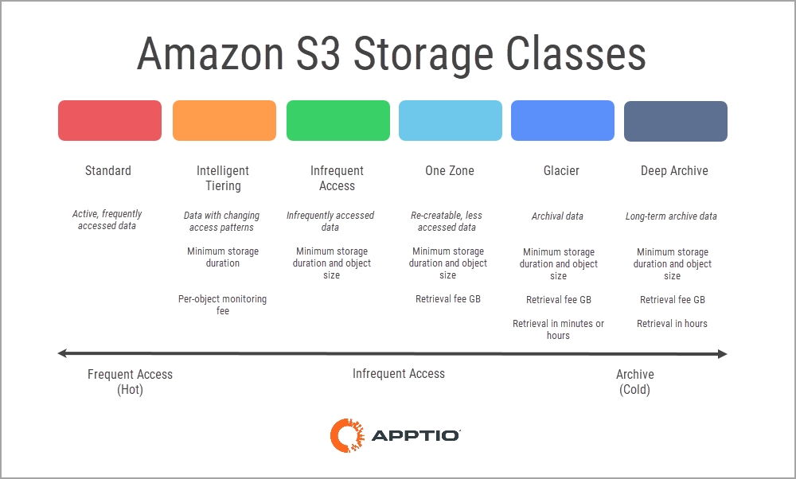
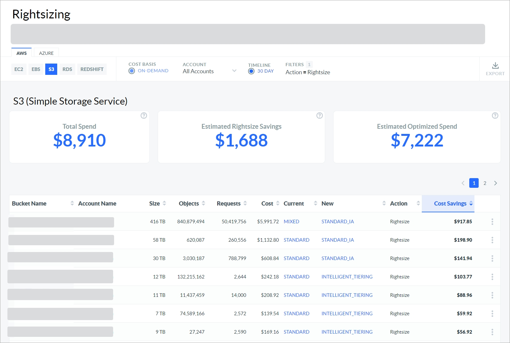
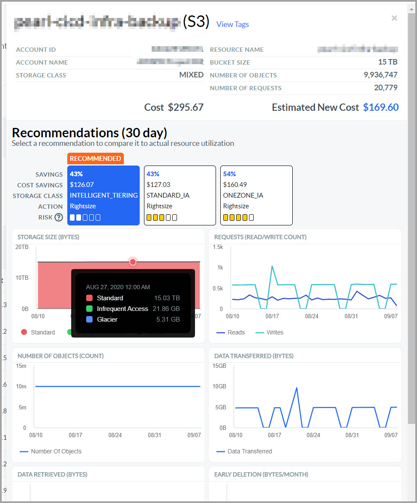

# AWS S3

You can use the Rightsizing dashboard to view the resource optimization recommendations for
Amazon Web Services (AWS)Simple Storage Service (S3). The dashboard shows both the rightsizing and
idle (terminate) recommendations. You can view the recommendations across multiple accounts from a
single dashboard.

[Rightsizing
in Cloudability](get-recommendations-for-scaling-your-cloud-resources-with-rightsizing.html)

AWS S3 overview

Amazon Web Services (AWS) S3 is a storage service that is organized around buckets. The buckets
are top-level containers. You can use these buckets to store individual objects that are associated
with a storage class and also organize individual objects hierarchically within folders.

Buckets

You can have up to one thousand buckets per account. Within each bucket, you can store up to
five terabytes of individual objects. Costs are incurred at the rate for the object’s storage class
and factor by the allocated storage space (GB per month), duration, number of operations (read,
write, lists, delete), and volume of data transferred (egress).

Storage Classes

Storage classes are tailored based on access patterns and durability needs, ranging from
frequent to infrequent (archival) storage. Only an object, not a bucket, is associated with a
storage class.

The AWS S3 storage classes differ in price, performance, availability, and minimum size and
duration requirements. Depending on the storage class you use, addition fees can be incurred for
monitoring, storage class transitioning, early delete, and restoration fees.

By default, S3 objects are created in the highest-priced Standard storage class. To manually
optimize individual objects, you need to identify the rates for each storage class by region,
collect the past access patterns and operations, then evaluate each of the alternatives considering
all the trade-offs.

Before you begin

To view the AWS S3 dashboard, make sure that you have connected Cloudability to the correct AWS
accounts.

[Connecting with AWS - Customer
Integration Guide](../admin/aws-credentialing-standard-enterprise-home.html)

Access the AWS S3 dashboard

To access the AWS EC2 dashboard, open the Cloudability home page, and from the left navigation
menu, select  Optimize > Rightsizing  . On the  Rightsizing  page, select the
 AWS  tab, and then select the  S3  subtab.

Note:

Only buckets with incurred costs greater than zero will be displayed.

Each day Cloudability analyzes your AWS S3 cost, usage, and utilization metrics for the past 30
days. Rightsizing produces bucket-level insights and optimization recommendations. Spend is
determined by GB Months.

Note: Rightsizing provides a break out of heterogeneous storage classes within a bucket.

Note: Idle resources or allocated storage volumes containing negligible or no data are also
displayed in the Rightsizing dashboard.

Customize the dashboard

You can set the following options to customize your dashboard.

Note:

Only the On-Demand Cost Basis is supported for S3.

The On-Demand cost basis provides a direct comparison between the instance listed in the 
Current  column and the instance recommended in the  New  column based purely on 
On-Demand Pricing  . It does not include any potential impact from Reserved Instances (RIs) or
Savings Plans (SPs). Note that the on-demand prices will reflect any custom pricing agreements that
you have configured in Cloudability.

Select Account

By default, the dashboard shows recommendations for all accounts. To view recommendations for a
particular account, select the account name from the  Account  dropdown.

Specify Timeline

You can choose to review spend across the last 10 days or the last 30 days. By default, the 
Timeline  option is set to  10 days  . For most users, 10 days is the recommended time
period because it captures the most recent performance trends and is more predictive of future
resource use.

Apply Filters

You can add filters to include or exclude data based on one or more conditions.

Add a filter

To add a filter:

1. Select Add Filter from the toolbar.
2. In the Add Filter menu, choose a Dimension.
3. Select an Operator to provide a logical condition.
4. Choose a value to refine your filter.
5. Select Add Filter to apply the new filter to the page.

Apply filters with links

You can also add filters by selecting the blue hyperlinked values in the main table. The filter
rule is automatically applied to the  Filters  field. You can select only one value or
parameter from each column at a time.

Remove a filter

To remove a filter:

1. Select the filter icon  .
2. Select  X next to the filter that you want to remove.

Key Performance Indicators

You can view the following Key Performance Indicators (KPIs) on your Rightsizing dashboard:

- Total Spend: Shows the total current allocated spend.
- Estimated Rightsizing Savings: Shows the estimated total potential
  savings achievable for all Rightsize recommendations.
- Estimated Optimized Spend : Shows the estimated total spend after
  recommendations are applied.

Rightsizing recommendations table

The dashboard contains a rightsizing recommendations table, which provides an overview of your
S3 resources. The table includes the following columns:

Note:

By default, the data is sorted by the  Cost Savings  column. To change the sort order,
just select the column name.

- Bucket Name: The S3 bucket name.
- Account Name: The AWS account name.
- Size: The size of all objects within the bucket.
- Objects: The number objects within the bucket.
- Requests: The number of requests (read, write, list) done via the console
  or API.
- Cost: The cost incurred for the past 30-days for the objects within the
  bucket.
- Current: The derived storage class for the bucket. When 100% of all
  objects are in the same storage class, that storage class will be displayed. If a bucket consists of
  objects within multiple storage classes, then MIXED will be displayed. Clicking the details will
  display the relative distribution across these classes.
- New: The recommended optimal storage class for all objects within the
  bucket.
- Action : Recommendation for the resource. The recommendation can be one
  of the following

| Recommendation | Description |
| --- | --- |
| Rightsize | Resize to the resource type specified in the New column. |
| No Action | No action is recommended by default, but additional recommendations with higher risk levels may be available in the Details panel. |

Cost Savings  : The estimated 10- or 30-day cost savings amount.

Export recommendations to an Excel file

To export the recommendations to an excel file, select  Export  . Note that the excel
file will include several additional columns, such as region, operating system, unit price, and
others.

Recommendation details

To view the recommendation details for a particular resource, select  View Details 
from the More Options (3 dots) menu.

The following figure shows a sample recommendation details panel.

The S3 details panel shows the following information:

Recommendations

Shows one or more recommendations, ranked by cost savings and risk (0-5).

- Savings: Estimated savings percent for the 10- or 30-day period.
- Cost Savings: Estimated savings amount.
- Storage Class: Recommended storage class.
- Action: Recommended action.
- Risk: On a scale of 0-5, the number of storage class transitions from
  frequent to infrequent access.

Charts

- Storage Size (Bytes): Displays the storage size amount by storage class.
  The possible values include the following:
  - Standard
  - Intelligent FA (Intelligent Tiering - Frequent Access)
  - Intelligent IA (Intelligent Tiering = Infrequent Access)
  - Infrequent Access
  - One Zone
  - Glacier
  - Deep Archive
  - Reduced Redundancy
- Requests (Read/Write/Count): Displays read and write requests performed
  against the bucket. This chart provides valuable insights into the usage category of the bucket such
  as mostly reads, balanced read-writes, or write oriented.
- Number of Objects (Count): The graph shows the number of objects in the
  bucket over the time period.
- Data Transferred (Bytes): Amount of egress to the internet (or data
  transferred across regions).
- Data Transitions (Bytes): Amount of data transitioned across storage
  classes (excludes Standard).
- Early Deletion (Bytes): Amount of storage incurring an early deletion
  fee.

Taking action on recommendations

Storage classes

To transition the storage class of objects in bulk, you have two options:

- Object Life Cycle Management

  You can enable a life cycle management rule at the bucket level
  to transition all contained objects to the recommended storage class based on the object creation
  date.

  For more information about object life cycle management, refer to
  [Managing the lifecycle of objects](https://docs.aws.amazon.com/AmazonS3/latest/userguide/object-lifecycle-mgmt.html "(Opens in a new tab or window)").
- S3 Batch Operations

  If you prefer a programmatic route, you can leverage S3 Batch Operations
  to change the storage class of all or selected objects within one or more buckets.

  For more
  information about batch operations, refer to [https://aws.amazon.com/blogs/aws/new-amazon-s3-batch-operations/](https://aws.amazon.com/blogs/aws/new-amazon-s3-batch-operations/ "(Opens in a new tab or window)")  .

Intelligent Tiering

Intelligent Tiering is a hybrid storage class service that monitors each object’s access
patterns and attributes. Based on this data, the service will automatically transition objects
between the Standard and Infrequent Access storage class for a per-object monitoring fee in addition
to the storage class-specific rates.

Bucket level rightsizing helps you to identify which buckets will benefit from this service.
Although most objects are created in the Standard class initially, as your S3 buckets become
optimized over time, additional incremental optimization recommendations such as Infrequent Access
or even Glacier may be recommended.

For more information, refer to [https://aws.amazon.com/s3/storage-classes/](https://aws.amazon.com/s3/storage-classes/ "(Opens in a new tab or window)")  .

**Parent topic:** [Rightsizing](../product/get-recommendations-for-scaling-your-cloud-resources-with-rightsizing.html)
