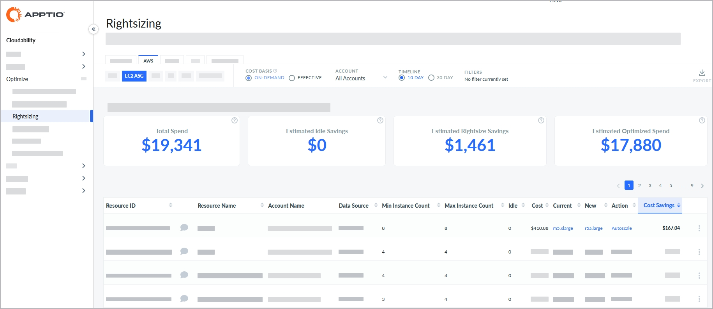
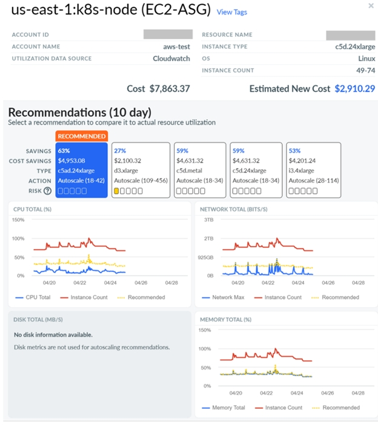

# AWS EC2 Autoscaling Group (ASG)

You can use the Rightsizing dashboard to view the resource optimization recommendations for
Amazon Web Services (AWS) Elastic Compute Cloud (EC2) Auto Scaling Groups (ASG). The dashboard shows
both the rightsizing and idle (terminate) recommendations. You can view the recommendations across
multiple accounts from a single dashboard.

[Rightsizing
in Cloudability](get-recommendations-for-scaling-your-cloud-resources-with-rightsizing.html)

[Autoscale Action for Rightsizing](rightsizing-autoscale-action.html)

Before you begin

To view the AWS EC2 ASG dashboard, make sure that the following requirements are met:

You have connected Cloudability to the correct AWS accounts.

You are using AWS AutoScaling Groups.

The  aws:autoscaling:groupName  tag is included in the
Cost and Usage Report (CUR) files provided to Apptio and the updated files have been ingested.

[Connecting
with AWS - Customer Integration Guide](../admin/aws-credentialing-standard-enterprise-home.html)

Note:

Currently, this feature has the following limitation:

- The recommendations exclude spot instances. The dashboard only shows on-demand instances.

Access the AWS EC2 ASG dashboard

To access the AWS EC2 ASG dashboard, open the Cloudability home page, and from the left
navigation menu, select  Optimize > Rightsizing  . On the 
Rightsizing  page, select the  AWS  tab, and then select the
 EC2 ASG  subtab.

Customize the dashboard

You can set the following options to customize your dashboard.

Specify Cost Basis

Cost Basis determines how recommendations are calculated. Cost basis can be 
On-Demand  or  Effective  . The On-Demand cost basis is selected
by default.

Note:

[Refer](../chatbot/custom-discounts-enterprise-discount.html)  to learn more.

- On-Demand:  The On-Demand cost basis provides a direct comparison
  between the instance listed in the  Current  column and the instance
  recommended in the  New  column based purely on  On-Demand Pricing 
  . It does not include any potential impact from Reserved Instances (RIs) or Savings Plans (SPs).
  Note that the on-demand prices will reflect any custom pricing agreements that you have configured
  in Cloudability.
- Effective:  The Effective cost basis takes into account the historical
  impact of Reserved Instances (RIs) and Savings Plans (SPs) to calculate the cost for the current
  instance type over the reporting period. Like the Cost (Amortized) metric, it includes all
  associated upfront and recurring costs.   
   In other words, the Effective cost basis shows
  the effective cost of running your current instance. The cost figures for the recommended New
  instance type are based on the on-demand prices. This is because the new configuration may not
  benefit from RIs or SPs. This comparison is the more conservative option. Even if you inadvertently
  move away from RIs or SPs, your new overall rate will still be better. As a result, the overall
  savings reported using this methodology will sometimes be lower. Custom pricing will be applied to
  these figures, if applicable.

Use the On-Demand cost basis if you are looking to remove the unpredictable nature of
commitment-based discounts from your analysis and to maximize the number of recommendations provided
to you. Use the Effective cost basis if you prefer to base your recommendations on the historical
 True Cost  of running your instances and to take a conservative approach.

Select Account

By default, the dashboard shows recommendations for all accounts. To view recommendations for a
particular account, select the account name from the  Account  dropdown.

Specify Timeline

You can choose to review spend across the last 10 days or the last 30 days. By default, the
 Timeline  option is set to  10 days  . For most
users, 10 days is the recommended time period because it captures the most recent performance trends
and is more predictive of future resource use.

Apply Options

You can also set page-level options to include or exclude certain recommendations.

Apply filters

You can add filters to include or exclude data based on one or more conditions.

Add a filter

Add a filter

To add a filter:

1. Select Add Filter from the toolbar.
2. In the Add Filter menu, choose a Dimension.
3. Select an Operator to provide a logical condition.
4. Choose a value to refine your filter.
5. Select Add Filter to apply the new filter to the page.

Apply filters with links

You can also add filters by selecting the blue hyperlinked values in the main table. The filter
rule is automatically applied to the  Filters  field. You can select only one
value or parameter from each column at a time.

Remove a filter

To remove a filter:

1. Select the filter icon  .
2. Select  X  next to the filter that you want to remove.

Key Performance Indicators

You can view the following Key Performance Indicators (KPIs) on your Rightsizing dashboard:

- Total Spend  : Shows the total current allocated spend.
- Estimated Idle Savings  : Shows the estimated total savings for all
   Terminate  recommendations.
- Estimated Rightsize Savings  : Shows the estimated total potential
  savings achievable for all  Rightsize  recommendations.
- Estimated Optimized Spend  : Shows the estimated total spend after
  recommendations are applied.

Note:

For EC2, spend is determined by instance usage.

Rightsizing recommendations table

The dashboard contains a rightsizing recommendations table, which provides an overview of all
your EC2 ASG resources. The table includes the following columns:

Note:

By default, the data is sorted by the  Cost Savings  column. To change
the sort order, just select the column name.

- Resource ID:  The account ID plus the ASG name.
- Resource Name  : The ASG name.
- Account Name  : The AWS account name.
- Data Source  : The source or APM (such as Cloudwatch) providing the
  data.
- Min Instance Count  : The minimum number of instances observed.
- Max Instance Count  : The maximum number of instances observed.
- Idle  : The time spent below 2% CPU on a scale of 1-100.
- Cost  : The total cost of all running instances in the ASG.
- Current  : The ASG instance type. For ASGs with multiple types, the
  column will show  multiple  .
- New  : The top recommended ASG instance type.
- Action  : Recommendation for the resource. The recommendation can be one
  of the following.

| Recommendation | Description |
| --- | --- |
| Terminate | Terminate your resource because it is predominantly idle. |
| Autoscale | Set up autoscaling for the resource. |
| No Action | No action is recommended by default, but additional recommendations with higher risk levels may be available in the Details panel. |

Cost Savings  : The estimated 10- or 30-day cost savings amount.

Export recommendations to an Excel file

To export the recommendations to an excel file, select  Export  . Note
that the excel file will include several additional columns, such as region, operating system, unit
price, and others.

Recommendation details

To view the recommendation details for a particular resource, select  View Details
 from the More Options (3 dots) menu.

The following figure shows a sample recommendation details panel.

In addition to the information provided in the EC2 details panel, the ASG details panel shows
the following information:

Instance Count  : The observed minimum and maximum instance count.

Action (Autoscale)  : When the recommended action for an ASG is 
Autoscale  , the recommended minimum and maximum instance count configuration is shown
in parentheses next to the text. For more information on how autoscale recommendations are used,
refer to  [Autoscale
Action for Rightsizing](rightsizing-autoscale-action.html)  .

Risk  : Characterizes the likelihood to reach capacity limits for a given
recommendation, based on scaling up to larger number of instances with lower individual capacity.

Utilization Metrics  : The utilization metrics displayed for ASGs are based
on the following parameters:

| Parameter | Description |
| --- | --- |
| CPU Total (%) | - CPU Total (blue line)  : The normalized percentage of maximum CPU   utilization in the indicated hour, based on the maximum instance count for the entire ASG in the   time window of 10 or 30 days. - For example, if an ASG contained 5 instances and all 5 instances utilized 100% CPU, then the    CPU Total (%)  will show 100%. If 1 instance utilized 100% CPU, while the   other 4 instances utilized 0% CPU, then the  CPU Total (%)  will show 20%. - Instance Count (red line)  : The total number of instances running for this   ASG in the indicated hour. - Recommended (yellow dashed line)  : The recommended normalized percentage of   CPU utilization allocation for the entire ASG in the indicated hour. - Recommended instance count (yellow line, displayed on hover)  : The total   number of instances recommended for this ASG in the indicated hour. |
| Network Total (Bits/s) | - Network Total (blue line)  : The total number of bits per second   utilized based on the maximum instance count for the entire ASG in the indicated hour. - Instance Count (red line)  : The total number of instances running for   this ASG in the indicated hour. - Recommended (yellow dashed line)  : The recommended network allocation   for the entire ASG in the indicated hour. - Recommended instance count (yellow line, displayed on hover)  : The   total number of instances recommended for this ASG in the indicated hour. |
| Memory Total (%) | - Memory Total (blue line)  : The normalized percentage of maximum memory   utilization in the indicated hour, based on the maximum instance count for the entire ASG in the   time window of 10 or 30 days. - For example, if an ASG contained 5 instances and all 5 instances utilized 100% memory, then    Memory Total (%)  will show 100%. If 1 instance utilized 100% memory, while   the other 4 instances utilized 0% memory, then  Memory Total (%)  will show 20%. - Instance Count (red line)  : The total number of instances running for   this ASG in the indicated hour. - Recommended (yellow dashed line)  : The recommended normalized   percentage of memory utilization allocation for the entire ASG in the indicated hour. - Recommended instance count (yellow line, displayed on hover)  : The   total number of instances recommended for this ASG in the indicated hour. |
| GPU Total (%) | - GPU Total (%):  This is handled in the same manner as  CPU   Total (%)  . |
| GPU Memory Total (%) | - GPU Memory Total (%):  This is handled in the same manner as    CPU Memory Total (%) |

Note:

Disk metrics are not used for autoscaling recommendations.

**Parent topic:** [Rightsizing](../product/get-recommendations-for-scaling-your-cloud-resources-with-rightsizing.html)
