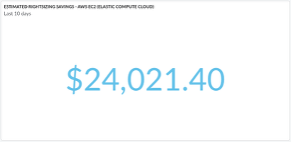

# Rightsizing Widget

Cloudability Dashboards have an option to visualize the data from the “Rightsizing” data
source.

Currently, the Rightsizing Widget can only display the last 10 days of Rightsizing savings.

Rightsizing in Cloudability Dashboards is available for the following products:

- AWS EC2 (Elastic Compute Cloud)
- AWS EBS (Elastic Block Store)
- AWS RDS (Relational Database Service)
- Azure Compute
- Azure Managed Disk
- Azure SQL Database

**Parent topic:** [Create or Edit a Widget in a Dashboard](../product/create-or-edit-a-widget-in-a-dashboard.html)
