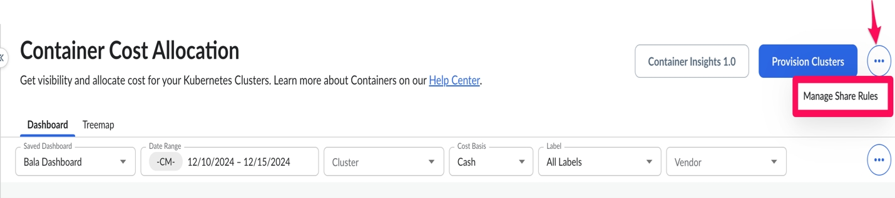
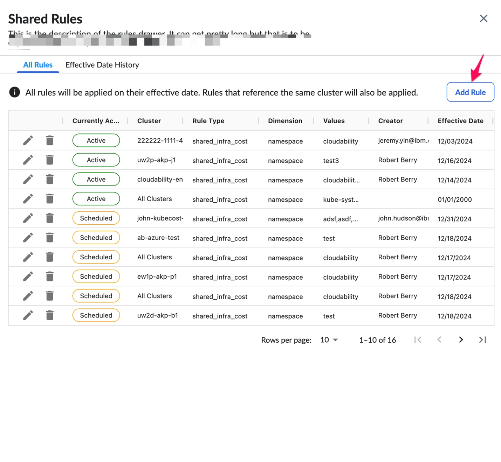
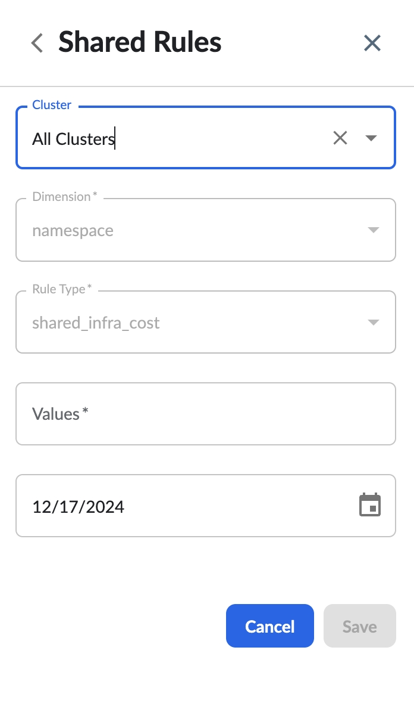
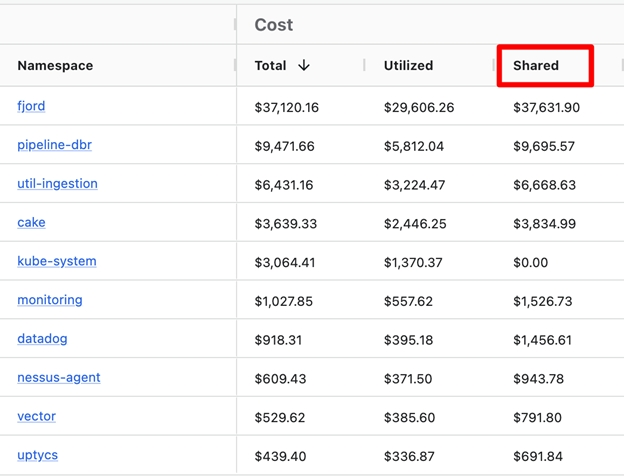

# Shared Cost Allocation - Container Insights UI

We are introducing a new container cost allocation feature that transforms how shared infrastructure expenses are tracked in Kubernetes environments. This feature enables customers to annotate and allocate shared infrastructure costs, such as system proxies, monitoring tools, and other operational resources, to specific application owners or cost centers.

Previously, these shared infrastructure costs were indistinguishably reported as standard workload expenses. Now, organizations can precisely tag and distribute these operational costs, providing application teams and financial managers with a more transparent, granular view of their true total infrastructure expenditure.

To start, this capability supports allocating shared costs at the Kubernetes namespace level. We'll be looking to expand support to additional Kubernetes constructs in the future.

## Key Capabilities

Automated Shared Cost Identification

- Automatically recognizes shared infrastructure costs from predefined namespaces:

  - `kube-system`
  - `Cloudability`

- Applied consistently across all clusters

Flexible Administrative Controls

- Cloudability administrators can:

  - Define shared infrastructure cost rules for applicable namespaces
  - Configure organization-level or cluster-specific cost allocations
  - Precisely target infrastructure-related workloads (namespaces) and the effective date for the
    rules to apply

New Cost Metrics

- New cost metrics have been introduced in the Container Insights UI to provide visibility into
  the allocated shared costs, including  Shared Cost  as well as
  resource-specific  Network Shared  ,  Memory Shared  ,
   CPU Shared  ,  GPU Shared  and others. This Shared
  Cost metric reflects the total cost, including allocated shared costs, after shared rules are
  applied.

Note:

Shared costs will only be calculated starting from the feature release date. Queries including
dates before the release date will return empty results in the *Shared Cost* column.

How to Configure Manage Share Rules

To configure shared cost allocation, use  Manage Share Rules  in the
Container Insights interface to define how shared costs should be distributed across Kubernetes
namespaces.

1. Navigate to the  Container Cost Allocation  UI.
2. Locate the ellipsis menu (...) in the upper-right corner, next to the Provision Clusters button.
3. Click the ellipsis to open a dropdown menu.
4. From the dropdown, select  Manage Share Rules  . 
5. Configure  Rules  and provide the  Effective Date 
   .
6. Select  All Clusters  for organization-level configuration or choose a
   specific cluster from the dropdown for cluster-level configuration. Then, specify the namespace
   values to allocate the shared costs.
7. Save changes.

The Shared Cost metric provides enhanced visibility into the total costs for your Kubernetes
namespaces, including allocated shared costs. Once shared cost rules are applied, the Shared Cost
column reflects the combined cost, distributing shared resources proportionally across the selected
namespaces.

This feature ensures greater accuracy in cost allocation for showback and chargeback processes,
helping you account for shared infrastructure and resource usage effectively.

## Customer Awareness: Known Behaviors and Clarifications

To ensure a smooth experience, please note the following:

- Future-Dated Rules Only
  - Rules for shared cost allocation can only be created, updated, or deleted for future dates (in
    UTC).
  - Changes will not apply retroactively to historical data.

- Effective Dates for Rule Updates and Deletions
  - Rule updates or deletions do not take effect immediately.
  - Instead, a new scheduled rule with the updated or empty value will be created, taking effect on
    the scheduled date.

- Union Relationship for Multiple Rules
  - When multiple rules are applied, they work as a union.
  - Example: If an  All Clusters  rule includes namespaces A and B, and a
    rule for *cluster-foo* includes namespace C, then all three namespaces (A, B, C) will be
    treated as shared costs for *cluster-foo*.

- Empty Shared Cost Before Feature Release Date
  - If a query includes dates prior to the release date, the Shared Cost column will be empty, as
    shared costs are not calculated retroactively.
- Shared namespace reflecting non-zero shared cost amount
  - If you're seeing non-zero shared cost for a given shared namespace like
    `kube-system`, it is likely due to the namespace existing on a node that
    does not have any non-shared application workloads (namespaces). This will
    result in the fair share cost being reflected as the shared cost for this namespace, because there
    are no "normal" workloads to share the cost with on the node.

**Parent topic:** [Container Cost Allocation](../product/k8s-cost-allocation.html)
