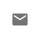
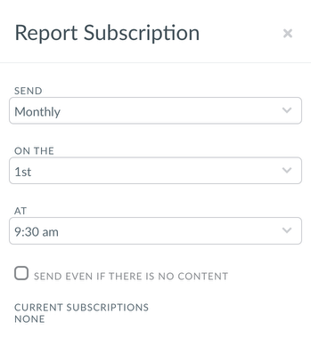

# Subscribe to a Report

Users can Subscribe to a Report to receive the Report on a given cadence. Report Subscription can
be configured by clicking the envelope icon when accessing a Report: 

This will open the Subscription configuration menu that allows users to configure the time
interval at which the Report will be generated.

Reports can be delivered daily, weekly or monthly.

**Parent topic:** [Create or Edit a Report](../product/create-or-edit-a-report.html)
