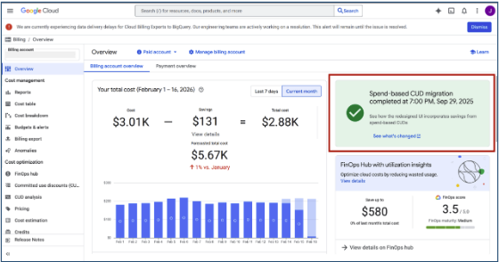

# Supplemental Guide to GCP's Spend CUD Program

**Instructions to backfill data for customers who voluntarily migrated to the new Spend CUD
Program before February 1st, 2026**

Customers need us to refetch GCP data dating back to the month of their migration. There are
three cohorts:

1. **Forced Migration:** Customers who were force migrated by GCP during the first week of
   February have been taken care of. No further action is needed by our customers/field to support this
   cohort.
2. **Voluntary Migration, Customer Communicated Awareness:** For customers that migrated and let
   us know, we have gone ahead and refetched your data on your behalf.
3. **Voluntary Migration, Customer Did Not Communicate Awareness:** For customers who have not
   notified us, please file a support case with the following information:

<Your name> voluntarily migrated to GCP’s New Spend CUD Program and is requesting a refetch of
their GCP data dating back to their migration date. Provided is the requested information about
their account: Customer Name, Frontdoor Region, Frontdoor Customer Name, FrontdoorEnvironment Name,
Internal Contact, Migration Date, Billing Accounts, and whether or not the accounts are credentialed
as detailed or standard billing.

Note the account information is not required but is much preferred since there is a non-trivial
cost to be running these refetches. If you do not know if the refetch took place on your behalf,
please reach out to your account team. The date for your migration can be found in the GCP console.
See below:

If you do not know if the refetch took place on your behalf, please reach out to your account
team.

**Parent topic:** [Guide to Advanced Commitment Functionality](../product/guide_to_advanced_commitment_functionality.html)
