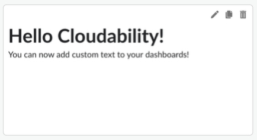

# Text Widget

Text Widget can be used to provide additional description, comments or explanation to the
Dashboard. Most important features include:

- Built-in basic editor options
- Markdown support
- Embedding links to external content

**Parent topic:** [Create or Edit a Widget in a Dashboard](../product/create-or-edit-a-widget-in-a-dashboard.html)
