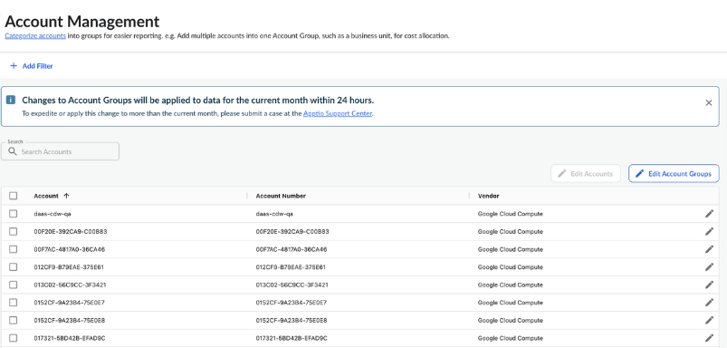
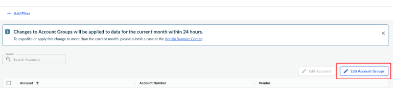
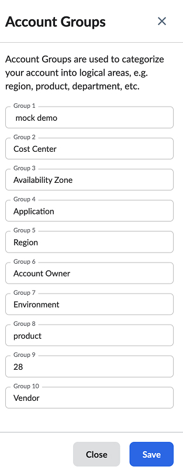
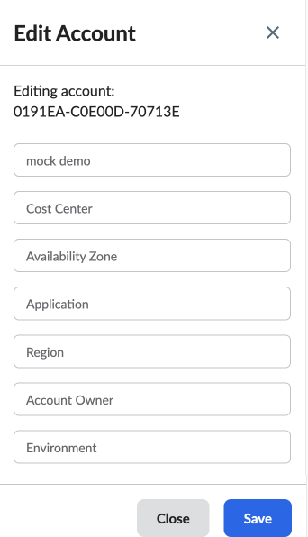
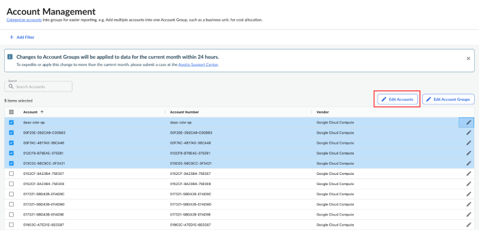
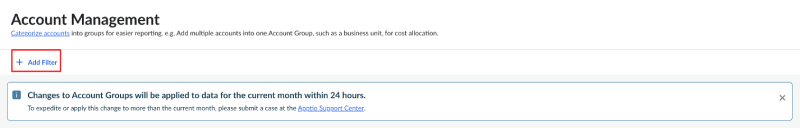
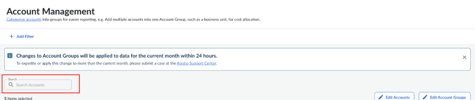
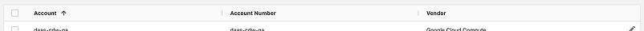

# Grupos de cuentas

Las cuentas y los grupos de cuentas te permiten editar y agrupar las cuentas a las que se accede mediante Cloudability. Además, funcionan como etiquetas para las cuentas de AWS, las suscripciones de Azure y los proyectos de GCP. Te permiten asignar un par clave-valor en el que «Grupo de cuentas» es la clave y «Entrada del grupo de cuentas» representa el valor. Por ejemplo, puedes crear un grupo de cuentas denominado «Entorno» y utilizar las entradas del grupo de cuentas para asignar un valor («Producción», «Prueba» o «Desarrollo») a cuentas de nube concretas en Cloudability.

Los grupos sirven para clasificar tus cuentas según diferentes variables. Puedes asignar los valores clave a tus grupos; por ejemplo, podrías tener grupos llamados «Región», «Producto» y «Departamento» Esto te permitirá clasificar las cuentas individuales según la región, el producto y el departamento a los que estén asociadas.

Configuración de grupos de cuentas

1. Ve a «Organizar > Grupos de cuentas ».

   

   Cuando accedas a la página por primera vez, verás todas las cuentas a las que accedes a través de Cloudability, ordenadas por cuenta, número de cuenta y proveedor.
2. Selecciona «Editar grupos de cuentas» en la esquina superior derecha de la página.

   

   Al hacerlo, aparecerá un panel en el que podrás asignar los valores clave a tus grupos. Por ejemplo, podrías tener grupos llamados «Región», «Producto» y «Departamento». Esto te permitirá clasificar las cuentas individuales según la región, el producto y el departamento a los que estén asociadas.

   

Asignar grupos de cuentas

Selecciona el icono del lápiz situado en el extremo derecho de cualquier cuenta para editar el nombre y asignarla a grupos.

Puedes modificar estos datos para varias cuentas a la vez marcando las casillas correspondientes y, a continuación, seleccionando «Editar cuentas ».

Ahora puedes asignar manualmente tu cuenta a grupos de cuentas en Cloudability.

Filtrar cuentas

En la parte superior de la página «Gestión de cuentas», selecciona «Añadir filtro» para filtrar por grupo de cuentas.

Buscar cuentas

Haz clic en **«Buscar cuentas»** para buscar cuentas concretas.

Ordenar cuentas

Selecciona los encabezados de las columnas para ordenar tus cuentas.

Añadir credenciales 

Selecciona «Clasificar cuentas» en el encabezado de la página. Esto te llevará a la página **«Credenciales de proveedor»,** donde podrás editar las credenciales de tus cuentas.

**Tema principal:** [Organiza tu gasto en la nube](../admin/tag-data.html)
