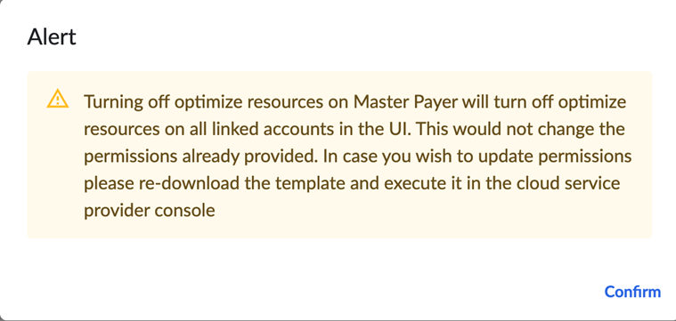
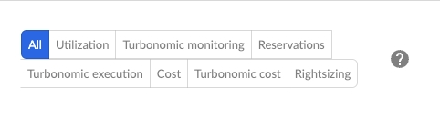

# Conexión con AWS - Actualización de los clientes existentes de Cloudability a Cloudability Premium

Si ha actualizado a Cloudability Premium, sus credenciales actuales de Cloudability seguirán funcionando en Cloudability, pero no en Turbonomic. Para que ambas herramientas funcionen conjuntamente, tendrás que volver a introducir las credenciales de tus cuentas de AWS. Esto se debe a que se necesitan más permisos de IAM para que Turbonomic funcione a la perfección con Cloudability.

1. En Cloudability, vaya a **Configuración > Credenciales de proveedor > AWS**
2. Seleccione una cuenta consolidada existente haciendo clic en.
3. Seleccione el icono del lápiz para abrir Editar una credencial.
4. Elige entre las opciones avanzadas de ajuste de recursos: **«Solo lectura»** o **«Automatizar acciones»**
   - La selección **«Solo lectura»** implica que estás concediendo permisos de lectura para tu entorno, pero no para realizar acciones, tanto en Cloudability cost como en Turbonomic cost y Turbonomic.
   - La selección **de «Automatizar acciones»** implica que estás concediendo todos los permisos de Cloudability y Turbonomic, incluidos los relativos a las acciones automatizadas, es decir, la ejecución de Turbonomic y la ejecución de facturación de Turbonomic.
5. Haga clic en Guardar para descargar la plantilla.
6. Actualice los permisos IAM existentes ejecutando la plantilla en la consola AWS según esta sección (enlace a Credencialización automatizada de cuentas vinculadas)
7. Vuelva a verificar la cuenta a través de Cloudability UI.
8. La verificación correcta se indicará con una marca verde.

Esto debe hacerse tanto para la cuenta consolidada como para las cuentas vinculadas.

Nota: En sus cuentas vinculadas individuales, el estado de Automatizar acciones se mostrará como:

- **DESACTIVADO** si la opción **«Ajuste avanzado»** se ha configurado como **«Solo lectura»** (heredada de la cuenta consolidada)
- **ACTIVADO** si la opción **«Ajuste avanzado»** se ha seleccionado como **«Automatizar acciones»** (una vez más, heredado de la cuenta consolidada)
- AWS el estado de las cuentas vinculadas no puede modificarse en las cuentas vinculadas individuales cuando se opta por la acreditación automática

Nota: Si la credencialización automatizada no está activada.

- Tanto la cuenta consolidada como las cuentas vinculadas pueden tener diferentes estados **ON/OFF** en Automatizar acciones.
- El estado **ON/OFF** puede cambiarse individualmente sin dependencia entre la cuenta consolidada y las cuentas vinculadas.

Nota: Al cambiar de **«Acciones automatizadas»** a **«Solo lectura»**, aparece una notificación emergente que solicita confirmación.

Visualización de los permisos de « Turbonomic »

Como se ha mencionado anteriormente, se han añadido permisos adicionales de Turbonomic para las categorías «Básico» (datos de facturación), «Avanzado» (datos de uso) y «Acciones de automatización» (para ejecutar acciones), que se describen detalladamente en la sección « IBM Turbonomic » de los documentos del centro de ayuda. <INSERTAR ENLACE AQUÍ, POR FAVOR>. Una vez que se hayan actualizado los permisos de IAM y se hayan verificado todas las cuentas, se podrá consultar la lista de permisos seleccionando la opción **«Detalles»** en cada cuenta de AWS que aparece en la sección « Cloudability ».

Cabe señalar que, tal y como se muestra en la captura de pantalla anterior, se puede seleccionar la opción « Turbonomic » (Supervisar) para ver los permisos de lectura aplicados, mientras que se puede seleccionar la opción « Turbonomic » (Ejecutar) para ver los permisos de ejecución aplicados.

**Tema principal:** [Conexión con AWS - Guía de integración de clientes](../admin/aws-credentialing-premium-home.html)
