# Configuración de credenciales avanzadas, Azure Rightsizing and Reserved Instance Planning

Azure Las credenciales de nivel de suscripción desbloquean las siguientes funciones en Cloudability :

- Aplicar etiquetas de grupo de recursos a los recursos dentro de los grupos de recursos

  Más información sobre [la asignación de etiquetas](tag-data.html)
- Optimización mediante la asignación de derechos e instancias reservadas (RI)

  Más información [Obtenga recomendaciones para escalar sus recursos en la nube con Rightsizing](../product/get-recommendations-for-scaling-your-cloud-resources-with-rightsizing.html)

  Más información sobre [la cartera de reservas](../product/reservation-portfolio.html)

Actualmente, nuestra plataforma utiliza un rol personalizado llamado “CloudabilitySubscriptionDataReader” en Suscripciones con los permisos mencionados a continuación para obtener los datos necesarios:

- Microsoft.Compute/virtualMachines/read
- Microsoft.Compute/virtualMachines/extensions/read
- Microsoft.Compute/disks/read
- Microsoft.Sql/servers/databases/read
- Microsoft.Sql/servers/read
- Microsoft.Sql/servers/elasticpools/read
- Microsoft.Insights/metricDefinitions/read
- Microsoft.Insights/metrics/read
- Microsoft.Resources/subscriptions/read
- Microsoft.Resources/subscriptions/resourceGroups/read
- Microsoft.Authorization/roleAssignments/read
- Microsoft.Insights/Metricnamespaces/Read
- Microsoft.Consumption/usageDetails/read
- Microsoft.Consumption/pricesheets/read
- Microsoft.CostManagement/query/read
- Microsoft.Commerce/UsageAggregates/read
- Microsoft.Commerce/RateCard/read
- Microsoft.Network/networkInterfaces/read

Utilizamos el flujo de concesión de autorización de OAuth 2.0 para registrar nuestra aplicación y crear una entidad de servicio dentro del inquilino de Azure. Puedes obtener más información sobre este proceso aquí: [https://docs.microsoft.com/en-us/azure/active-directory/develop/app-objects-and-service-principals](https://docs.microsoft.com/en-us/azure/active-directory/develop/app-objects-and-service-principals "(se abre en una pestaña o una ventana nueva)")

Antes de empezar

Debe cumplir los requisitos mínimos para obtener la acreditación.

- Usted es administrador de Cloudability. La función de administrador de Cloudability le da acceso a la página Credenciales de proveedor, donde puede gestionar sus credenciales.

  Más información sobre [la gestión de credenciales de proveedores](manage-vendor-credentials.html)
- Usted tiene uno de los siguientes roles Azure Active Directory en su organización:
  - Administrador global
  - Desarrollador de aplicaciones
  - Administrador de aplicaciones en la nube

  Esto es necesario para el flujo de concesión de autorización de OAuth 2.0. Ver [https://docs.microsoft.com/en-us/azure/active-directory/develop/app-objects-and-service-principals](https://docs.microsoft.com/en-us/azure/active-directory/develop/app-objects-and-service-principals "(se abre en una pestaña o una ventana nueva)")

  Su función Azure Active Directory (AD) se utiliza para registrar nuestra aplicación empresarial en su inquilino de AD Azure y crear el Service Principal.
- Usted es propietario (o superior) de la suscripción que está acreditando. Esto es necesario para el flujo de concesión de autorización de OAuth 2.0. Consulte [https://docs.microsoft.com/en-us/azure/active-directory/develop/app-objects-and-service-principals](https://docs.microsoft.com/en-us/azure/active-directory/develop/app-objects-and-service-principals "(se abre en una pestaña o una ventana nueva)"). Usted necesita ser al menos un Propietario en la Suscripción para que los permisos puedan ser adjuntados al Servicio Principal a través de IAM.

Nota: Asegúrate de que dispones del permiso « billing:EnrollmentReader » en tu cuenta de facturación.

Habilitar función personalizada de sólo lectura en una suscripción

Los siguientes pasos suponen que ya ha añadido un EA de Azure a la página Credenciales de proveedor de Cloudability. Además, usted tiene una o más Suscripciones listadas en esa página a las que le gustaría darnos acceso.

Más información sobre cómo [configurar la gestión de costes para los nuevos clientes de Cloudability Azure Enrollment Agreement (EA)](azure-cm-ea.html)

1. En Cloudability, edite la suscripción. Selecciona el icono «Editar» de la suscripción a la que quieras conceder acceso a Cloudability. 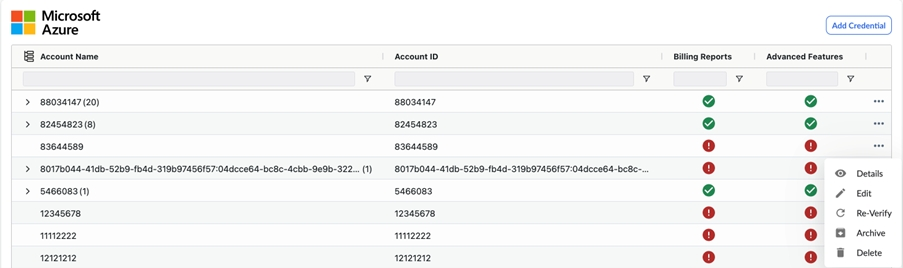
2. Selecciona el botón «Generar enlace» para generar un enlace URL para cada suscripción seleccionada, que luego utilizarás para completar el flujo de concesión de autorización OAuth 2.0 para cada una de esas suscripciones.
   1. Seleccionar Suscripciones.

      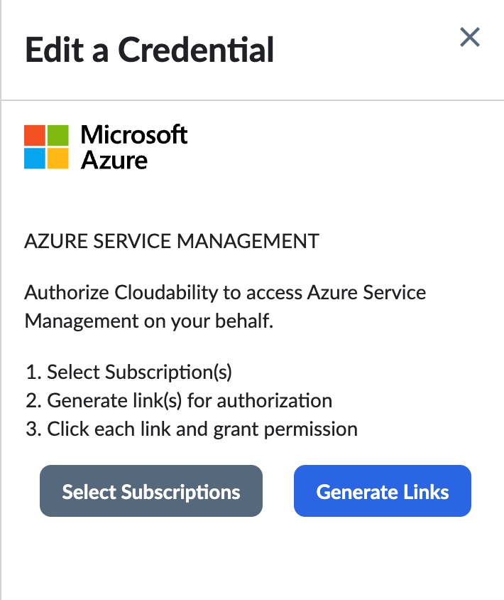
   2. Selecciona «Ajuste avanzado del tamaño» como «Solo lectura» en lugar de «Automatizar acciones ».
   3. Seleccione la(s) suscripción(es) para la(s) que desea generar enlaces.

      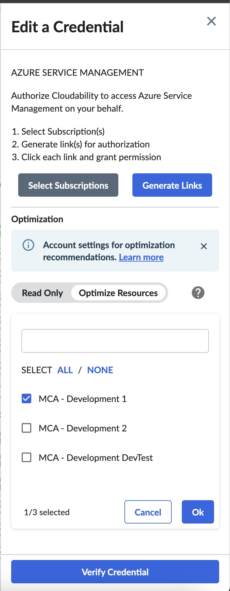
   4. elija Ok para completar sus selecciones.
   5. Seleccione Generar enlaces. Se genera un enlace para cada Suscripción que haya seleccionado.
3. Seleccione cada enlace para completar el registro de nuestra aplicación y crear una entidad de servicio.
4. Completa el proceso de « OAuth » ( 2.0 ) que se inicia al hacer clic en el enlace.

   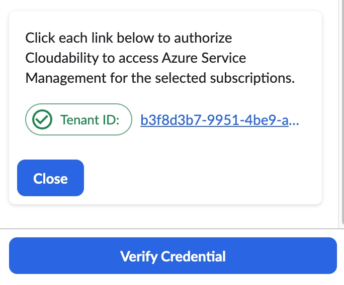
5. Acepte el « CloudabilityUtilizationDataCollector » (Acuerdo de uso de la aplicación) para completar el proceso de consentimiento.

   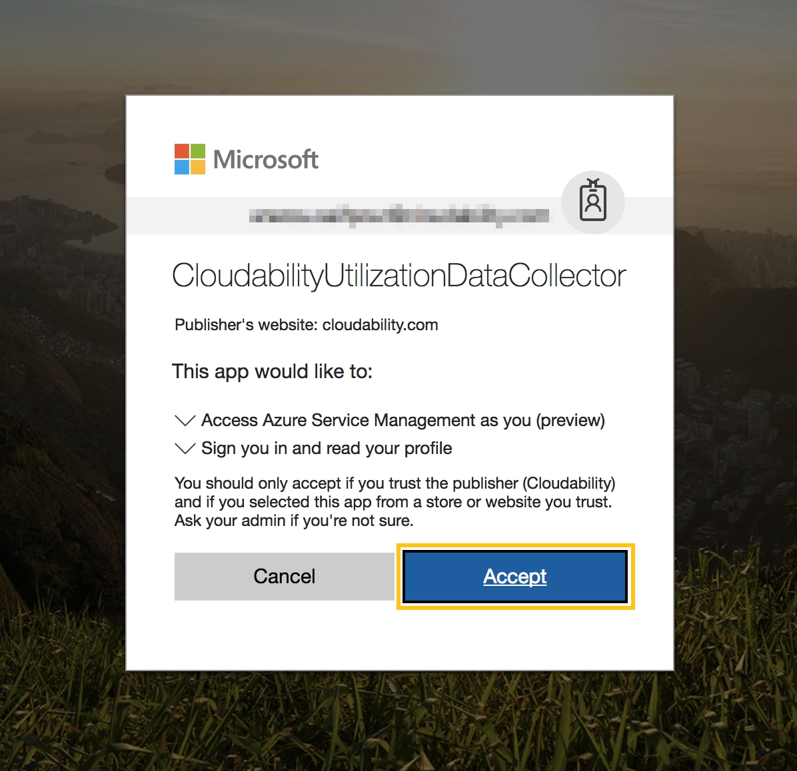
6. Verifique el consentimiento con éxito en el portal Azure :
   - Active Directory. Puede verificar que la aplicación ha sido aceptada correctamente comprobando la sección Aplicaciones empresariales en su Azure Active Directory.

     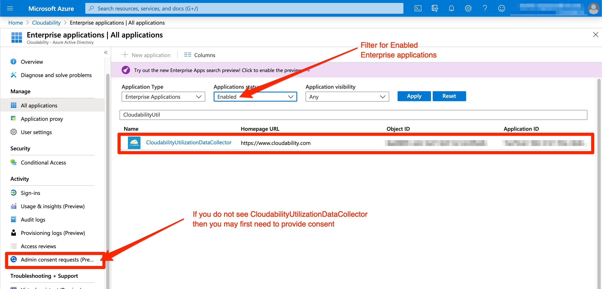
7. Suscripción IAM. Puedes comprobar si al sujeto de servicio se le ha asignado el rol personalizado « ‘CloudabilitySubscriptionDataReader’ » en la suscripción. 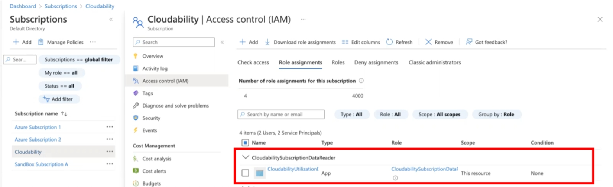

Confirme que ha acreditado correctamente su suscripción.

Vuelva a la página Credenciales de proveedor en Cloudability para verificar las credenciales.

**Verificar credenciales** **mediante acciones masivas**

Para verificar varias cuentas rápidamente, haz clic en el botón Acciones masivas. Esta pantalla muestra todas las cuentas excepto aquellas con el estado «Se requieren credenciales» (X).

1. Seleccione las cuentas que deben verificarse.
2. Haga clic en **Revisar selección.**
3. Haga clic en **Verificar.**

Esto activaría el proceso de verificación masiva y el botón de acciones masivas se desactivaría hasta que el proceso finalizara.

Una vez completadas, las cuentas pasarán a tener el estado «Credencial verificada» o «Credencial no válida» (debido a errores).

Nota: Si el número de cuentas es muy grande, esto puede tardar unos minutos.

Es posible que vea una casilla de verificación amarilla o verde, en la columna Funciones avanzadas, para la Suscripción.

- Una casilla de verificación verde para una Suscripción indica que Cloudability la tiene,
  - un rol personalizado de sólo lectura en la Suscripción (a través de nuestro principal de servicio)
- Una casilla de verificación amarilla implica que Cloudability tiene una credencial incompleta, por ejemplo, el proceso de credencial podría haberse iniciado (es decir, tenemos un registro en nuestra base de datos) pero no hay permisos asociados a esa credencial.
- Un color de estado rojo para la credencial implica que hay un error con la credencial.

Nota: Ahora podemos habilitar todas las funciones avanzadas a través de nuestro entidad de servicio (para ello, es necesario que la entidad de servicio tenga el rol de « CloudabilitySubscriptionDataReader » en las suscripciones). El cuadro de permisos se mostrará como una casilla de verificación amarilla, pero esto está bien.

1. Vuelve a verificar la credencial haciendo clic en la flecha circular. 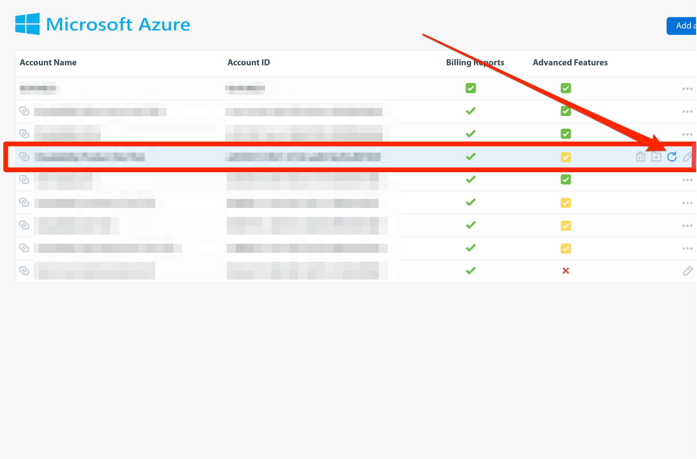

   Si la verificación se realiza correctamente, aparece brevemente una marca de verificación.

   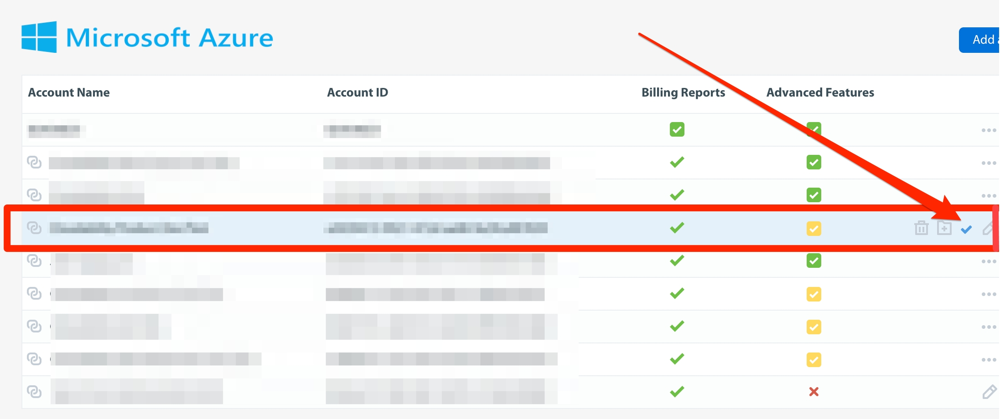

   Es posible que tenga que actualizar el navegador para obtener los nuevos cambios.
2. Selecciona  para ver los permisos actualizados.

   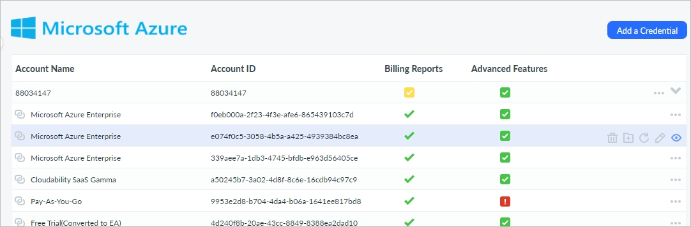s
3. Compruebe si tiene la función CloudabilitySubscriptionDataReader en la suscripción. Esta función en la suscripción se identifica mediante estos 11 permisos, que aparecen marcados con marcas verdes. 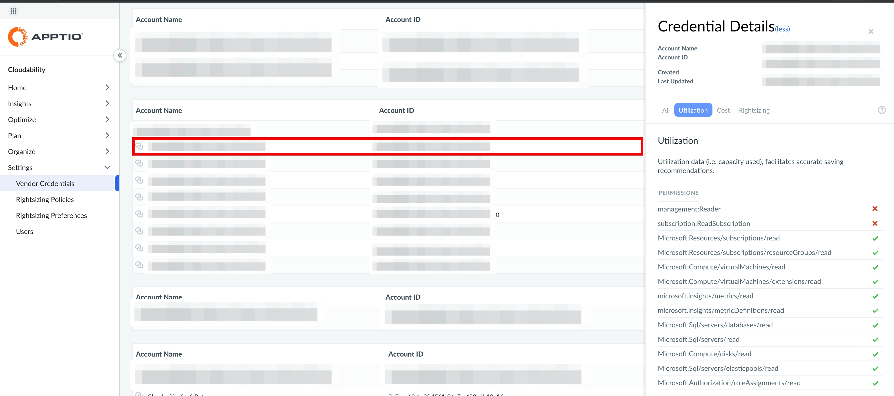

Nota: Algunos permisos aparecen en verde y otros en rojo. Mientras tengamos los 11 permisos mostrados en verde arriba, las Funciones Avanzadas estarán desbloqueadas para esa Suscripción.

Se requiere un permiso adicional para las cuentas de EA de Azure.

Se añadirá el permiso «Enrollment Reader» a Apptio Cloudability para acceder a los datos del planificador de SQL RI de Azure (incluidos Azure Compute, SQL, Cosmos DB y Savings Plans)

Haga clic aquí para [configurar la recopilación de métricas de memoria Azure](azure-advanced-metrics.html)

Actualización de los clientes de Cloudability a Cloudability Premium

Al actualizar a Cloudability Premium, el estado de los Informes de facturación e Informes avanzados de cada cuenta de Azure en la página de listado cambia automáticamente al estado de error.. Por lo tanto, el administrador de Cloudability debe editar cada cuenta siguiendo los pasos que se indican a continuación, lo que permitirá establecer el estado correcto de la cuenta en Cloudability para la ingesta de datos de Azure, así como habilitar Cloudability para compartir estas cuentas con Turbonomic.

1. En Cloudability, vaya a Configuración > Credenciales de proveedor > Azure.
2. Sitúe el cursor sobre el icono del pagador o proyecto cuyas credenciales desea actualizar.
3. Selecciona el  icono para abrir la opción «Editar una credencial».
4. Elige entre «Ajuste avanzado» en modo de solo lectura o «Automatizar acciones»:
5. Generar script de configuración.
6. Actualice los permisos ejecutando el script.
7. Vuelva a verificar la cuenta.

Hay permisos adicionales de Turbonomic que se añaden a los permisos básicos (datos de facturación), avanzados (datos de uso) y de optimización de recursos (ejecución de acciones), los cuales se describen en los documentos del centro de ayuda. Una vez verificada tu cuenta, podrás consultar la lista de permisos seleccionando la opción «Detalles» en cada cuenta de Azure que aparece en Cloudability. 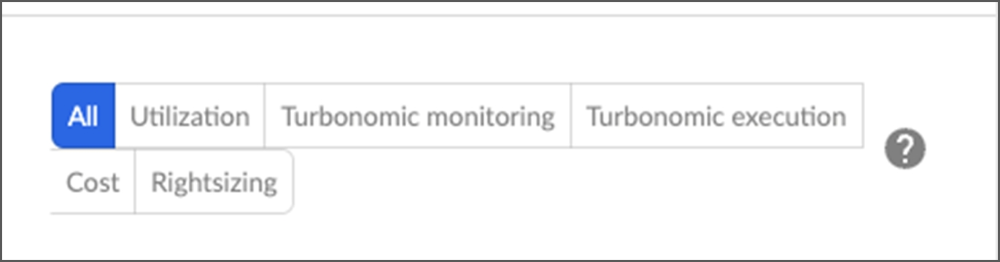

En caso de que los clientes existentes no añadan los nuevos permisos, entonces

- No habría cambios en la interfaz de usuario de las credenciales de vendedor.
- Las acciones de Automatizar se mostrarán como Desactivadas en las suscripciones.
- En la pestaña «Detalles», todos los permisos de « Turbonomic » aparecen marcados con una «x» ROJA.

Una vez habilitados los nuevos permisos en las suscripciones con selección de Sólo lectura

- Las acciones Automatizar seguirán apareciendo como Desactivadas.
- En la pestaña «Detalles», los permisos de « Turbonomic » para «Costes», «Facturación» y «Ejecución de la facturación» aparecerán marcados con una marca de verificación verde.

Una vez que se hayan habilitado los nuevos permisos en las acciones de Automate y se haya verificado la(s) cuenta(s)

- Las acciones Automatizar se marcarán como Activadas.
- En la pestaña «Detalles», todos los permisos de « Turbonomic » aparecen marcados con una marca de verificación verde.

Nota: La opción «Activar/Desactivar acciones automatizadas» aparece en la interfaz de usuario de «Credenciales de proveedor» en función de la selección realizada en el botón de alternancia y de la descarga de la plantilla.

**Tema principal:** [Conectar Microsoft Azure](../admin/azure-cm-setup-premium.html)
