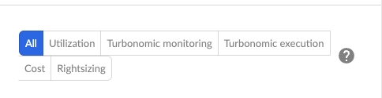
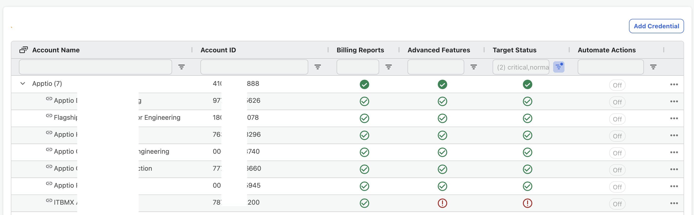

# Conectar Microsoft Azure

Configurar las credenciales de Cloudability para acceder a los datos de gestión de costes de Azure exportando un archivo CSV desde el portal Azure. El archivo CSV captura datos sobre costes y uso, y los guarda en un almacenamient Azure. A continuación, se proporciona al usuario el acceso Cloudability a ese almacenamiento para leer los datos.

1. Establecer la gestión de costes

   Configure datos de facturación en formato CSV para que se exporten automáticamente al almacenamiento Azure diariamente.

   - Más información sobre [Connecting with Azure (MCA) - Gestión de costes de exportación](azure-cm-exports-mca.html)
   - Más información sobre la [conexión con Azure (EA) - Gestión de costes de exportación](azure-cm-exports-ea.html)
   - Más información sobre [la conexión con Azure (MCA) - Detalles del coste API](azure-cmapi-mca.html)
   - Más información sobre la [conexión con Azure (EA) - API de detalles de costes](azure-cmapi-ea.html)
2. Permitir la adaptación y la planificación de RI

   Proporcione a Cloudability información sobre la configuración de sus datos de facturación desde su Portal Azure.

   - Más información sobre la [configuración Azure Redimensionamiento y planificación de RI](azure-advanced-rightsizing-premium.html)
3. Activar la recopilación de métricas de memoria

   Proporcione a Cloudability acceso de sólo lectura a los datos de coste y uso de su almacenamiento Azure.
4. - Más información sobre la [configuración Azure Recopilación de métricas de memoria](azure-advanced-metrics.html)

A continuación figura un ejemplo del tipo de información que Cloudability solicita al portal Azure;

- ID de arrendatario
- id de suscripción
- nombre del grupo de recursos
- nombre de la cuenta de almacenamiento
- nombre de contenedor
- nombre del directorio
- nombre de exportación de costes
- nombre de exportación amortizado

Antes de empezar

Antes de empezar a configurar las credenciales de Cloudability, confirme que es administrador de Cloudability y que cumple los siguientes requisitos.

Asegúrese de que tiene uno de los siguientes roles Azure Active Directory en su organización:

- Administrador mundial
- Desarrollador de aplicaciones
- Administrador de aplicaciones en la nube
- Azure Lector del Plan de Ahorro (Para clientes de Cloudability Premium )

Para el portal Azure, debe tener permisos proporcionados por uno de estos ámbitos Azure para crear la exportación de datos de facturación.

Más información [https://docs.microsoft.com/en-us/azure/cost-management-billing/costs/understand-work-scopes](https://docs.microsoft.com/en-us/azure/cost-management-billing/costs/understand-work-scopes "(se abre en una pestaña o una ventana nueva)")

- Propietario (puede ver/gestionar todo, incluida la configuración de costes)
- Colaborador (puede ver/gestionar todo, incluida la configuración de costes, excluido el control de acceso)
- Colaborador en la gestión de costes (puede ver/gestionar la configuración de costes)

Nota: Para poder aplicar correctamente el permiso «Enrollment Reader» al rol de IAM (necesario para funciones avanzadas como los planes de ahorro y la planificación de instancias reservadas), la cuenta de usuario que ejecute el script de PowerShell debe tener, como mínimo, el rol «Enrollment Writer» en el marco de EA.

Para cuentas de Azure Storage :

- Debe tener permisos de "escritura" para cambiar la cuenta de almacenamiento configurada (independientemente de los permisos en la exportación).
- La cuenta de almacenamiento debe estar configurada para almacenamiento blob o de archivos. Si es posible, Cloudability debe crear una nueva cuenta de almacenamiento dedicada a los datos de gestión de costes.

Para Azure Función de lector del Plan de Ahorro:

Si tiene planes de ahorro para sus cargas de trabajo de Azure, habilite el acceso de Turbonomic a estos planes de ahorro asignando la función integrada Savings Plan Reader al principal de servicio de Cloudability.

Nota: Antes de seguir los pasos que se indican a continuación, el sujeto de servicio de la aplicación « Cloudability » debe existir ya en el o los inquilinos de Azure a los que se asignará el rol «Savings Plan Reader». Siga primero los pasos de las secciones [Conectarse con Azure (EA) - Exportaciones de administración de costos](azure-cm-exports-ea.html), [Conectarse con Azure (EA) - API de detalles de costos](azure-cmapi-ea.html), [Conectarse con Azure (MCA) - Exportaciones de administración de costos](azure-cm-exports-mca.html), [Conectarse con Azure (MCA) - API de detalles de costos](azure-cmapi-mca.html) y/o [Configurar Azure Rightsizing y la planificación de instancias reservadas](azure-advanced-rightsizing.html) para crear la entidad de servicio Cloudability en el/los inquilino(s).

1. Inicia sesión en el portal Azure con una cuenta de usuario que tenga permisos para asignar roles a los planes de ahorro [https://portal.azure.com](https://portal.azure.com/ "(se abre en una pestaña o una ventana nueva)").

   Asegúrese de que está trabajando en el directorio Azure correcto al que asignará el rol de Lector del Plan de Ahorro.
2. Accede a la página de planes de ahorro: [https://portal.azure.com/#view/Microsoft\_Azure\_Reservations/ReservationsBrowseBlade/productType/SavingsPlan](https://portal.azure.com/#view/microsoft_azure_reservations/reservationsbrowseblade/producttype/savingsplan "(se abre en una pestaña o una ventana nueva)")
3. En la página Planes de ahorro, seleccione Asignación de funciones.
4. En la página Control de acceso, seleccione Añadir asignación de funciones.
5. En la página Añadir asignación de funciones :

   1. Seleccione la pestaña Rol.
   2. En la barra de búsqueda, escriba Savings Plan Reader como palabra clave de búsqueda.
   3. Seleccione Lector de planes de ahorro en la lista de funciones incorporadas que se muestra y, a continuación, Siguiente.
   4. En la pestaña Miembros, seleccione + Seleccionar miembros.
   5. Buscar el CloudabilityUtilizationDataCollector principal del servicio.
   6. Añade el servicio principal. Si lo desea, especifique una descripción para esta asignación de funciones y, a continuación, seleccione Siguiente.
   7. En la pestaña Revisar + Asignar, revise su configuración y luego elija Revisar + Asignar.

Al actualizar a Cloudability Premium, el estado de los Informes de facturación e Informes avanzados para cada una de las cuentas Azure (EA o MCA) en la página de listado no cambiará. Sin embargo, el administrador de Cloudability debe editar cada cuenta de suscripción siguiendo los pasos que permiten a Cloudability compartir estas cuentas con Turbonomic.

Nota: Para acceder a esta página se necesitan permisos de administrador.

1. En Cloudability, vaya a Configuración > Credenciales de proveedor > Azure.
2. Sitúe el cursor sobre el icono de la cuenta para la que desea descargar la plantilla. Se muestran opciones adicionales.
3. Selecciona el  icono para abrir la opción «Editar una credencial».
4. Se abre el panel Editar una credencial.
5. Selecciona la opción en el botón de alternancia «Ajuste avanzado de recursos ».
6. Generar script de configuración.
7. Actualice los permisos ejecutando el script.
8. Vuelva a verificar la cuenta.

Hay permisos adicionales Turbonomic que se añaden a los básicos (datos de facturación), avanzados (datos de utilización) y optimización de recursos (ejecutar acciones). Una vez verificada tu cuenta, puedes ver la lista de permisos seleccionando la opción Detalles en cada cuenta de Azure que aparece en Cloudability.

**Estado de las credenciales**

Cloudability La pantalla de credenciales del proveedor muestra el estado de la cuenta desde:

- Cloudability
- Turbonomic

Una vez que se ejecuten las últimas plantillas, el estado de la cuenta debería estar sincronizado entre Cloudability y Turbonomic. Para obtener más información sobre el estado de la cuenta, consulte la sección de detalles de la cuenta.

- **[Conexión con Azure EA - Exportación de gestión de costes](../admin/azure-cm-exports-ea.html)**
- **[Conexión con Azure EA - API de detalles de costes](../admin/azure-cmapi-ea.html)**
- **[Conexión con Azure MCA - Gestión de costes de exportación](../admin/azure-cm-exports-mca.html)**
- **[Conexión con Azure MCA - API de detalles de costes](../admin/azure-cmapi-mca.html)**
- **[Configuración de credenciales avanzadas, Azure Rightsizing and Reserved Instance Planning](../admin/azure-advanced-rightsizing-premium.html)**
- **[Azure Etiquetas](../admin/azure-resource-group-tags.html)**
- **[Configurar la recopilación de métricas de](../admin/set_up_azure_memory_metrics_collection.html)**  
   memoria de Azure El agente de monitorización Azure recopila datos de monitorización de máquinas virtuales Azure y los envía al monitor Azure.
- **[Permisos Referencia - Microsoft Azure](../admin/permissions-reference-azure.html)**
