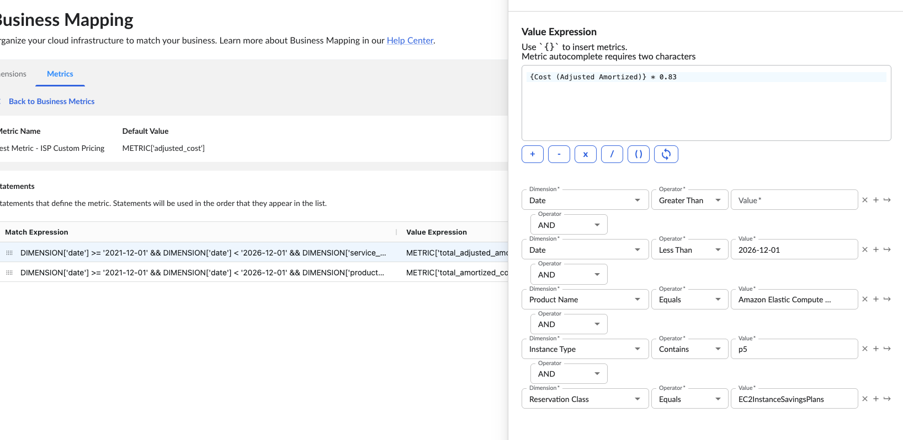

# Métricas empresariales en Cloudability

**Descripción general**

Las métricas empresariales te permiten organizar tu infraestructura en la nube para adaptarla a las necesidades de tu empresa. Estas métricas personalizadas te permiten crear informes significativos que se ajustan a los requisitos financieros y operativos específicos de tu organización.

**¿Qué son las métricas empresariales?**

Las métricas empresariales son cálculos financieros personalizables que puedes definir en Cloudability para realizar un seguimiento de aspectos específicos de tu gasto en la nube. A diferencia de las métricas estándar, las métricas empresariales te permiten:

- Crear fórmulas personalizadas utilizando datos de costes ya existentes
- Aplicar lógica condicional basada en dimensiones como proveedor, servicio o cuenta
- Convertir los datos brutos sobre los costes de la nube en indicadores financieros relevantes para la empresa
- Establecer condiciones específicas sobre cuándo deben aplicarse las métricas

**Creación de una métrica empresarial (mediante la interfaz de usuario de Cloudability )**

Para crear una métrica empresarial, sigue los pasos que se indican a continuación:

1. Accede a la sección «Business Mapping».
2. Selecciona la pestaña «Métricas».
3. Haz clic en el botón «Nueva métrica empresarial».
4. Introduce un nombre significativo para tu métrica.
5. Elige el formato de valor (Moneda o Número).
6. Configura la definición de la métrica utilizando cualquiera de las siguientes opciones:
   - Valor por defecto: un valor simple o una referencia métrica

     Métrica de valor fijo

     Situación: Coste estándar por empleado para la repercusión de gastos

     ```
     Metric Name: "Cost Per Employee" 
     Type: Default Value 
     Value: 150 
     Usage: Allocate $150 per employee per month for cloud infrastructure
     ```

     Referencia métrica

     Calcular el índice de rentabilidad

     ```
     Metric Name: "Cost Efficiency Ratio" 
     Type: Default Value 
     Formula: Total_Cost / Total_Usage_Hours 
     Where: 
     Total_Cost = Sum of all cloud costs 
     Total_Usage_Hours = Sum of instance hours
     ```
   - Expresión previa al partido: condiciones que determinan cuándo se aplica la métrica

     Escenario: Diferentes porcentajes de asignación de costes para distintos entornos

     ```
     Metric Name: "Environment Cost Multiplier"
     Type: Prematch Expression
      
     Prematch Expression 1:
       IF tag:Environment = "Production"
       THEN Multiplier = 1.0
      
     Prematch Expression 2:
       IF tag:Environment = "Staging"
       THEN Multiplier = 0.5
      
     Prematch Expression 3:
       IF tag:Environment = "Development"
       THEN Multiplier = 0.3
      
     Default:
       Multiplier = 0.1
     ```

**Cómo definir la lógica de tus métricas**

Las métricas empresariales utilizan sentencias para definir su comportamiento. Cada declaración consta de:

1. Expresión de coincidencia: condiciones que determinan cuándo se aplica la instrucción
   - Ejemplo: DIMENSION['vendor'] == ' GCP '
   - Ejemplo: DIMENSION['date'] >= '2021-12-01' && DIMENSION['date'] < '2026-12-01'
2. Expresión de valor: el cálculo que se debe realizar cuando se cumplen las condiciones
   - Ejemplo: METRIC['bytes\_transferred']
   - Ejemplo: METRIC['unblended\_cost']
   - Ejemplo: {Cost (Adjusted Amortized)} \* 0.83
3. 

Se pueden crear varias condiciones para una misma métrica, y se evaluarán en el orden en que aparezcan en la lista.

**Uso de métricas empresariales en los informes**

Una vez creadas, tus métricas empresariales se pueden utilizar en los informes igual que cualquier métrica estándar:

1. Crear o editar un informe.
2. Añade tu métrica empresarial personalizada al informe.
3. Combínalo con dimensiones como las asignaciones de « ATUM », el proveedor o el nombre del servicio.

**Casos de uso habituales**

- Normalización de costes: crear métricas que normalicen los costes entre los distintos proveedores de servicios en la nube
- Precios internos: Implementar modelos de precios personalizados para la facturación interna
- Seguimiento presupuestario: Realiza un seguimiento de los gastos en relación con los presupuestos predefinidos
- Cálculos de ahorro: Calcular el ahorro real o potencial derivado de las medidas de optimización
- Amortización personalizada: define tus propias reglas de amortización para las instancias reservadas o los planes de ahorro
- Economía por unidad: Calcula el coste por usuario o por transacción para comprender mejor tu modelo económico

**Funciones avanzadas**

- Utiliza los operadores matemáticos (+, -, \*, /) para crear fórmulas complejas
- Haz referencia a las métricas existentes utilizando la sintaxis {}
- Aplica la lógica condicional utilizando los operadores && (Y) y || (O)
- Filtrar según valores específicos de dimensiones como proveedor, nombre del servicio o región

**¿Cómo funcionan las métricas empresariales con las correspondencias empresariales?**

Las métricas empresariales se elaboran a partir de declaraciones de mapeo empresarial que combinan datos de facturación existentes con datos facilitados por los clientes. Los usuarios pueden crear métricas personalizadas relacionadas con conceptos de facturación en la nube, que se completan con los valores específicos derivados de la lógica que mejor se adapte a sus necesidades de generación de informes en el contexto de sus empresas.

**Evaluado en el momento de la ingestión**

Cuando Cloudability recopila los datos detallados de facturación de los proveedores de servicios en la nube, evaluamos cada partida de coste comparándola con las declaraciones de «Business Mapping» correspondientes a las métricas empresariales que hayas configurado. Aquellos de vosotros que tengáis conocimientos de programación podéis considerar que la lista de sentencias es similar a una sentencia «case». En cuanto se produce una coincidencia, se evalúa el nombre de la propia instrucción y se calcula aritméticamente el valor resultante, que se utiliza para completar la métrica empresarial correspondiente a ese elemento. Este nombre de métrica personalizada puede ser simplemente una cadena de caracteres significativa que tú mismo introduzcas. Cuando los proveedores de servicios en la nube publiquen nuevos datos de facturación, detectaremos automáticamente cualquier cambio o añadido que realices en tus extractos de Business Mapping. Para que los meses históricos reflejen las normas actualizadas, puedes ponerte en contacto con el servicio de atención al cliente o con tu gestor de cuentas (TAM) para que se lleve a cabo esta acción.

**El nombre de la métrica personalizada**

Cada métrica empresarial que crees debe tener un nombre. Reflexiona detenidamente sobre el contexto empresarial que quieres transmitir y elige un nombre que la gente pueda entender rápidamente. Estás asignando un nombre a la métrica personalizada tal y como aparecerá en los informes y paneles de control de Cloudability.

**El formato de métricas personalizado**

Además del nombre, debes decidir si esta métrica personalizada mostrará los datos en formato monetario o como un número normal. El caso de uso que motiva esta métrica personalizada te ayudará a decidir cuál es el formato adecuado.

Por ejemplo: si tu caso de uso consiste en aplicar un recargo por gastos de gestión, el formato de la métrica personalizada será «moneda».

**El valor por defecto**

Una vez que hayas elegido un nombre y un formato, debes establecer un valor por defecto. Este es el valor que heredará la métrica empresarial si ninguna de las condiciones que declares coincide.

Por ejemplo: una opción sería utilizar el importe del coste que ya figura en los datos de facturación. A medida que vayas creando tus métricas empresariales, cada caso de uso te ayudará a determinar un buen valor por defecto.

**Se trata de encontrar coincidencias con las afirmaciones**

Cada instrucción tiene dos componentes:

Una expresión que indica con qué se debe realizar la búsqueda. Esta expresión puede incluir lógica booleana compleja, un intervalo de tiempo y cuenta con una lista muy completa de operadores que pueden aplicarse a todos los atributos importantes de las partidas de coste.

Una expresión que, al evaluarse, da como resultado el valor de la métrica empresarial si se cumple el criterio indicado en el punto 1.

A continuación se muestra un ejemplo sencillo:

```
"statements": [{
	"matchExpression": "DIMENSION['vendor'] == 'Amazon'
		|| DIMENSION['vendor'] == 'Azure' ",
	"valueExpression": "METRIC['unblended_cost'] * 1.15"
}]
```

**¿Por qué utilizas indicadores empresariales?**

**Casos de uso**

Business Metrics puede ayudarte a abordar diversos casos de uso en los que, además de las métricas nativas de Cloudability, es posible que necesites métricas personalizadas para satisfacer los requisitos de generación de informes de tu empresa. A continuación se muestran algunos ejemplos de los casos de uso más habituales entre los clientes:

|  |  |
| --- | --- |
| Economía unitaria | También conocido como «coste por X». Un cliente puede contextualizar su gasto en la nube como un coste unitario en una única métrica dentro de la aplicación. Por ejemplo: coste por viaje, coste por usuario activo, coste por suscripción, etc. |
| Coste basado en indicadores clave de rendimiento (KPI) | Coste en el contexto de un indicador clave de rendimiento (KPI) específico de la empresa. Por ejemplo, un cliente puede contextualizar el coste en términos de ingenieros a tiempo completo (coste en ETC) para comprender su gasto en la nube en función del número de ingenieros de DevOps necesarios para dar soporte a una aplicación desplegada. |
| Recargo/Margen de beneficio | Se puede incorporar un recargo o un margen de beneficio al gasto en la nube y mostrar los costes, incluidos los honorarios de gestión, los costes de licencia u otros recargos, mediante una única métrica integrada en la aplicación. |

El motor de reglas que controla esta función cuenta con sofisticadas capacidades lógicas, y las reglas individuales pueden basarse prácticamente en todos los atributos importantes que los proveedores facilitan junto con los datos de facturación y consumo. Entre estos atributos se incluyen dimensiones y métricas proporcionadas por los proveedores, como las etiquetas de coste y los nombres de las cuentas, así como el «coste sin ajustar» (Unblended Cost); pero también se incluyen dimensiones y métricas mejoradas proporcionadas por Cloudability, como «familia de uso», «tipo de arrendamiento» y «coste ajustado».

**Creación de una métrica empresarial (mediante la API de Cloudability )**

Las métricas empresariales se pueden crear mediante la API, utilizando el lenguaje de expresiones de Business Mapping. Las reglas se definen mediante expresiones y sentencias en formato JSON que se evalúan aritméticamente, lo que da como resultado una métrica personalizada y el valor correspondiente.

**Trabajar con métricas empresariales**

Desde el «[Punto final de Business Mappings](../api-v3/business_mappings_endpoint.html) » puedes consultar una descripción general de las funciones, incluidos los puntos finales de Business Metrics con sus correspondientes descripciones y ejemplos, que te permitirán trabajar con Business Metrics. Además, encontrarás plantillas que te servirán para ponerte en marcha con la configuración de tus métricas personalizadas, así como otros recursos útiles.

Puedes configurar un máximo de cinco métricas empresariales.

A continuación se incluyen referencias rápidas y ejemplos sobre (i) cómo mostrar una métrica empresarial que ya hayas creado, (ii) cómo crear una nueva métrica empresarial y (iii) cómo actualizar una métrica empresarial existente.

**Métricas de cotización empresarial**

```
 curl -X GET 'https://api.cloudability.com/v3/business-mappings/metrics/' -u '[auth_token]:'
```

**Crear una métrica empresarial**

```
 curl -X POST 'https://api.cloudability.com/v3/internal/business-mappings/metrics/' \
  -H 'Content-Type: application/json' \
  -u '[auth_token]:' \
  -d @- >> EOF
{
  "name": "Cost (Surcharge)",
  "numberFormat": "number",
  "defaultValueExpression": "METRIC['unblended_cost']",
  "statements": [
    {
      "matchExpression": "DIMENSION['vendor'] == 'Amazon' || DIMENSION['vendor'] == 'Azure' ",
      "valueExpression": "METRIC['unblended_cost'] * 1.15"
    }
  ]
}
EOF
```

**Resultado esperado**

```
{
  "result": {
    "name": "Cost (Surcharge)",
    "index": 1,
    "kind": "BUSINESS_METRIC",
    "defaultValue": "METRIC['unblended_cost']",
    "numberFormat": "number",
    "updatedAt": "2025-11-12T07:29:27.182Z",
    "statements": [
      {
        "matchExpression": "DIMENSION['vendor'] == 'Amazon' || DIMENSION['vendor'] == 'Azure' ",
        "valueExpression": "METRIC['unblended_cost'] * 1.15"
      }
    ]
  }
}
```

**Actualizar una métrica empresarial**

```
curl -X PUT 'https://api.cloudability.com/v3/internal/business-mappings/1/metrics/' \
  -H 'Content-Type: application/json' \
  -u '[auth_token]:' \
  -d @- >> EOF
{
  "name": "Cost (Surcharge)",
  "numberFormat": "number",
  "defaultValueExpression": "METRIC['unblended_cost']",
  "statements": [
    {
      "matchExpression": "DIMENSION['vendor'] == 'Amazon' || DIMENSION['vendor'] == 'Azure' ",
      "valueExpression": "METRIC['unblended_cost'] * 1.25"
    }
  ]
}
EOF
```

**Resultado esperado**

```
 {
  "result": {
    "name": "Cost (Surcharge)",
    "index": 1,
    "kind": "BUSINESS_METRIC",
    "defaultValue": "METRIC['unblended_cost']",
    "numberFormat": "number",
    "updatedAt": "2025-11-12T07:32:16.858Z",
    "statements": [
      {
        "matchExpression": "DIMENSION['vendor'] == 'Amazon' || DIMENSION['vendor'] == 'Azure' ",
        "valueExpression": "METRIC['unblended_cost'] * 1.25"
      }
    ]
  }
}
```

**Operadores**

Con el lenguaje de expresiones de Business Mappings, dispondrás de una amplia gama de operadores para comprobar la lógica de tus sentencias. Algunos ejemplos de operadores que puedes utilizar son el de «mayor que», que puede resultar útil para comparar elementos como fechas. Elige un operador que haga que tu expresión sea lo más sencilla posible. Al utilizar nuestra API, dispondrás de opciones adicionales, entre las que se incluyen las expresiones regulares.

Por ejemplo, establecer un intervalo de tiempo para el valor de una métrica empresarial entre dos fechas:

```
 {
  "name": "Cost (Surcharge)",
  "numberFormat": "number",
  "defaultValueExpression": "METRIC['unblended_cost']",
  "statements": [
    {
      "matchExpression": "DIMENSION['date'] >= '2019-01-01T00:00' && DIMENSION['date'] <= '2019-01-31T23:59'",
      "valueExpression": "METRIC['unblended_cost'] * 1.25"
    }
  ]
}
```

**Lógica booleana**

Dentro de una instrucción individual, puedes agrupar expresiones mediante operadores «OR» y combinarlas con operadores «AND» para obtener el resultado lógico exacto que se ajuste a tus reglas de negocio.

A continuación se muestra un ejemplo muy sencillo:

```
{
  "name": "Cost (in FTEs)",
  "numberFormat": "number",
  "defaultValueExpression": "METRIC['unblended_cost']",
  "statements": [
    {
      "matchExpression": "DIMENSION['date'] >= '2019-01-01T00:00:00' && DIMENSION['date'] <= '2019-01-31T23:59:59' && (DIMENSION['transaction_type'] == 'usage' || DIMENSION['transaction_type'] == 'recurring')",
      "valueExpression": "METRIC['unblended_cost']  / 115000"
    }
  ]
}
```

Si necesitas más ayuda sobre cómo utilizar Business Metrics de forma eficaz, ponte en contacto con tu representante de cuenta o envía una solicitud de asistencia.

**Tema principal:** [Cartografía empresarial](../admin/business-tags.html)
