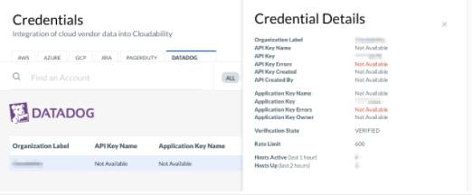
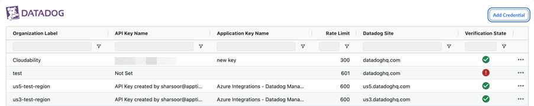
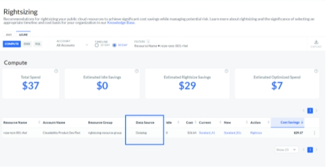

# Conectarse a Datadog - Datos de utilización

Si utiliza Datadog para supervisar sus recursos, puede aprovechar la integración de Cloudability con Datadog para ayudarle a reducir el gasto innecesario optimizando el uso de sus recursos. Cloudability Compatible con [Datadog múltiples cuentas organizativas](https://docs.datadoghq.com/account_management/multi_organization/ "(se abre en una pestaña o una ventana nueva)").

Cloudability utiliza sus credenciales de Datadog para recopilar métricas de utilización y generar recomendaciones precisas de redimensionamiento para los siguientes tipos de recursos de computación en la nube en todas sus cuentas organizativas de Datadog :

- AWS EC2
- Azure Compute
- GCP CEG

Además, admitimos las siguientes capacidades de Datadog :

[Residencia de datos en la Unión Europea ( datadoghq.eu )](https://www.datadoghq.com/about/latest-news/press-releases/eu-region-germany/ "(se abre en una pestaña o una ventana nueva)")

[Datadog varias cuentas organizativas](https://docs.datadoghq.com/account_management/multi_organization/ "(se abre en una pestaña o una ventana nueva)")

El uso de un producto de supervisión del rendimiento de las aplicaciones (APM), como Datadog, facilita la generación y recopilación de las métricas de utilización de recursos necesarias (como las métricas de memoria de invitado, que pueden ser difíciles de instrumentar a gran escala) para obtener una imagen precisa de cómo se está utilizando el recurso, lo que permite realizar una recomendación precisa sobre el dimensionamiento adecuado. Más información sobre Datadog y su oferta de productos [aquí](https://www.datadoghq.com/ "(se abre en una pestaña o una ventana nueva)").

Nota: La integración utilizará la clave API y la clave de nombre de aplicación para autenticar la cuenta de los clientes de Cloudability Premium.

Beneficios

- Recomendaciones mejoradas: los datos de utilización proporcionados por Datadog ofrecen una mayor precisión, ya que el muestreo métrico se realiza con mayor frecuencia en comparación con el proveedor nativo. Como resultado, podemos aprovechar esta mayor precisión para descubrir un 15-20% adicional de oportunidades de ahorro de costes con respecto a las métricas predeterminadas de la plataforma.
- Mayor cobertura: al completar la integración de Datadog Azure, se beneficiará de una cobertura más sencilla y ampliada de los recursos de máquinas virtuales, recibiendo recomendaciones de redimensionamiento y las correspondientes oportunidades de ahorro de costes.

Antes de empezar

Claves API y de aplicación

Para integrar tu cuenta de Datadog con la plataforma Cloudability, necesitas lo siguiente:

- Datadog Clave API
- Clave de aplicación

Si tienes varias organizaciones de Datadog, debes crear una clave API y una clave de aplicación por cada organización. Cloudability Solo se necesita una clave API y una clave de aplicación por cada cuenta organizativa de Datadog

Nota: Datadog dispone de tres tipos de claves de aplicación que determinan el nivel de acceso:

- Administrador
- Standard
- Sólo lectura

Cloudability admite los tres tipos, pero las claves de sólo lectura tienen las siguientes limitaciones:

- Las claves de sólo lectura impiden que Cloudability obtenga metadatos, como el nombre de la clave, para las claves.
- Las claves de sólo lectura impiden que Cloudability pueda realizar la desduplicación. Por ejemplo, en el caso de que un usuario añada varias claves de solo lectura desde la misma cuenta organizativa Datadog, solo necesitamos una única API y clave de aplicación por cuenta, pero no podemos eliminar duplicados, ya que las claves de solo lectura no nos proporcionan acceso a los datos necesarios para realizar esa comprobación. En otras palabras, Cloudability no sabe que estas credenciales de solo lectura pertenecen a la misma cuenta.

Si añade una clave de aplicación de sólo lectura a sus credenciales de Cloudability, los metadatos como el nombre y el propietario de la clave se muestran como No disponible.

Pasos para la integración

Recomendamos degradar el Usuario Administrador a Usuario de Sólo Lectura para los propósitos de esta integración, para seguir las mejores prácticas de seguridad y privacidad de la información.

Si ya es Administrador y necesita ser el responsable de esta integración, invítese a sí mismo como nuevo usuario utilizando una dirección de correo electrónico diferente a la que tiene actualmente configurada como Usuario Administrador y cree las claves. A continuación, pase a ser un usuario de sólo lectura.

Crea nuevas claves en Datadog

En la consola de Datadog :

1. Invite a un nuevo miembro como usuario administrador de la integración.

   Consulte la [sección Roles de usuario y permisos de Datadog](https://docs.datadoghq.com/account_management/users/ "(se abre en una pestaña o una ventana nueva)") para obtener más información.
2. Inicie sesión como usuario administrador recién creado.
3. Vaya a Integraciones > APIs > Nueva clave API.
4. Cree una nueva clave API.
5. Vaya a la sección Nueva clave de aplicación y cree una nueva clave de aplicación.

Añade tus claves Datadog a Cloudability

Repita los siguientes pasos para todas sus cuentas organizativas de Datadog.

1. En Cloudability, vaya a Configuración > Credenciales del proveedor > Añadir fuente de datos > Datadog. Se abre el panel Añadir cuenta de Datadog.

   O

   En Cloudability, vaya a Configuración > Credenciales de proveedor > Datadog. Seleccione Añadir una credencial. Se abre el panel Añadir una credencial.
2. Seleccione la Datadog pestaña.
3. Seleccione «Sí, estoy listo » para confirmar que tiene sus claves de Datadog.
4. Copie y pegue la nueva clave API y la clave de aplicación en el campo correspondiente.
5. Introduzca su límite de API en Límite de tarifa.

   Nota: Esta integración requerirá unas 300 solicitudes de API por hora, ya que Cloudability necesita recopilar los datos de un mes en un plazo de 24 horas. El límite predeterminado establecido por Datadog es de 300 solicitudes API por hora por organización.

   Si utiliza la API Datadog para otros fines, le recomendamos encarecidamente que se ponga en contacto con el servicio de asistencia de Datadog para solicitar un aumento del número de solicitudes de API que puede realizar.

   En general, recomendamos aumentarlo a entre 600 y 900 peticiones API por hora y organización. Se trata de una solicitud sencilla y gratuita que debe enviarse a Datadog. Puede hacer referencia a Cloudability en su solicitud.

   Cloudability Enumera todas tus credenciales de Datadog en la misma página:

Cloudability Integración con Datadog para Azure Compute

Una vez que haya completado los pasos de integración anteriores, complete la [integración de la suscripción Datadog](https://docs.datadoghq.com/integrations/azure/?tab=azurecliv20#setup "(se abre en una pestaña o una ventana nueva)") para cada suscripción que contenga máquinas virtuales. Este procedimiento incluye la instalación del agente Datadog en cada máquina virtual.

Cloudability Integración con Datadog para GCP GCE ( Google Compute Engine )

Para obtener más información sobre la configuración e instalación de Datadog en Google Cloud Platform, consulta [https://docs.datadoghq.com/integrations/google\_cloud\_platform/#setup](https://docs.datadoghq.com/integrations/google_cloud_platform/#setup "(se abre en una pestaña o una ventana nueva)")

Cómo confirmar el éxito

En un plazo de 24 horas tras completar la integración de Datadog Azure, verá recomendaciones de ajuste de tamaño basadas en métricas de utilización de Datadog. La columna Fuente de datos mostrará ahora Datadog si la recomendación se basó en datos de utilización de Datadog.

- **[Conectarse a Datadog - Datos sobre costes y uso](../admin/connect-datadog-cost-usage_data.html)**
