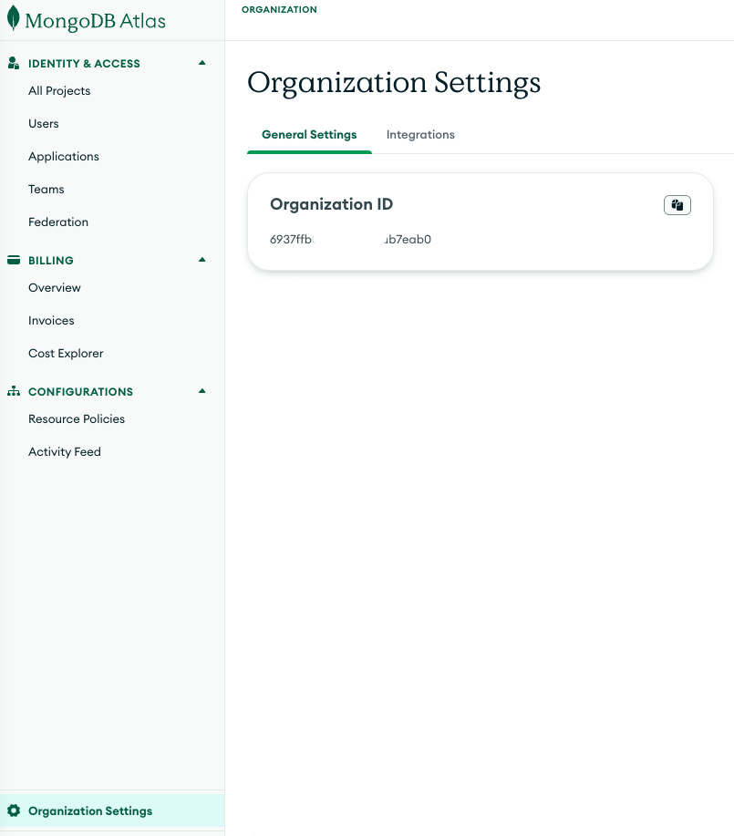
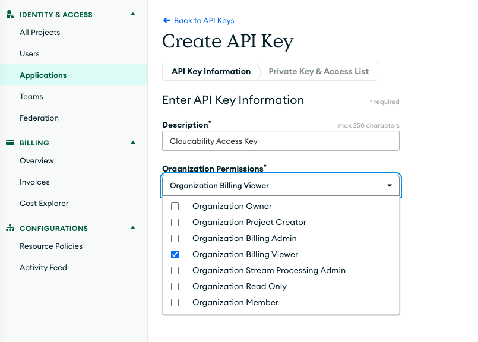
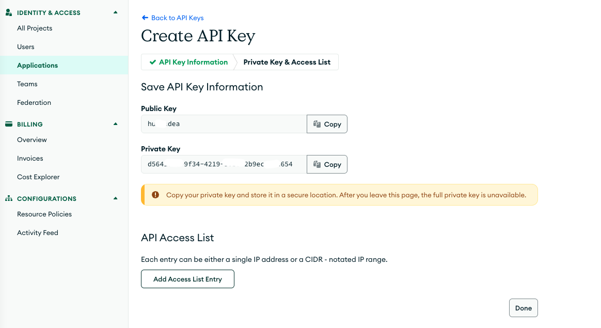
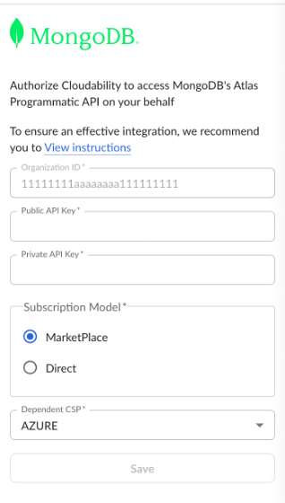

# Conectar MongoDB

**Visión general**

Esta guía te explica paso a paso cómo conectar tu **MongoDB** a IBM Cloudability. Una vez conectado, tendrás acceso a los datos de costes y consumo de « MongoDB » en Cloudability.

**Requisitos previos**

- Debes ser administrador de « Cloudability ».
- Debes tener permisos de administrador en la consola de MongoDB Atlas.

Nota: Si has adquirido « MongoDB » a través del mercado de un proveedor de servicios en la nube y añades datos de costes y uso de « MongoDB » con esta integración, verás que los costes aparecen dos veces en los informes de « Cloudability ». Por ejemplo, si has comprado « MongoDB » a través de la tienda de AWS, verás lo siguiente:

- La partida de alto nivel correspondiente a « AWS »
- Las partidas con costes detallados de MongoDB, en las que aparece « AWS Marketplace» como vendedor.

Si quieres ocultar los costes de tu mercado, configura un filtro.

Los costes del Marketplace no se incluyen en la factura.

MongoDB El proceso de acreditación de cuentas consta de varios pasos que requerirán que realices acciones tanto en la consola de MongoDB como en Cloudability en distintas fases.

Durante este proceso, Cloudability utilizará tu MongoDB OrganizationID para conectarse a tu cuenta y obtener los datos de costes y uso.

**Paso 1 – Consola de « MongoDB »**

**Consigue tu ID de organización**

1. Accede a la consola de MongoDB Atlas.
2. Haz clic en el perfil de usuario y, a continuación, en «Organizaciones».
3. Haz clic en el **nombre de la organización**
4. Haz clic en el icono con forma de rueda dentada que hay junto a «Configuración de **la organización** ».
5. Copia el ID de tu organización y guárdalo para utilizarlo más adelante.

   

**Crear una clave API de la organización**

1. Accede a la página «Access Manager» en la consola de MongoDB Atlas.
2. Haz clic en «Aplicaciones» y selecciona la pestaña «API»
3. Haz clic en «**Crear clave API** ».
4. Introduce los datos **de la clave API**.
   - En el cuadro **«Descripción»**, introduce una descripción (por ejemplo, « Cloudability Access»).
   - En el menú «**Permisos de la organización** », selecciona el rol «**Visor de facturación de la organización** ».
5. Haz clic en «**Siguiente** ».
6. Copia las claves pública y privada

   

   

**Paso 2 – Cloudability**

1. Abre Cloudability en una nueva pestaña o ventana.
2. En « Cloudability », ve a **«Configuración»** > «**Credenciales de proveedor** ».
3. En la sección **«Ingress»**, selecciona el mosaico « **MongoDB** ». Se abre el panel «**Añadir una cuenta de MongoDB** ».
4. Lee la información que se muestra y pulsa el botón **«Siguiente»** cuando estés listo para continuar.
5. Pega el ID de organización que has copiado en el campo «**ID de organización** ».
6. Pega la **clave pública** y **la clave privada** en sus respectivos campos.
7. En el campo «**Modelo de suscripción** », selecciona si tu organización utiliza un **Marketplace** o realiza la compra **directamente** en MongoDB.
8. Haz clic en el botón «**Guardar** ».
9. Haz clic en «Verificar credenciales».

Una notificación verde indica que la credencial se ha verificado correctamente.

Nota: Una vez que te hayas conectado a MongoDB,, los datos iniciales sobre costes y consumo tardarán hasta 24 horas en aparecer en Cloudability.

De forma predeterminada, MongoDB restringe el acceso a la API mediante la lista de acceso por IP de la API de administración de Atlas. Si esta opción no está desactivada en tu organización, utiliza los siguientes rangos de IP para permitir que MongoDB acceda a Cloudability :

- **185.115.88.0/22**
- **103.195.128.0/22**
- **129.41.0.0/22**

Para obtener más información sobre cómo incluir direcciones IP en la lista blanca, ponte en contacto con los equipos de asistencia de IBM.

**Preguntas más frecuentes**

- **¿Qué versión de MongoDB es compatible con Cloudability?**
  - MongoDB Atlas
- **¿Cuándo debo optar por Marketplace y cuándo por la suscripción?**
  - Si has comprado « MongoDB » en una **plataforma de venta** como AWS o Azure, utiliza esta opción
  - Si has comprado « MongoDB **» directamente** en MongoDB, selecciona «Directo»
