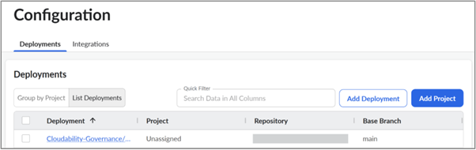

# Configuraciones de implantación

Nota: Un despliegue es una unidad gestionada por Terraform, que normalmente está vinculada a un servicio, entorno y región específicos. Representa una única unidad de cambio versionada aplicada al entorno de la infraestructura. **Un despliegue corresponde a un espacio de trabajo en HCP Terraform**.

***Por ejemplo:*** *Un equipo posee un ServiceA y lo despliega en varios entornos como (beta, staging, producción) entonces pueden configurar despliegues en Governance para ServiceA-beta, ServiceA-staging, ServiceA-production.*

Las implantaciones se generan automáticamente y se enumeran en la página de configuración de gobernanza cuando:

- Una acción GitHub se invoca desde flujos de trabajo CI/CD, o bien
- Una vez finalizada la configuración, se activa una tarea de ejecución en HCP Terraform.

No es necesario añadir despliegues manualmente en la interfaz de usuario de configuración de Cloudability Governance. Recomendamos agrupar estos "Despliegues" en "Proyectos" para facilitar la aplicación de las políticas. los "proyectos" representan mecanismos de agrupación específicos de Cloudability Governance.

A continuación se muestran los campos asociados para cada una de sus implantaciones (recuperados automáticamente - excepto para "Proyecto"):

- **IaC Proveedor** : Terraform o Terragrunt
- **Nombre de la implantación:** Nombre dado al despliegue para identificarlo (debe ser único entre todos sus despliegues)
- **Proyecto:** Mecanismo de agrupación específico para Cloudability Gobernanza
- **GitHub Repositorio:** Repositorio donde se encuentra el código de la infraestructura
- **Rama base:** Rama supervisada por Gobernanza y es el objetivo de las fusiones pull request. Normalmente representa su rama principal o maestra y sirve como punto de referencia para detectar cambios en los costes de infraestructura.

**Tema principal:** [Configuración Cloudability Governance](../admin/governance-setup-cldy-governance.html)
