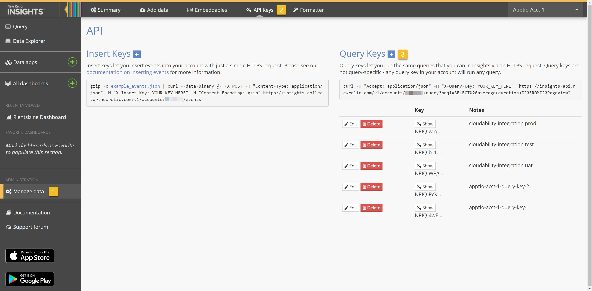
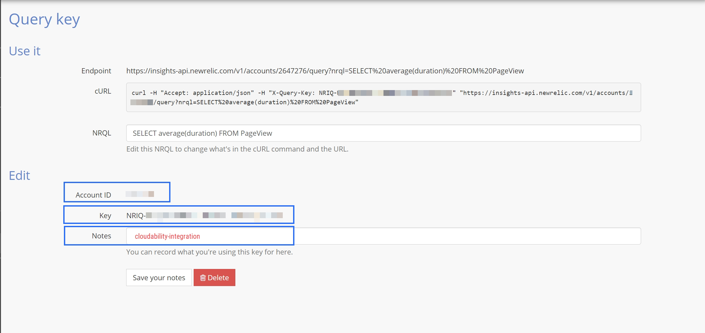
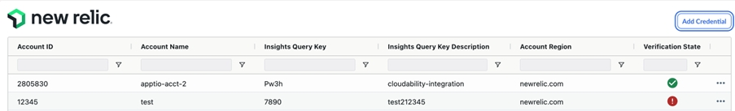
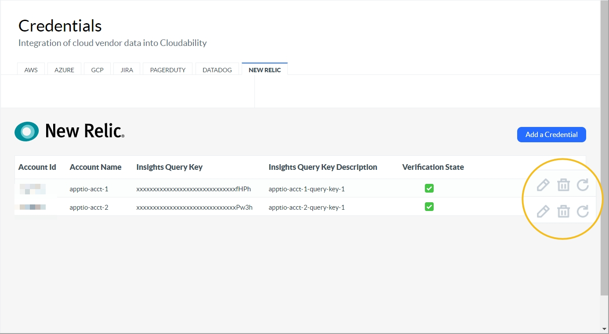
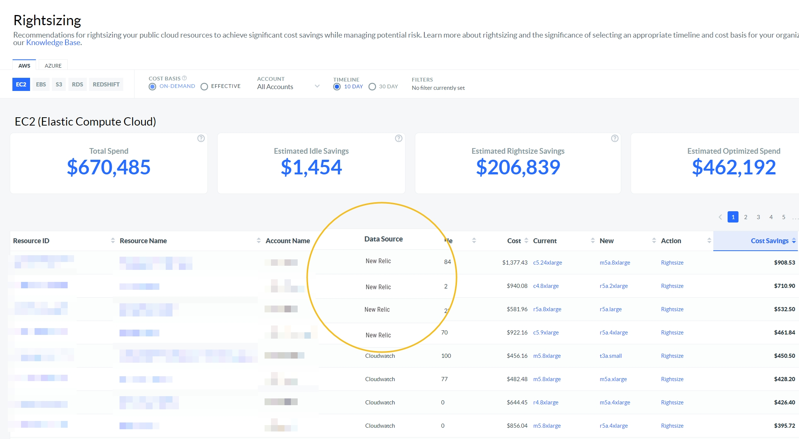
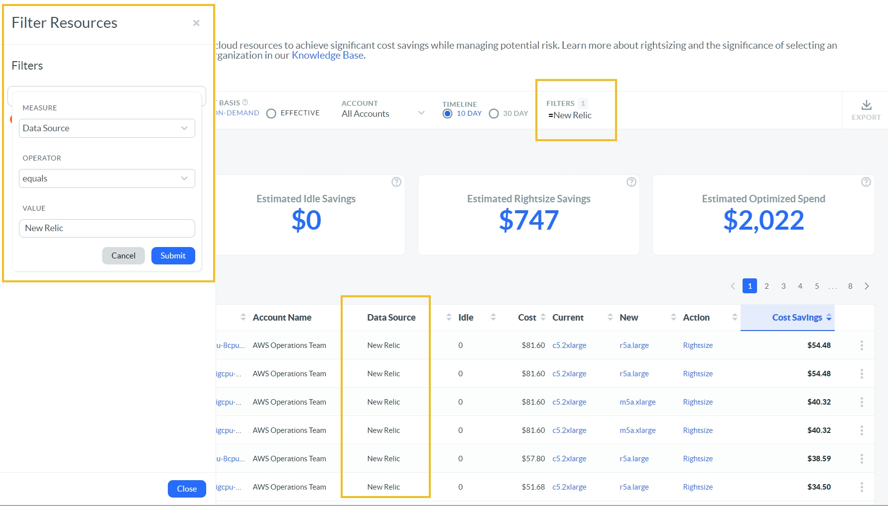

# Conectarse New Relic

New Relic es una popular plataforma de gestión del rendimiento de las aplicaciones (APM). Esta integración permite a los clientes de Apptio Cloudability aprovechar New Relic como su proveedor preferido de datos de utilización, lo que se traduce en mejores recomendaciones de dimensionamiento para las máquinas virtuales de Amazon EC2, GCP GCE y Azure Compute. Esta integración también admite [varias cuentas](https://docs.newrelic.com/docs/accounts/install-new-relic/account-setup/manage-apps-or-users-sub-accounts "(se abre en una pestaña o una ventana nueva)").

En comparación con los proveedores de datos de utilización nativos, New Relic proporciona métricas de rendimiento de la plataforma más precisas (CPU, red, disco) y acceso a métricas de memoria del sistema operativo invitado. Con esta fuente de datos de mayor precisión, el motor de redimensionamiento ofrece recomendaciones más informadas, proporcionando hasta un 15 por ciento de ahorro adicional, además de las oportunidades de ahorro existentes, reduciendo aún más su gasto en nube.

Antes de empezar

Para habilitar correctamente la integración de New Relic con Cloudability, es necesario seguir los siguientes pasos:

- **Máquinas virtuales**

Cada recurso de máquina virtual debe tener instalado el agente de infraestructura de New Relic. Las instrucciones varían según el sistema operativo; actualmente, se admiten Linux y Windows.

[Linux](https://docs.newrelic.com/docs/infrastructure/install-infrastructure-agent/linux-installation/install-infrastructure-agent-linux-using-package-manager "(se abre en una pestaña o una ventana nueva)")

[Windows](https://docs.newrelic.com/docs/infrastructure/install-infrastructure-agent/windows-installation/install-infrastructure-agent-windows-server-using-msi-installer "(se abre en una pestaña o una ventana nueva)")

- New Relic Cuentas

Para cada cuenta de New Relic, debe proporcionar un ID de cuenta y una clave de consulta de Insights. Cloudability utiliza estas credenciales de solo lectura para recuperar las métricas de rendimiento de los recursos de máquinas virtuales asociados a través de la [API de Insights](https://docs.newrelic.com/docs/insights/insights-api/get-data/query-insights-event-data-api "(se abre en una pestaña o una ventana nueva)").

Véase más abajo

[Obtener las credenciales de la cuenta](#obtainin "(se abre en una pestaña o una ventana nueva)")

[Introducción de las credenciales de New Relic](#entering "(se abre en una pestaña o una ventana nueva)")

Pasos para la integración

- Habilitar la integración de Azure

Además del agente New Relic, también se requieren integraciones Azure para máquinas virtuales Azure Compute. Proporciona los datos necesarios a nivel de recursos, como la suscripción y el identificador de inquilino, para obtener identificadores de recursos inequívocos.

[Habilitar la integración de Azure](https://docs.newrelic.com/docs/integrations/microsoft-azure-integrations/getting-started/activate-azure-integrations "(se abre en una pestaña o una ventana nueva)")

- **Obtención de credenciales de cuenta**

Para gestionar u obtener las credenciales de su cuenta New Relic :

1. Vaya a [insights.newrelic.com](https://docs.newrelic.com/docs/integrations/microsoft-azure-integrations/getting-started/activate-azure-integrations "(se abre en una pestaña o una ventana nueva)") y cambie a la cuenta deseada
2. En el menú de la izquierda, haga clic en **Gestionar datos**
3. En el menú superior, haga clic en **Claves API**
4. Para crear una nueva clave, haga clic en **Claves de consulta [+]**
5. Para ver o editar una clave existente, haga clic en el botón **Editar** correspondiente. 

La siguiente pantalla permite al cliente crear o editar las Notas asociadas a una clave Insights Query.

Desde esta pantalla, el cliente puede obtener lo siguiente:

- Id. de cuenta (un número de siete o más dígitos)
- Insights Query Key (la clave empieza por NRIQ-)

  Nota: Te recomendamos que asignes a esta clave de consulta el nombre «cloudability-integration» con fines de seguimiento y auditoría.

  

Introducción de las credenciales de New Relic

Para integrar las nuevas credenciales de reliquia en Cloudability :

1. En Cloudability, vaya a Configuración > Credenciales del proveedor > Añadir fuente de datos > New Relic. Se abre el panel Añadir cuenta de New Relic.

   O

   En Cloudability, vaya a Configuración > Credenciales del proveedor > New Relic. Seleccione Añadir una credencial. Se abre el panel Añadir una credencial.
2. Introduzca las credenciales de New Relic.
3. Selecciona «Guardar ».

Cómo confirmar el éxito

Una vez validadas las credenciales, el cliente puede modificarlas, eliminarlas o actualizarlas.

- Para modificar una credencial, seleccione Editar
- Para eliminar una credencial, seleccione Eliminar
- Para validar una credencial, seleccione Actualizar.

Uso del redimensionamiento

Una vez completada la configuración, el cliente puede consultar las recomendaciones de ajuste de tamaño en la columna «Fuente de datos ». 

Filtrar u ordenar por fuente de datos

El cliente puede filtrar u ordenar la lista de recomendaciones por el proveedor de la fuente de datos de utilización.

- Para ordenar, haga clic en el encabezado de la columna **Fuente de datos** y la lista se ordenará por este valor.
- Para filtrar, haga clic en el valor Fuente de datos para limitar las recomendaciones a este valor, o haga clic en el menú Filtros y seleccione **Medida = Fuente de datos**, **Operador = igual** a y **Valor = New Relic**.
- Para borrar el filtro, haz clic en el menú **Filtro** y, a continuación, elimina la condición haciendo clic en el icono «x».

GCP Integración

Para obtener más información sobre cómo conectar los servicios de Google Cloud Platform a New Relic, consulta [https://docs.newrelic.com/docs/infrastructure/google-cloud-platform-integrations/get-started/connect-google-cloud-platform-services-new-relic/](https://docs.newrelic.com/docs/infrastructure/google-cloud-platform-integrations/get-started/connect-google-cloud-platform-services-new-relic/ "(se abre en una pestaña o una ventana nueva)")

Actualización para los clientes actuales de Cloudability a Cloudability Premium

Tras actualizar a Cloudability Premium, el estado de verificación de cada cuenta de New Relic en la página de listado no cambiará con esta versión. Sin embargo, el administrador de Cloudability debe editar cada cuenta siguiendo los pasos que permiten a Cloudability compartir estas cuentas con Turbonomic.

1. Haga clic en Editar en la cuenta de New Relic.
2. Introduzca un valor de campo adicional para Clave de usuario y haga clic en Guardar.

Tras la validación y verificación, Cloudability comparte la cuenta con Turbonomic.
