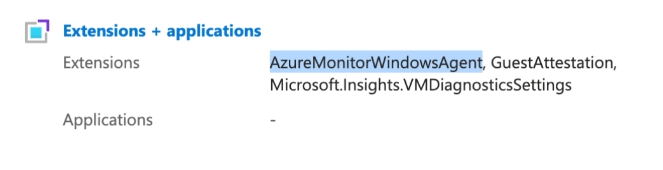

# Configurar la recopilación de métricas de memori Azure

Azure Monitor Agent recopila datos de supervisión de las máquinas virtuales de Azure y los envía a Azure Monitor.

## Acerca de esta tarea

Hay dos tipos de métricas disponibles en el monitor de « Azure »:

- **Métricas estándar** : porcentaje de uso de la CPU, lecturas/escrituras en disco, rendimiento de red
- **Métricas del sistema operativo invitado** : utilización de memoria

Para obtener más información sobre las métricas de « Azure » Monitor, consulta «[Métricas compatibles con « Azure » Monitor](https://learn.microsoft.com/en-us/azure/azure-monitor/reference/metrics-index "(se abre en una pestaña o una ventana nueva)") ».

## Procedimiento

1. Instalar el agente de monitorizació Azure
   1. Linux Instalación

      **Uso de Azure PowerShell:**

      ```
      Set-AzVMExtension -Name AzureMonitorLinuxAgent -ExtensionType AzureMonitorLinuxAgent -Publisher Microsoft.Azure.Monitor -ResourceGroupName <resource-group-name> -VMName <virtual-machine-name> -Location <location> -TypeHandlerVersion <version-number> -EnableAutomaticUpgrade $true
      ```

      **Uso de la CLI de Azure :**

      ```
      az vm extension set --name AzureMonitorLinuxAgent --publisher Microsoft.Azure.Monitor --ids <vm-resource-id> --enable-auto-upgrade true
      ```

      Para obtener más información, consulta « [Azure](https://learn.microsoft.com/en-us/azure/azure-monitor/agents/azure-monitor-agent-manage?tabs=azure-portal "(se abre en una pestaña o una ventana nueva)") : Gestión de agentes de monitorización».
   2. Instalación de Windows

      **Uso de Azure PowerShell:**

      ```
      Set-AzVMExtension -Name AzureMonitorWindowsAgent -ExtensionType AzureMonitorWindowsAgent -Publisher Microsoft.Azure.Monitor -ResourceGroupName <resource-group-name> -VMName <virtual-machine-name> -Location <location> -TypeHandlerVersion <version-number> -EnableAutomaticUpgrade $true
      ```

      **Uso de la CLI de Azure :**

      ```
      az vm extension set --name AzureMonitorWindowsAgent --publisher Microsoft.Azure.Monitor --ids <vm-resource-id> --enable-auto-upgrade true
      ```

      Nota: Para comprobar que la instalación del agente se ha realizado correctamente, consulta la sección de extensiones de tu máquina virtual.

      
2. Enviar métricas del sistema operativo invitado con el agente de monitorizació Azure

   Azure Monitor Agent permite enviar métricas del sistema operativo invitado directamente a un monitor de Azure. Sigue los pasos que se indican a continuación para configurar la recopilación de datos.

   **Referencia:** [Normas de recopilación de datos para el agente de monitorización de Azure](https://learn.microsoft.com/en-us/azure/azure-monitor/agents/data-collection-rule-azure-monitor-agent?tabs=portal "(se abre en una pestaña o una ventana nueva)")

   1. Crear una regla de recopilación de datos

      1. En el menú **«Monitor»**, selecciona «**Reglas de recopilación de datos** ».
      2. Selecciona **«Crear»** para crear una nueva regla de recopilación de datos y sus asociaciones.
      3. Introduce un **nombre para la regla** y especifica una **suscripción**, **un grupo de recursos**, **una región** y **un tipo de plataforma**.
      4. En la pestaña «**Recursos** »:
         - Selecciona **«+ Añadir recursos»** y asocia los recursos a la regla de recopilación de datos. Los recursos pueden ser máquinas virtuales, conjuntos de máquinas virtuales a escala y Azure Arc para servidores. El portal Azure instala el agente de monitorización de Azure en los recursos que aún no lo tengan instalado.
         - Selecciona «**Habilitar puntos finales de recopilación de datos** ».
         - Selecciona un punto final de recopilación de datos para cada uno de los recursos asociados a la regla de recopilación de datos.
      5. En la pestaña «**Recoger y entregar** », selecciona **«Añadir fuente de datos»** para añadir una fuente de datos y configurar un destino.
      6. Selecciona un **tipo de fuente de datos**.
      7. Selecciona los datos que deseas recopilar. En el caso de los contadores de rendimiento, puedes seleccionar entre un conjunto predefinido de objetos y su frecuencia de muestreo. En el caso de los eventos, puedes elegir entre un conjunto de registros y niveles de gravedad.

         Importante: «Cloudability » solo tiene en cuenta las siguientes métricas para la utilización de la memoria:
         - **Windows:** Bytes de memoria disponible + Bytes de memoria asignada
         - **Linux :** mem/disponible + mem/utilizada
      8. En la pestaña **«Destino»**, añade uno o varios destinos para la fuente de datos. Puedes seleccionar varios destinos del mismo tipo o de tipos diferentes. Por ejemplo, puedes seleccionar varios espacios de trabajo de Log Analytics, lo que también se conoce como «multihoming».
      9. Selecciona **«Añadir fuente de datos»** y, a continuación, selecciona **«Revisar + crear»** para revisar los detalles de la regla de recopilación de datos y su asociación con el conjunto de máquinas virtuales.
      10. Selecciona **«Crear»** para crear la regla de recopilación de datos.

          Nota: Los datos pueden tardar hasta 5 minutos en enviarse a los destinos una vez creada la regla de recopilación de datos.

**Tema principal:** [Conectar Microsoft Azure](../admin/azure-cm-setup-premium.html)
