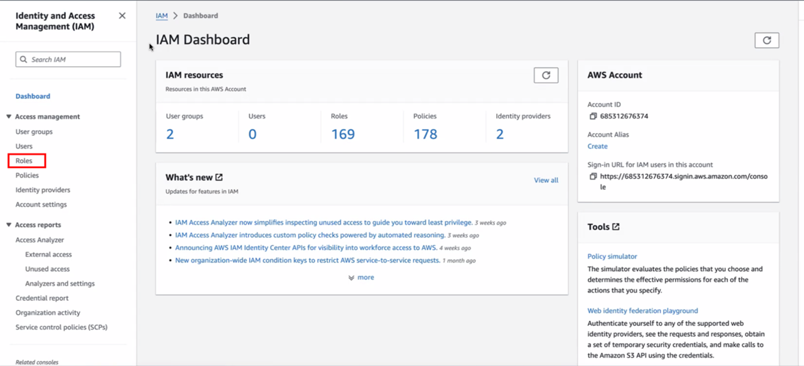
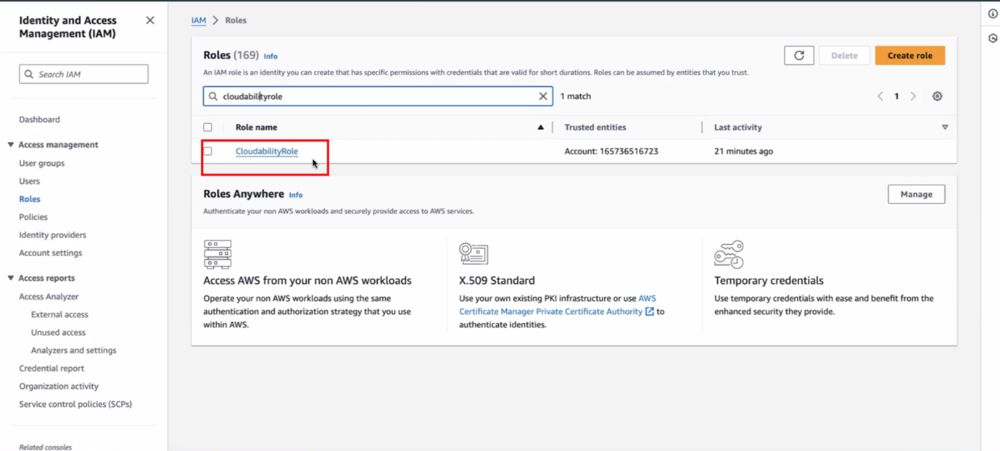
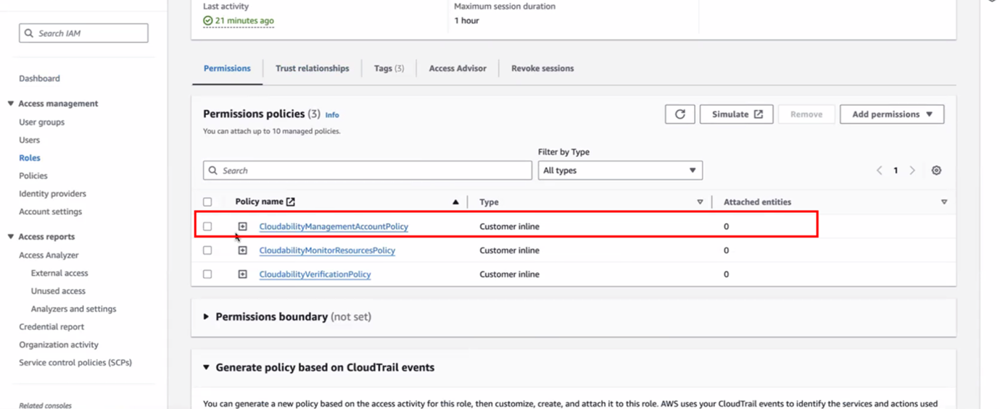
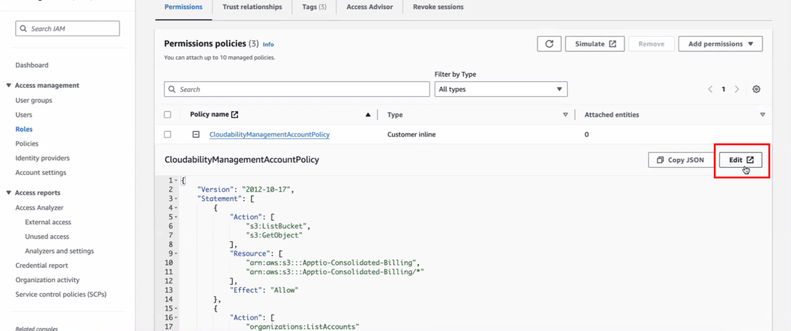
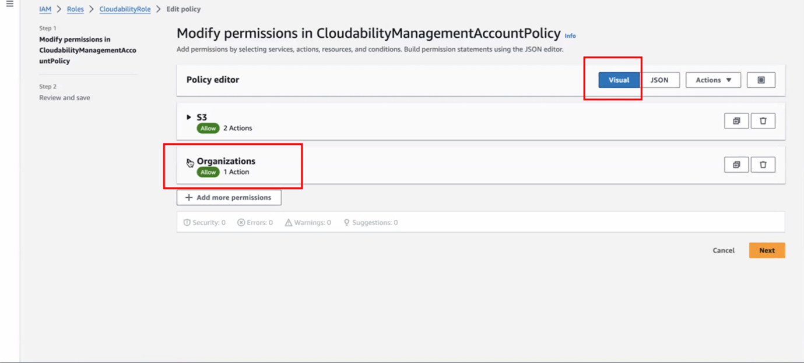
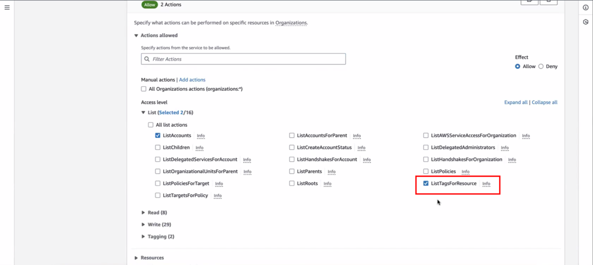
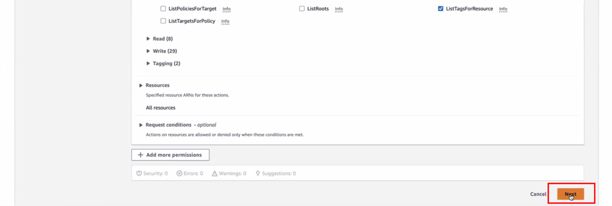
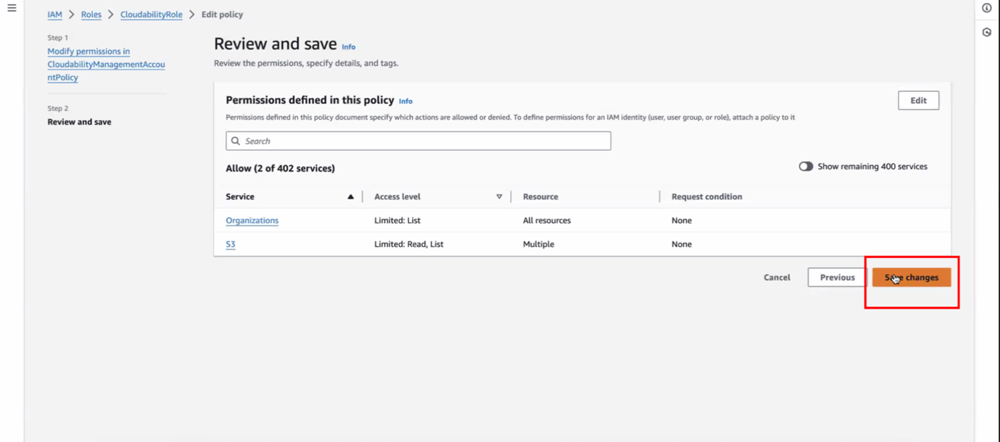
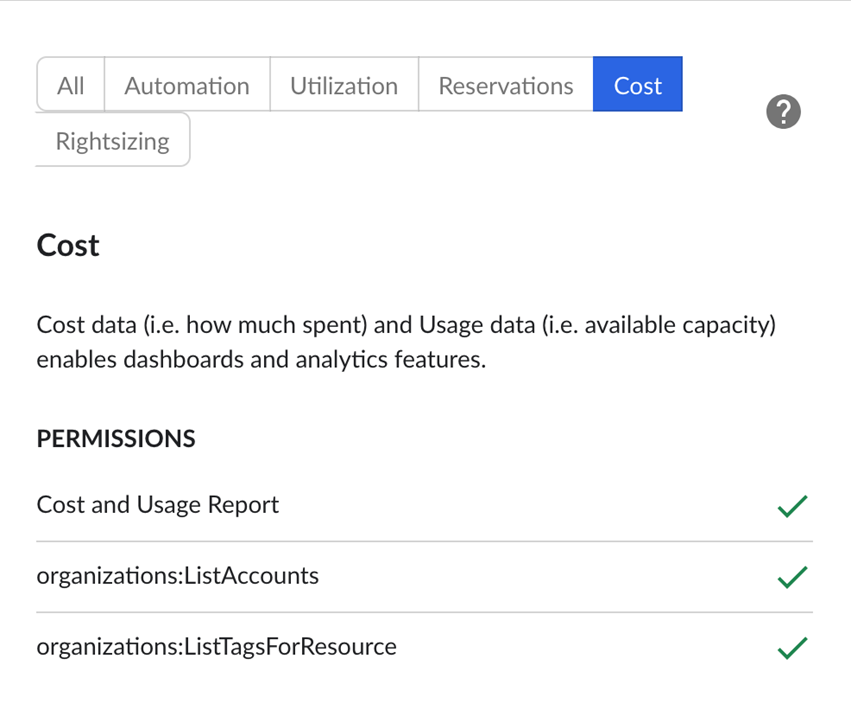

# AWS Etiquetas

Cloudability admite las siguientes etiquetas para « AWS »:

- **Etiquetas de nivel de recurso**
  - Estos forman parte de los archivos CUR de AWS y no se necesitan permisos adicionales en Cloudability para activarlos
- **Etiquetas a nivel de cuenta**
  - Para obtener las etiquetas a nivel de cuenta de las organizaciones de AWS, Cloudability necesita un permiso adicional denominado
    - organizations:ListTagsForResource
  - Se muestran con el siguiente formato en Cloudability
    - cldy:aws:accountLevelTag:<tag clave>

      Nota: Si un cliente cambia del CUR antiguo al CUR 2.0, deberá volver a configurar sus etiquetas y rótulos en Cloudability.

      Las etiquetas a nivel de cuenta no están disponibles actualmente en Cloudability Gov.Diferencia entre las etiquetas « AWS » y «Legacy CUR» y «CUR» 2.0
  - Formato antiguo de las etiquetas CUR
    - Etiquetas de AWS = aws:<tagkey>; p. ej., aws:autoscaling:groupname
    - etiquetas de usuario = <tagkey> p. ej., aplicación
  - Formato de las etiquetas « 2.0 » de CUR
    - Etiquetas de AWS = aws\_<la clave de la etiqueta irá separada por un guión bajo> = p. ej., aws\_autoscaling\_group\_name
    - etiquetas de usuario = user\_<tagkey>, p. ej., user\_application

Para habilitar **las etiquetas a nivel de recurso**, asegúrate de haber activado lo siguiente:

En la consola de AWS : habilitar las etiquetas de asignación de costes

- Desde el **Panel de control de facturación y gestión de costes**, vaya a [**Etiquetas de asignación de costes**.](https://console.aws.amazon.com/billing/home#/tags "(se abre en una pestaña o una ventana nueva)")
- Selecciona las etiquetas que quieras incluir
- Nota: ten en cuenta el uso de mayúsculas y minúsculas (camel case); por ejemplo, si tienes «Name» o «name» como clave de etiqueta, ambas deben estar activadas para que se escriban en CUR.
- **Selecciona** «Activar».

Para habilitar **las etiquetas a nivel de cuenta** de las organizaciones de AWS, Cloudability necesita un permiso adicional denominado « ***organizations:ListTagsForResource*** »

**Si ya eres cliente de AWS y utilizas Cloudability, puedes activar esta función mediante dos opciones:**

**Opción 1** : Vuelve a acreditar tus cuentas de pagador principal de AWS para las que quieras habilitar las etiquetas a nivel de cuenta de AWS

**Opción 2** : si no deseas volver a introducir tus credenciales, puedes conceder el permiso mencionado anteriormente a un rol de IAM de Cloudability que se haya añadido a tu cuenta de AWS siguiendo los pasos que se indican a continuación:

1. Accede al **panel de control de IAM** en AWS y haz clic en «**Roles** ».
2. Busca el rol que le has asignado a Cloudability. Si no has cambiado el nombre del rol, debería aparecer como « **CloudabilityRole** ». Haz clic en este puesto.
3. En **«Políticas de permisos»**, haz clic en « **CloudabilityManagementAccountPolicy** »
4. Haz clic en «**Editar** ».
5. Cambia a la vista **«Visual»** en la esquina superior derecha. Despliega «**Organizaciones** ».
6. Comprueba el permiso « **ListTagsForResource** ».

   
7. Selecciona «**Siguiente** ».
8. En **«Revisar y guardar»,** haz clic en «**Guardar cambios** ».

   
9. Comprueba que el permiso aparezca **marcado con una marca verde en** la pestaña **«Coste»** del panel de permisos (que se muestra al hacer clic en el icono del ojo de la cuenta principal correspondiente) en Cloudability, tal y como se muestra a continuación:

Nota: Es posible que los permisos tarden un par de horas en actualizarse en la interfaz de usuario de las credenciales de proveedor de Cloudability.

**Tema principal:** [Conexión con AWS - Guía de integración para clientes](../admin/aws-credentialing-premium-home.html)
