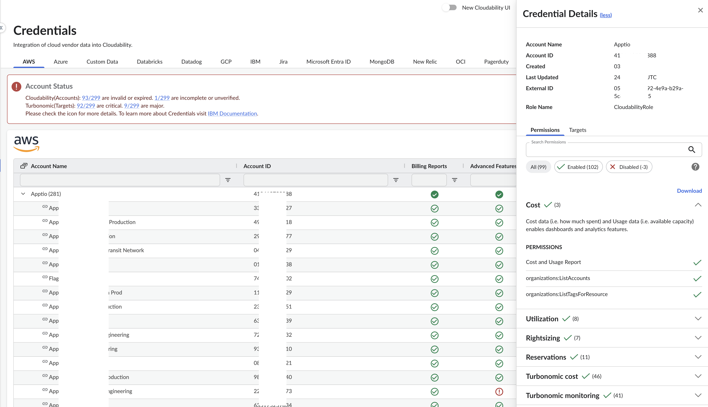

# Credenciales del proveedor

Resumen:

La página «Credenciales de proveedores» de Cloudability permite a los usuarios con permisos de administrador ver y conectarse a las distintas fuentes de datos disponibles. Esta página también permite a los administradores ver, actualizar o eliminar cuentas individuales dentro de las fuentes de datos. Los administradores pueden buscar y filtrar las cuentas, así como consultar el nivel de permisos de cada una de ellas.

Nota: Cloudability muestra el estado de las credenciales de los proveedores en varias páginas. Si tienes algún problema, comunícalo al administrador de Cloudability de tu organización. Si eres administrador, ponte en contacto con tu gestor de cuentas (CSM) o gestor de cuentas técnico (TAM) de IBM, quien podrá ayudarte a actualizar las credenciales de tus cuentas para garantizar que Cloudability disponga de los permisos necesarios.

Requisitos previos

Acceso de administrador a las credenciales de proveedor de Cloudability

Guía de inicio

1. Para añadir una nueva fuente de datos, haz clic en «Añadir fuente de datos ». Esto mostraría todas las fuentes de datos disponibles. 
2. Selecciona la fuente de datos a la que quieras asignar credenciales.

   Nota: Algunas de las fuentes de datos requieren una configuración previa. Para consultar las instrucciones correspondientes a tu fuente de datos concreta, búscala en la lista de la sección «Cómo introducir datos en **Cloudability** » de la documentación.
3. Una vez iniciada la sesión, los administradores podrán ver una pestaña correspondiente a cada fuente de datos, por ejemplo, AWS.
4. En la pestaña «Fuente de datos», los administradores pueden buscar y filtrar por columnas concretas.
5. Exportar: el estado de las credenciales de una fuente de datos también se puede exportar en formato CSV mediante la opción de exportación.
6. Haz clic en «…» para realizar las siguientes acciones.
   - Ver detalles: muestra los detalles de la cuenta junto con sus permisos

   

   - Editar cuenta: permite modificar las credenciales existentes
   - Volver a verificar: vuelve a verificar manualmente las credenciales de la cuenta y sus permisos
   - Archivar – Archiva la cuenta
   - Eliminar: elimina la cuenta
7. Las cuentas aparecerán ocultas de forma predeterminada. Sin embargo, hay iconos que:
   - Mostrar todas las cuentas
   - Ocultar todas las cuentas
8. El estado de las cuentas se muestra mediante distintos iconos. En la tabla siguiente se explican las correspondencias entre los iconos y los estados.

   | Cloudability Estado | Turbonomic Estado | Icono |
   | --- | --- | --- |
   | Credencial verificada | Normal | icono de credencial verificada , Icono de credencial verificada 2 |
   | Credencial no válida | Crítico | Icono de credencial no válida 2 , icono de credencial no válida |
   | Credencial necesaria | Desconocido | Icono «sin credenciales» |
   | Credenciales incompletas | Principal | icono de «incompleto» |
   | Credenciales archivadas |  | icono de «archivado» |

**Renovación de la acreditación**

Cloudability Actualiza con frecuencia los servicios que admite en los distintos proveedores de servicios en la nube, ya sea para casos de uso de optimización —como incluir más servicios en procesos de «rightsizing» o compromisos— o para mejorar una conexión a una fuente de datos ya existente. Para aprovechar al máximo las funciones de « Cloudability », se recomienda renovar periódicamente las credenciales.

- **Nuevos clientes** : cuando los nuevos clientes realizan acciones para añadir fuentes de datos, Cloudability proporciona el conjunto más reciente de plantillas, que incluye todos los permisos necesarios para habilitar todas las funciones en función del SKU de Cloudability del cliente.
- **Clientes actuales** : los clientes actuales deben **renovar sus credenciales periódicamente** para seguir sacando el máximo partido a las funciones y mejoras de Cloudability. En caso de actualizar la referencia de producto « Cloudability », por ejemplo, **pasando a « Cloudability Premium** », los clientes **deberán volver a introducir sus credenciales** para poder aprovechar al máximo las funciones de los productos compatibles con « Cloudability Premium ».

Nota: El estado de las credenciales de los proveedores se muestra en el encabezado de la página de credenciales de los proveedores. En las implementaciones de « Cloudability Premium », también aparece en la página «Rightsizing» -> «Avanzado». Asegúrate de que todas las credenciales de tus proveedores cuenten con todos los permisos necesarios para garantizar que las recomendaciones de optimización se generen correctamente.

**Verificación de permisos**

Se realiza una llamada masiva pasando todos los permisos relevantes en la **solicitud de política de simulación AWS**

- Ejemplo 1: La política de simulación permite todos los permisos. Todos los permisos aparecen marcados como verificados
- Ejemplo 2: Simulación de una política no permitida.
  - Solicitaremos todos los permisos uno por uno y haremos una llamada **de prueba**. Algunas API no permiten realizar pruebas sin un identificador de recurso válido. Por eso hemos configurado un identificador de recurso **ficticio** para probar las llamadas.
  - Para ello no se utiliza ningún recurso real del cliente
    - Ejemplo: La política de simulación permite permisos parciales. Supongamos que Cloudability intentó simular 100 permisos, pero la simulación solo permitió 70. Se considerarán verificados los 70 permisos, y comprobaremos uno por uno los 30 permisos restantes. Más adelante, combinaríamos los resultados de ambas llamadas y marcaríamos todos los permisos pertinentes como verificados.

Cualquier permiso o permisos que no hayan podido verificarse mediante la comprobación «Simulate Policy» o «Dry-Run» se considerarán ausentes, y la interfaz de usuario los marcará con una cruz roja.

Preguntas más frecuentes

- **¿La funcionalidad de las credenciales de los proveedores es la misma para todos los proveedores**?
  - Aunque los pasos concretos para la acreditación varían según el proveedor, el proceso de filtrado, ampliación, reverificación, etc., es el mismo en las distintas fuentes de datos compatibles con Cloudability.
- **¿Qué significan los distintos estados que aparecen en Cloudability?**
  - **Credenciales verificadas** : indica que Cloudability dispone de los permisos mínimos en la cuenta y que se han instalado correctamente el rol Cloudability o los entidades de servicio.
  - **Credenciales no válidas** : indica que se ha producido algún error en la cuenta y que Cloudability no ha podido verificarla.
  - **Se requieren credenciales** : indica que se trata de una cuenta nueva y que aún no se ha iniciado el proceso de acreditación.
  - **Datos de acceso incompletos** : indica que las cuentas se han guardado, pero no se han verificado. Tras la verificación, estas cuentas pasarían a la sección siguiente, en función de los permisos concedidos.
    - Credenciales verificadas
    - Credenciales no válidas
  - **Credenciales archivadas** : indica que la cuenta se ha archivado
    - Si se trata de una cuenta principal, al archivar una cuenta se interrumpiría la importación de datos sobre costes.
    - Si se trata de una cuenta secundaria, la importación de datos de costes continuaría y el archivado solo detendría los datos necesarios para la acreditación previa, por ejemplo, los datos de utilización o compromisos, etc.
- **¿Qué significan los distintos estados que aparecen en Turbonomic?**
  - Se menciona más arriba, en la tabla.
- **¿El estado de la cuenta « Cloudability » y el estado de la cuenta de destino « Turbonomic » no coinciden en las pantallas de credenciales de proveedores? ¿Cuáles podrían ser las razones?**

  - Los clientes actuales de « Cloudability » que actualicen a « Cloudability Premium » deberán volver a autenticar sus cuentas para obtener los permisos más recientes de « Turbonomic ».

    Las discrepancias en el estado de la cuenta pueden deberse a varias razones:
    - La renovación de las credenciales no se llevó a cabo según las últimas plantillas y permisos.
    - Si se llevó a cabo la renovación de credenciales, es posible que se hiciera utilizando una versión anterior de la plantilla y que, desde entonces, se hayan añadido algunos permisos nuevos para Cloudability Premium.
    - Si la renovación de credenciales no soluciona el problema, ponte en contacto con los equipos de asistencia de IBM.
- **¿Dónde puedo encontrar la documentación sobre las fuentes de datos individuales?**
  - Consulta la sección **«Cómo introducir datos en Cloudability »** de la documentación.

- **[Alertas por correo electrónico y banners sobre las credenciales de los proveedores](../admin/email-alerts.html)**
- **[Gestionar las credenciales de los proveedores en Cloudability](../admin/manage-vendor-credentials.html)**
