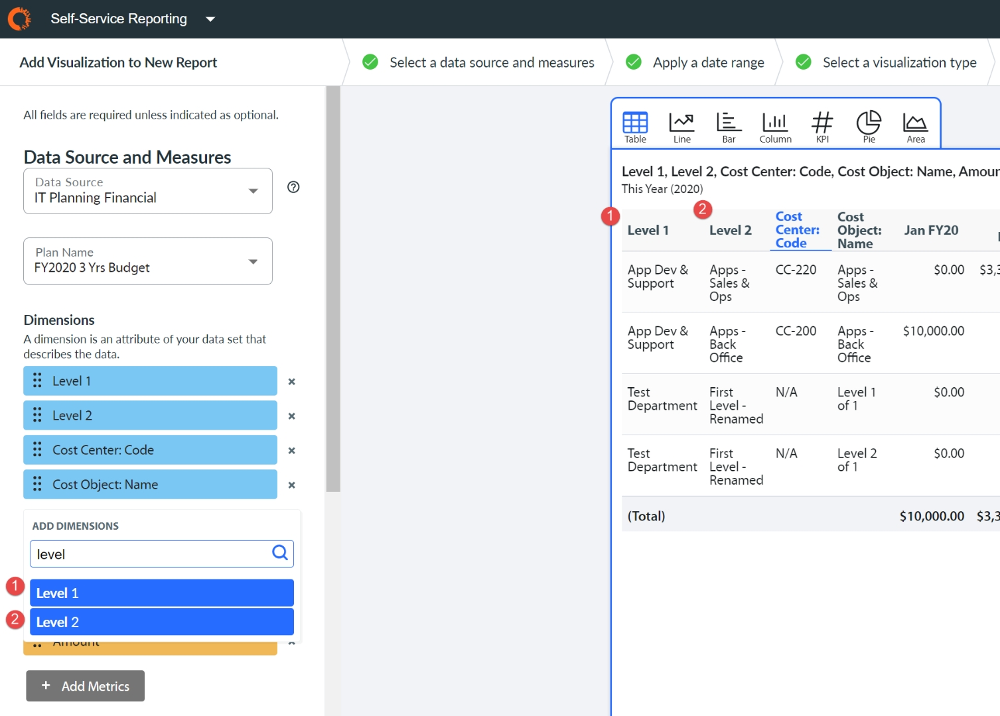
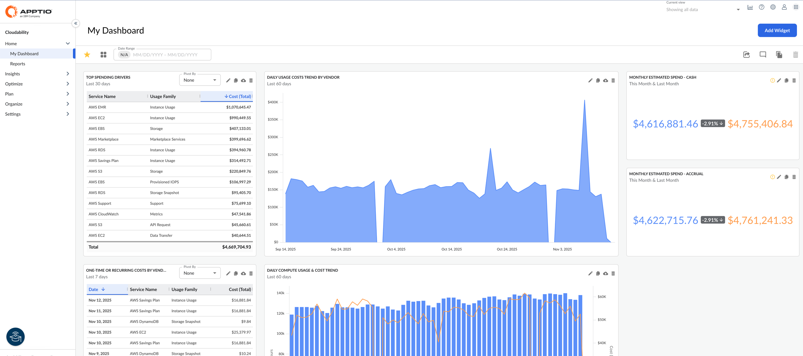

# Cómo acceder Cloudability

## Visión general

Puede acceder a este producto a través de Apex.

Apptio Experience (Apex ) proporciona una interfaz moderna y limpia con patrones de interfaz de usuario coherentes que aporta coherencia de producto a la plataforma y permite a los usuarios acceder a sus aplicaciones a través de una navegación de producto unificada.

## ¿Por qué Apex?

Apex ofrece a los usuarios las siguientes ventajas:

- todos los productos ofrecen una experiencia de usuario coherente
- refuerza el aspecto común de la plataforma Apptio / IBM
- ofrece funciones de plataforma compartida, como comentarios y colaboración, marcadores y notificaciones

Apex influye en la navegación y la arquitectura de la información de los productos. No hay cambios funcionales en las capacidades de los productos.

## Diseño y navegación en Apex

El diseño de Apex facilita a los usuarios navegar por sus productos y encontrar los datos que buscan.

- Puede navegar fácilmente por Apex utilizando el panel de navegación izquierdo plegable. Abra el panel de navegación izquierdo para navegar por los productos y ciérrelo para centrarse en la pantalla actual.
- Desplácese rápidamente entre los productos utilizando el conmutador de aplicaciones situado en la esquina superior derecha de la pantalla.
- Acceda a la ayuda contextual del producto o gestione sus preferencias mediante la barra de herramientas situada en la parte superior de la pantalla.

.
