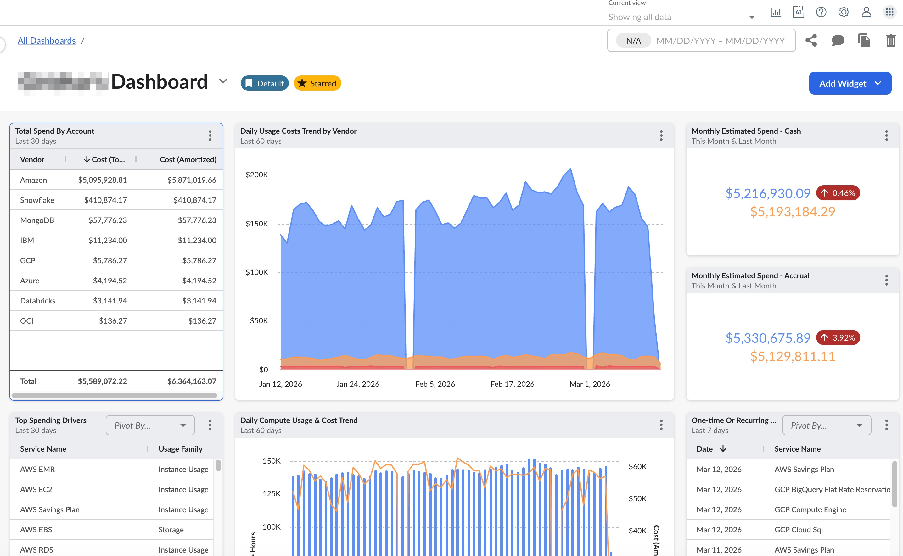

# Qué puede hacer con Cloudability Premium

## Introducción

IBM Cloudability Optimiza los recursos en la nube y transforma las facturas y las etiquetas en información útil para ofrecer claridad y transparencia en tiempo real sobre el consumo. Una vez que te hayas conectado a tus proveedores de servicios en la nube para configurar la importación de datos, podrás utilizar las funciones de Cloudability para analizar el uso de tus recursos e identificar oportunidades de ahorro.

## Paneles de control

Cloudability «Dashboards» es una herramienta sencilla y de autoservicio que permite crear paneles de control totalmente personalizables a partir de los datos disponibles en Cloudability. Los usuarios pueden elegir entre una amplia variedad de widgets para visualizar la información y ajustar las opciones de visualización con el fin de adaptar los paneles a sus necesidades individuales, lo que garantiza que los datos se muestren rápidamente y en el contexto adecuado. Puedes configurar uno o varios paneles con widgets personalizables para centrarte en los datos y los informes que te interesan. También puedes compartirlos con tus compañeros de trabajo.

[Más información sobre los paneles de control](../product/cloudability-dashboards.html)

## Informes

Cloudability «Informes» es una herramienta de autoservicio que permite a los usuarios acceder a sus datos de costes y utilización para responder a consultas puntuales, programar el envío de informes con una periodicidad determinada o exportar los datos sin procesar para un conjunto concreto de dimensiones, métricas y filtros. Cloudability incluye una selección de informes preconfigurados. También puedes crear informes personalizados modificando los informes predeterminados o creando uno desde cero.

[Más información sobre los informes](../product/cloudability-reports.html)

## Detalles

TrueCost Explorador

TrueCost Explorer te ayuda a comprender la estructura de los archivos de facturación en la nube. Ofrece una forma visualmente intuitiva de analizar tus datos de facturación y resolver dudas sobre los factores que influyen en los costes.

[Más información sobre TrueCost Explorer](../product/explore-cost-drivers-with-truecost-explorer.html)

Contenedores

Puedes integrar los datos de contenedores de Kubernetes ( k8s ) o OpenShift ( ROSA ) en Cloudability para obtener visibilidad sobre la parte de tu gasto en la nube correspondiente a los costes de los contenedores y asegurarte de que se asigna adecuadamente. Para obtener una visión global de los datos sobre costes y utilización de tus contenedores, utiliza la página «Contenedores».

[Más información sobre los contenedores](../product/analyze-data-for-your-containers.html)

Explorador de etiquetas

Con Tag Explorer, te facilitamos la tarea de ver qué etiquetas está utilizando actualmente tu organización. Por ejemplo, si sabes que tu empresa utiliza la etiqueta «Equipo» para asignar los gastos, pero no recuerdas si los nombres de los equipos deben escribirse en minúsculas, con mayúscula inicial y espacios entre palabras, abreviados, etc., Tag Explorer está aquí para ayudarte.

[Más información sobre Tag Explorer](../product/identify-tagged-and-untagged-spend-with-tag-explorer.html)

Detección de anomalías

La detección de anomalías en « Cloudability » ayuda a las organizaciones a identificar patrones inusuales o inesperados en el gasto. Esto ofrece un análisis exhaustivo de todos los servicios para detectar anomalías en los costes, lo que permite a los usuarios mitigar los picos repentinos en la facturación mediante alertas oportunas. Los usuarios pueden supervisar las anomalías directamente en Cloudability o recibir notificaciones por correo electrónico y a través de Pager Duty.

[Más información sobre la detección de anomalías](../product/identify-unusual-spending-patterns-with-anomaly-detection.html)

Tarjetas de puntuación

Los cuadros de mando te ayudan a comprender cómo estás gestionando tu nube, comparando tu uso con el de otras empresas del sector. Los «peers» son empresas que utilizan los recursos en la nube de forma similar a la tuya. Además, Scorecards facilita la comparación entre las distintas unidades de negocio de tu organización, lo que te permite identificar a los equipos que están a la vanguardia en la adopción de prácticas nativas de la nube.

[Más información sobre los cuadros de mando](../product/benchmark-your-cloud-spend-with-scorecards.html)

## Optimizar

Cartera de compromisos

Puede utilizar la cartera de compromisos para comprender cómo han evolucionado sus compromisos actuales a lo largo del tiempo, identificar dónde existen riesgos de cara al futuro y disponer de un punto de partida para iniciar el debate sobre dónde siguen existiendo oportunidades.

[Más información sobre la cartera de compromisos](../product/using_commitment_portfolio_to_understand_historical_performance.html)

Recomendaciones de compromiso

Puedes utilizar las «Recomendaciones de compromisos» para identificar dónde existen oportunidades de ahorro en función de tu gasto actual en la nube y de los compromisos que ya tienes. Las recomendaciones se generan mediante un modelo propio que tiene en cuenta tus preferencias y las limitaciones de tu negocio.

[Más información sobre las recomendaciones de compromiso](../product/using_commitment_recommendations_to_analyze_savings_opportunities.html)

Responsable de compromisos

Cloudability Commitment Manager te ayuda a obtener una visión global de cómo los instrumentos de gasto comprometido (por ejemplo, instancias reservadas o planes de ahorro) pueden ayudarte a optimizar tu gasto en la nube.

[Más información sobre Commitment Manager](../product/guide_to_commitment_management.html)

Dimensionamiento correcto

Con Rightsizing, puedes definir la infraestructura en la nube óptima que mejor se adapte a tus necesidades actuales y a corto plazo, de forma que se logre un equilibrio entre el riesgo y el coste para minimizar el desperdicio. Mediante los paneles de control de Rightsizing, puedes ver la utilización de los recursos en la nube a lo largo del tiempo. A continuación, podrás consultar los escenarios recomendados para cada recurso, lo que te permitirá tomar decisiones más fundamentadas sobre el ajuste de la capacidad en la nube.

[Más información sobre el «Rightsizing» en Cloudability](../product/rightsizing-in-cloudability-premium.html)

ROI de dimensionamiento correcto

Rightsizing ROI te permite realizar un seguimiento de las recomendaciones de reestructuración desde la oportunidad inicial hasta su finalización, así como elaborar informes sobre el impacto de tus iniciativas de reestructuración. Puedes crear tickets de forma manual o mediante políticas automatizadas que te permiten realizar un seguimiento de esas recomendaciones, revisar las oportunidades abiertas y cerradas, añadir comentarios a dichas oportunidades y elaborar informes sobre el ahorro conseguido gracias a ellas.

[Más información sobre cómo ajustar el retorno de la inversión (ROI)](../product/jira-for-rightsizing.html)

## Gobernabilidad

Gestión de costes

Cloudability La gobernanza permite a los equipos gestionar de forma proactiva los costes de la nube y aplicar políticas de « FinOps » directamente en los flujos de trabajo de los desarrolladores.

[Más información sobre la gestión de costes](../admin/governance-getting-started.html)

## Plan

Presupuestos y previsiones

La función «Presupuestos y previsiones» te ayuda a comprender y predecir tus gastos en la nube mediante: la elaboración de previsiones basadas en patrones de gasto históricos; el uso de dichas previsiones para crear presupuestos; y el seguimiento y las notificaciones sobre el gasto en relación con los presupuestos.

[Más información sobre presupuestos y previsiones](../product/plan-and-manage-your-budgets-and-forecasts.html)

Planificación de la carga de trabajo

La planificación de la carga de trabajo te ayuda a optimizar la arquitectura de tu carga de trabajo y a mejorar la precisión de tu planificación financiera entre los distintos proveedores de servicios en la nube.

[Más información sobre la planificación de cargas de trabajo](../product/get-recommendations-for-workload-planning.html)

## Organizar

Reparto de costes y telemetría

Compartir los costes ayuda a las organizaciones a gestionar el gasto en los procesos de «showback» y «chargeback» de forma más eficiente. Al compartir partidas de gasto en « Cloudability », consiguen ahorrar costes. La asignación basada en telemetría te permite distribuir los costes compartidos en tu entorno en la nube utilizando métricas de uso real de tus sistemas. Al cargar datos de telemetría, podrás crear reglas de asignación más precisas y basadas en datos dentro de Cost Sharing.

[Más información sobre el reparto de gastos en Cloudability](../product/cost-sharing.html)

Etiquetas y rótulos

Las etiquetas te ayudan a determinar quién es el responsable de cada recurso y cuáles son los costes asociados a ellos. Sin etiquetas, resulta difícil saber quién es el propietario de un recurso concreto y cuál puede ser su finalidad. Cloudability asigna estos elementos etiquetados. También se puede utilizar para encontrar cosas que no están etiquetadas o que no se pueden etiquetar. Cloudability admite múltiples tipos de etiquetas y clasificaciones en diversas fuentes de datos, que pueden utilizarse para una asignación exhaustiva de costes.

[Más información sobre las etiquetas y los rótulos](../admin/map-tags.html)

Grupos de cuentas

Clasifica las cuentas en grupos para facilitar la elaboración de informes; por ejemplo, agrupa varias cuentas en un mismo grupo, como una unidad de negocio, con el fin de asignar costes. Las cuentas y los grupos de cuentas te permiten editar y agrupar las cuentas a las que se accede mediante Cloudability.

[Más información sobre los grupos de cuentas](../admin/account-groups-spend.html)

Correspondencias empresariales

Organiza tu infraestructura en la nube para que se adapte a tu negocio. Las asignaciones empresariales se utilizan para crear dimensiones empresariales que clasifican el gasto en la nube según la taxonomía de tu organización.

[Más información sobre las correspondencias empresariales](../admin/business-tags.html)

Visualizaciones

La vista de « Cloudability » es una potente herramienta de filtrado de datos que permite organizar y controlar cómo se presentan y comparten los datos sobre costes y uso de la nube entre los usuarios de « Cloudability » de su organización. Actúan como filtros para toda la aplicación que te ayudan a centrarte en los datos más importantes.

[Más información sobre las vistas](../admin/create-and-manage-views.html)

Reprocesamiento de datos

Si modificas tu estrategia empresarial, será necesario ajustar las asignaciones empresariales, los grupos de cuentas y las etiquetas y marcas en Cloudability, lo que implicará una actualización retrospectiva de los datos históricos. La función de reprocesamiento de datos te resulta de gran ayuda en este caso.

[Más información sobre Data Reprocess](../product/data_reprocess.html)
