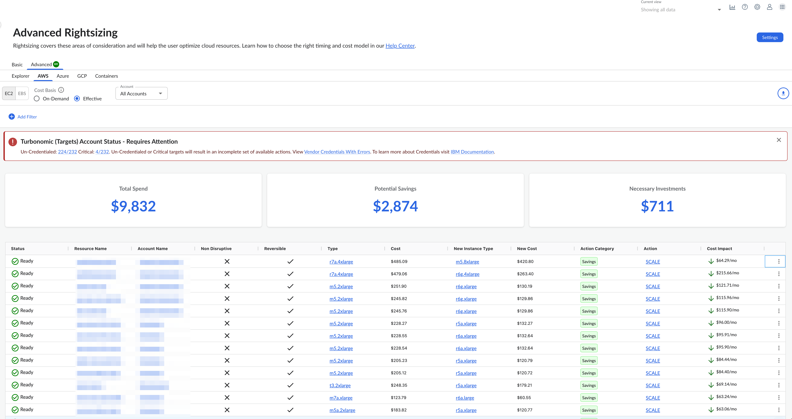
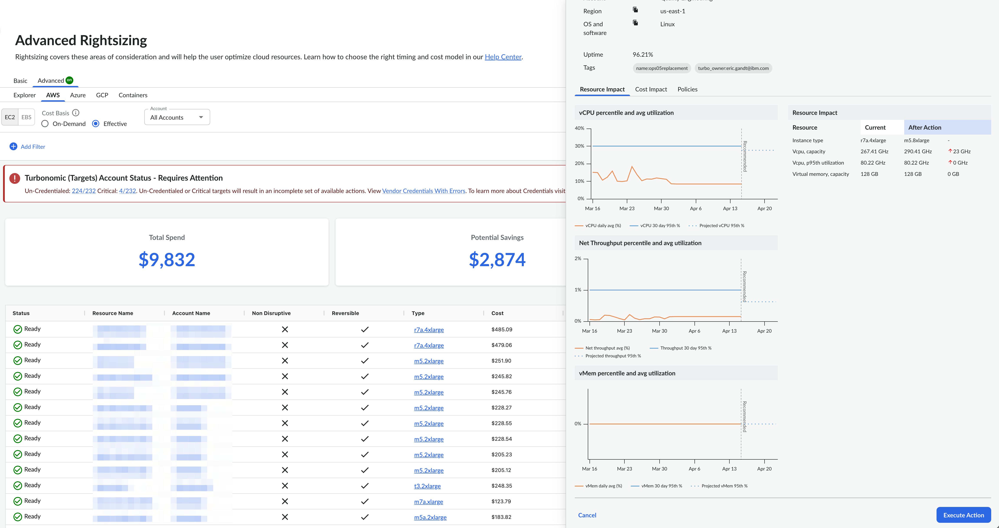

# Ejecución de la acción

## Introducción

Una vez que hayas introducido todas las credenciales de tus cuentas en la nube, el motor de Turbonomic comenzará a analizar tu entorno. El análisis integral que realiza el motor « Turbonomic » identifica las medidas que puedes adoptar para optimizar tus implementaciones en la nube, tanto en términos de rendimiento como de coste. Estas acciones de optimización, impulsadas por Turbonomic, se muestran en la página «Rightsizing > Advanced» de Cloudability para que puedas analizarlas y tomar las medidas oportunas.

Para obtener los mejores resultados de estas acciones impulsadas por Turbonomic, ejecútalas sin demora y plantéate automatizar tantas como sea posible.

## Ejecución y automatización de acciones

Por defecto, el motor de « Turbonomic » no ejecuta las acciones automáticamente. Si examinas las políticas predeterminadas que se incluyen con el producto, te darás cuenta de que estas políticas no permiten la automatización de ninguna acción. Turbonomic El motor te ofrece un control total sobre la ejecución de estas acciones y todas las decisiones relacionadas con la automatización.

Tu objetivo debe ser evaluar todas las acciones que se presentan en la página «Rightsizing > Avanzado» y, a continuación, llevar a cabo aquellas que supongan mejoras inmediatas en el rendimiento, los costes y la utilización de los recursos. Con el tiempo, irás desarrollando y perfeccionando tu proceso de gestión de acciones para alcanzar los objetivos de productividad y responder a las necesidades cambiantes de la empresa. Este proceso podría dar lugar a las siguientes decisiones clave:

- «Manully Execute Action»: Permite que el motor « Turbonomic » siga publicando determinadas acciones para que puedas ejecutarlas según cada caso concreto.

  Por ejemplo, es posible que determinadas acciones requieran la aprobación de personas concretas. En este caso, lo ideal sería que un mot Turbonomic e enviara esas acciones para su revisión y solo ejecutara aquellas que recibieran la aprobación correspondiente.

  Estas acciones dejan de mostrarse una vez ejecutadas, si las desactivas o las automatizas, o si el entorno cambia en el siguiente análisis de mercado de tal forma que las acciones ya no sean necesarias.
- Automatizar acciones mediante políticas de automatización: Las políticas de automatización permiten que determinadas acciones se ejecuten automáticamente, como aquellas que garantizan el rendimiento y/o el control de costes en los recursos críticos para la misión.

  La automatización simplifica tu trabajo, al tiempo que garantiza que las cargas de trabajo sigan contando con los recursos adecuados para funcionar de forma óptima. Por ello, es importante que te marques el objetivo de automatizar el mayor número posible de acciones. Para ello, es necesario evaluar qué acciones se pueden automatizar de forma segura y en qué entidades.

## Ejecución de acciones manuales

Si una acción se puede ejecutar, puedes hacerlo desde el panel «Detalles de la acción». Selecciona las acciones que te interesen haciendo clic en «Ver detalles» junto a la acción correspondiente en la página de listado de acciones de optimización y, a continuación, haz clic en «Ejecutar acción ».

El panel de detalles de la acción te permite ahora ejecutar esta acción.

Cuando decides realizar una acción, se te pide que la confirmes y, a continuación, se inicia la ejecución de la misma. En este momento, el botón «Ejecutar acción» aparece desactivado y muestra una información sobre herramientas que indica que la acción se está ejecutando. Esta acción seguirá en este estado (es decir, el botón «Ejecutar acción» aparecerá desactivado en la página de detalles) hasta el próximo ciclo de actualización de acciones (60 minutos).

Nota: Solo podrás realizar una acción si se te ha asignado el permiso « AutomatorFullAccess » en Frontdoor

Ejecución de acciones: aspectos a tener en cuenta

- Es posible que algunas acciones no se puedan ejecutar. Por ejemplo, es posible que la configuración de aceptación de acciones en una política se haya establecido en «Recomendar» o que la tecnología subyacente de la entidad no admita la automatización. En tales casos, es posible que el botón «Ejecutar acción» no esté activo para una acción en la interfaz de usuario
- Algunas acciones solo pueden llevarse a cabo una vez que se hayan cumplido ciertos requisitos previos. Por ejemplo, para suspender el servidor A, VM\_01, el dominio debe trasladarse primero al servidor B. Sin embargo, el servidor B solo tiene capacidad para un dominio VM y, actualmente, aloja VM\_02. En este caso, la suspensión del Host A queda bloqueada por dos acciones previas: VM\_02, que debe trasladarse a otro host, y VM\_01, que debe trasladarse al Host B. En el caso de una acción con requisitos previos, el botón «Ejecutar acción» aparece desactivado y el estado indica que está bloqueada.

## Preguntas más frecuentes

1. ¿Se pueden ejecutar todas las acciones de Turbo?

   No, no todas las acciones de optimización generadas por el motor « Turbonomic » son ejecutables. Depende de cómo estén configuradas las políticas: la tecnología subyacente de la entidad debe permitir la ejecución o bien deben cumplirse todos los requisitos previos necesarios para llevar a cabo una acción.
2. ¿Cómo puedo comprobar el estado de ejecución de una acción en la interfaz de usuario?

   El campo «Estado» de la página de listado de acciones, así como el panel de detalles de la acción, reflejan el estado actual de ejecución de la acción. Ten en cuenta que los valores de estado que aparecen en Cloudability no reflejan de forma inmediata el estado de ejecución de las acciones en la interfaz de usuario de Cloudability. No obstante, los usuarios pueden acceder a la interfaz de usuario de « Turbonomic » a través de Frontdoor, localizar el recurso en su contexto desde la vista de la cadena de suministro y consultar el estado de la acción en el widget «All Actions».
3. He realizado una acción, ¿qué pasa ahora?

   Al ejecutar una acción en la interfaz de usuario de Cloudability, se activa la solicitud de ejecución de la acción en el motor de Turbonomic. El botón «Ejecutar acción» de la interfaz de usuario de Cloudability aparecerá desactivado para evitar que este usuario o cualquier otro de Cloudability vuelva a ejecutar la misma acción. Un texto de información indicará que esta acción se está llevando a cabo. Esta acción seguirá apareciendo en la interfaz de usuario de « Cloudability », tanto en la página de listado como en las páginas de detalles de la acción, y será visible para los usuarios en la interfaz de usuario de « Cloudability », aunque estos no podrán ejecutarla. Sin embargo, el estado de la ejecución de la acción en el motor de Turbonomic no se refleja en la interfaz de usuario de Cloudability. Los usuarios pueden realizar un seguimiento de la solicitud de ejecución en la interfaz de usuario de Turbonomic a través del widget «Todas las acciones ». Cloudability Actualiza las acciones de Turbonomic cada 60 minutos y, en el siguiente ciclo de actualización, es posible que esta acción refleje las actualizaciones en la interfaz de usuario de Cloudability, según el ciclo de evaluación de Turbonomic
4. ¿Cómo puedo solucionar los problemas relacionados con el flujo de ejecución de las acciones? ¿Por dónde empezar?

   La ejecución de una acción en el motor de « Turbonomic » puede tardar unos segundos o unos minutos en completarse. Puedes consultar el estado de ejecución de la acción correspondiente al recurso en la nube en cuestión en la interfaz de usuario de Turbonomic. Accede a la página de recursos (desde la vista de la cadena de suministro, puedes seleccionar el tipo de entidad o similar) y busca el nombre o el identificador del recurso en el contexto. Abre la pestaña «Resumen». Aquí se muestra el widget «Todas las acciones», que recoge todas las acciones ejecutadas (tanto las que han tenido éxito como las que han fallado) a lo largo del ciclo de vida del recurso en cuestión.
5. He realizado una acción que se ha ejecutado correctamente, pero sigo viendo esa acción en la interfaz de usuario. ¿Cómo es posible?

   Aunque la ejecución de la acción se haya realizado correctamente, el motor de « Turbonomic » tarda unos minutos en actualizar este estado y en actualizar su cadena de suministro interna. Una vez que este estado se haya actualizado internamente en todos los servicios del motor « Turbonomic », la siguiente ejecución de generación de acciones en el motor « Turbonomic » garantizará que la acción no aparezca en la lista, ya que ya se ha llevado a cabo (a menos que la política se haya actualizado entretanto con umbrales diferentes). Dado que Cloudability actualiza las acciones de optimización generadas por el motor Turbonomic cada hora, la acción tarda entre 1 y 2 horas en desaparecer de la página «Rightsizing», incluso después de que se haya ejecutado correctamente
6. He realizado una acción y ha fallado, ¿qué pasa ahora?

   Turbonomic El motor tarda unos minutos en sincronizar este estado y actualizar su cadena de suministro interna. Una vez que este estado se haya actualizado internamente en todos los servicios de Turbonomic, el siguiente ciclo de análisis del motor de Turbonomic generará un conjunto de acciones basadas en las políticas configuradas, y esta acción volverá a aparecer en la lista de acciones de la interfaz de usuario (a menos que la política se haya actualizado entretanto con umbrales diferentes).

**Tema principal:** [Redimensionamiento avanzado](../product/advanced-rightsizing-powered-by-turbonomic.html)
