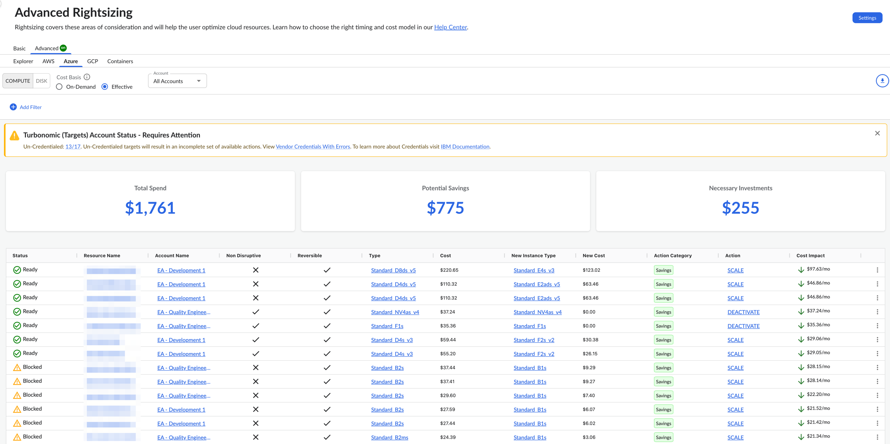
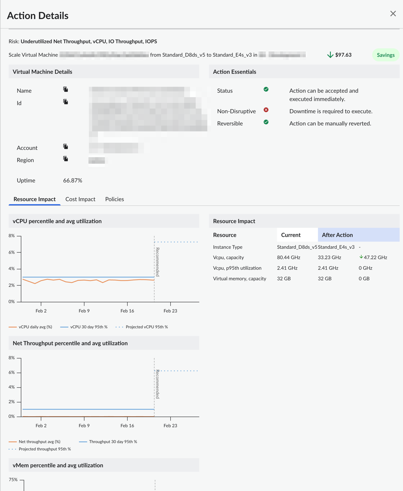

# Azure Compute

Puede utilizar el panel de control de ajuste avanzado para ver las recomendaciones de optimización de recursos para Microsoft Azure Compute. El panel de control muestra recomendaciones de optimización tanto para ahorros como para inversiones, impulsadas por un motor de optimización de cartera ( Turbonomic ). Puede ver las recomendaciones de varias cuentas de Azure desde un único panel de control.

[Redimensionamiento avanzado en Cloudability Premium](advanced-rightsizing-powered-by-turbonomic.html)

Antes de empezar

Para ver el panel de control de Azure Compute, asegúrese de haber conectado Cloudability a las cuentas correctas de Azure.

[Conectarse Microsoft Azure](../admin/azure-cm-setup.html)

Nota: Debe asegurarse de que todas las credenciales de sus proveedores actuales tengan los permisos pertinentes de Turbonomic, sin los cuales el motor Turbonomic podría no ser capaz de generar el conjunto de acciones adecuado. Si usted era cliente de Cloudability antes de la actualización a Cloudability Premium, deberá volver a acreditar todas y cada una de las credenciales de los proveedores para concederles un conjunto adicional de permisos.

Acceda al panel de control de computación de Azure.

Para acceder al panel de control de computación de Microsoft Azure, abra la página de inicio de Cloudability y, en el menú de navegación de la izquierda, seleccione Optimizar > Redimensionamiento > Avanzado. En la página Rightsizing, seleccione la pestaña « Azure » y, a continuación, seleccione la subpestaña «Compute ».

Personalizar el panel de control

Puede configurar las siguientes opciones para personalizar su panel de control.

Especificar la base del coste

La base de costes determina cómo se calculan las recomendaciones. La base del coste puede ser bajo demanda o efectiva. La base del coste efectivo se selecciona de forma predeterminada.

Nota:

Si su organización ha habilitado los precios personalizados en Cloudability, se aplicarán las tarifas personalizadas pertinentes a los cálculos de la base de costes.

- Bajo demanda: La base de costes bajo demanda proporciona una comparación directa entre la instancia que aparece en la columna Actual y la instancia recomendada en la columna Nueva basándose únicamente en los precios bajo demanda. No incluye ningún impacto potencial de las instancias reservadas (RI) ni de los planes de ahorro (SP). Tenga en cuenta que los precios bajo demanda reflejarán cualquier acuerdo de precios personalizados que haya configurado en Cloudability.
- Efectivo: La base de coste efectiva tiene en cuenta el impacto histórico de las instancias reservadas (RI) y los planes de ahorro (SP) para calcular el coste del tipo de instancia actual durante el periodo del informe. Al igual que la métrica «Coste (amortizado)», incluye todos los costes iniciales y recurrentes asociados.   
   En otras palabras, la base de coste efectivo muestra el coste efectivo de ejecutar su instancia actual. Las cifras de costes del nuevo tipo de instancia recomendado se basan en los precios bajo demanda. Esto se debe a que es posible que la nueva configuración no se beneficie de las RI ni de las SP. Esta comparación es la opción más conservadora. Incluso si, sin darse cuenta, se aleja de los RI o los SP, su nueva tasa global seguirá siendo mejor. Como resultado, el ahorro total calculado con esta metodología a veces será menor. Se aplicarán precios personalizados a estas cifras, si procede.

Utilice la base de costes bajo demanda si desea eliminar la naturaleza impredecible de los descuentos basados en compromisos de su análisis y maximizar el número de recomendaciones que se le proporcionan. Utilice la base de coste efectivo si prefiere basar sus recomendaciones en el coste real histórico de ejecutar sus instancias y adoptar un enfoque conservador.

Seleccionar cuenta

De forma predeterminada, el panel muestra recomendaciones para todas las cuentas. Para ver las recomendaciones para una cuenta en particular, seleccione el nombre de la cuenta en el menú desplegable Cuenta.

Aplicar filtros

Puede añadir filtros para incluir o excluir datos en función de una o varias condiciones.

Añadir un filtro

Para añadir un filtro:

1. Selecciona Añadir filtro en la barra de herramientas.
2. En el menú Añadir filtro, elige una dimensión.
3. Seleccione un operador para proporcionar una condición lógica.
4. Elija un valor para refinar su filtro.
5. Seleccione Añadir filtro para aplicar el nuevo filtro a la página.

Aplicar filtros con enlaces

También puede añadir filtros seleccionando los valores con hipervínculos azules de la tabla principal. La regla de filtro se aplica automáticamente al campo Filtros. Solo puede seleccionar un valor o parámetro de cada columna a la vez.

Eliminar un filtro

Para eliminar un filtro:

1. Seleccione el icono del filtro  .
2. Seleccione X junto al filtro que desea eliminar.

Indicadores clave de rendimiento

Puede ver los siguientes indicadores clave de rendimiento (KPI) en su panel de control de Advanced Rightsizing:

- Gasto total : muestra el gasto total asignado actualmente
- Ahorros potenciales : muestra el ahorro potencial total estimado que se puede conseguir con todas las recomendaciones de optimización con un impacto en los costes menor que el coste actual
- Inversiones necesarias : muestra el total estimado de inversiones potenciales en todas las recomendaciones de optimización con un impacto en los costes superior al coste actual

Tabla de recomendaciones de redimensionamiento

El panel de control contiene una tabla de recomendaciones de redimensionamiento, que ofrece una visión general de los recursos informáticos de Azure para los que se han identificado recomendaciones. La tabla incluye las siguientes columnas:

Nota:

De forma predeterminada, los datos se ordenan por la columna Impacto en el coste. Para cambiar el orden de clasificación, solo tienes que seleccionar el nombre de la columna.

- Estado: Estado que indica la disponibilidad para la ejecución de la acción
- Nombre del recurso : El nombre de la máquina virtual
- Nombre de la cuenta : El nombre de la cuenta de Azure
- No disruptivo: Indicación de si la acción presentada no es disruptiva
- Reversible : Indicación de si la acción presentada es reversible o no
- Tipo : El tipo de instancia actual de la máquina virtual
- **Coste** : el coste actual de la instancia de máquina virtual
- Nuevo tipo de instancia : el tipo de instancia de máquina virtual recomendado
- Nuevo coste : el coste previsto del nuevo tipo de instancia de máquina virtual recomendado
- Categoría de la acción : La categoría de la acción recomendada. Los que se admiten actualmente son «Rendimiento» o «Ahorro»
- Acción : La acción recomendada. La tabla siguiente enumera las distintas acciones compatibles
- Impacto en los costes : Impacto en los costes de la implementación de esta medida

| Recomendación | Descripción |
| --- | --- |
| Escala | Cambia el tamaño al tipo de recurso especificado en la columna Nuevo tipo de instancia. Esto puede ser una acción de «ampliación» o «reducción» según las políticas configuradas |
| Desactivar | Elimine su recurso porque está predominantemente inactivo |

Recomendaciones para optimizar las exportaciones a un archivo Excel

Para exportar las acciones recomendadas a un archivo Excel, seleccione Exportar. Tenga en cuenta que el archivo Excel incluirá varias columnas adicionales, como región, sistema operativo, precio unitario y otras.

Detalles de la recomendación

Para ver los detalles de la acción recomendada para un recurso concreto, seleccione Ver detalles en el menú Más opciones (3 puntos).

La siguiente figura muestra un panel de detalles de acción de muestra.

Para ver las descripciones de las dimensiones y métricas de costes, consulte el [Glosario de dimensiones y métricas de costes.](glossary-of-cost-dimensions-and-metrics.html)

Para ver los detalles de la dimensión y las métricas de utilización, consulte [el](glossary-of-utilization-dimensions-and-metrics.html) Glosario de dimensiones y métricas de utilización

**Tema principal:** [Redimensionamiento avanzado](../product/advanced-rightsizing-powered-by-turbonomic.html)
