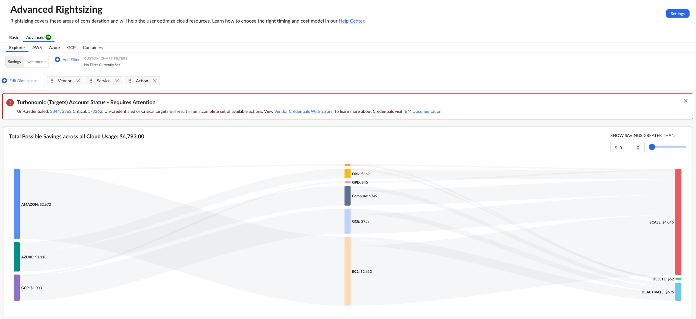

# Dimensionamiento correcto avanzado

## Acciones de optimización impulsadas por Turbonomic

Turbonomic El motor que impulsa Cloudability recopila métricas históricas de utilización de recursos para analizar el rendimiento de las cargas de trabajo de forma integral y, a continuación, recomienda medidas de optimización para escalar estas cargas de trabajo con el fin de garantizar el rendimiento al menor coste posible.

Turbonomic El motor genera acciones de optimización para los recursos de la nube y de la nube híbrida ( Kubernetes ) en su entorno de nube pública, lo que garantiza que sus aplicaciones reciban la asignación precisa de recursos informáticos, de almacenamiento y de red en todos los niveles de la pila tecnológica. Mediante la optimización continua de la asignación de recursos, su organización puede lograr un rendimiento garantizado, un ahorro de tiempo significativo y una optimización óptima de los costes.

Actualmente, las acciones del servicio de controlador de máquinas virtuales, discos y cargas de trabajo en AWS, Microsoft Azure y Google Cloud son compatibles con Cloudability Premium, impulsado por Turbonomic.

Nota: Debe asegurarse de que todas las credenciales de sus proveedores actuales tengan los permisos pertinentes de Turbonomic, sin los cuales el motor Turbonomic podría no ser capaz de generar el conjunto de acciones adecuado. Si usted era cliente de Cloudability antes de la actualización a Cloudability Premium, deberá volver a acreditar todas y cada una de las credenciales de los proveedores para concederles un conjunto adicional de permisos.

## Panel de control avanzado de optimización

El panel de control de Advanced Rightsizing muestra la pestaña Explorer de forma predeterminada. Rightsizing Explorer ofrece una visión general de los posibles ahorros o inversiones en todos los recursos de la nube que utiliza su empresa. Puede utilizar este panel para agrupar, filtrar y navegar por sus acciones de optimización.

Las pestañas adicionales de Advanced Rightsizing son acciones de optimización para proveedores de nube específicos.

[Explorador avanzado de redimensionamiento](advanced-rightsizing-explorer.html)

## Preguntas frecuentes sobre acciones de optimización

¿Por qué se admiten los periodos de acción?

Turbonomic Admite un periodo retrospectivo de entre 7 y 90 días. Se pueden configurar en las políticas globales o de ámbito.

¿Por qué el gasto total de esta página no coincide exactamente con los valores que se muestran en Informes/Explorador de costes reales?

Las acciones de optimización solo enumeran los recursos para los que se ha encontrado al menos un recurso que permite ahorrar dinero, por lo que es probable que estos valores no coincidan exactamente.

¿Con qué frecuencia se actualizan las acciones?

Actualizamos las acciones de optimización cada hora. Puede acceder a las recomendaciones de recursos 24 horas después de que se haya creado el recurso, siempre que haya suficientes datos de utilización.

¿Qué servicios en la nube y qué acciones son compatibles actualmente con Cloudability Premium?

Los servicios de máquina virtual, volumen/disco y controlador de carga de trabajo son compatibles con Cloudability Premium a fecha de hoy. En cuanto a las acciones, se admiten las acciones de escalado, cambio de tamaño y suspensión para máquinas virtuales, las acciones de escalado y eliminación para servicios de volumen/disco y las acciones de cambio de tamaño para servicios de controlador de carga de trabajo.

- **[Explorador avanzado de redimensionamiento](../product/advanced-rightsizing-explorer.html)**
- **[AWS EC2](../product/advanced-rightsizing-for-aws-ec2.html)**
- **[AWS EBS](../product/advanced-rightsizing-for-aws-elastic-block-store.html)**
- **[AWS RDS](../product/aws_rds.html)**
- **[Azure Calcular](../product/advanced-rightsizing-for-azure-compute.html)**
- **[Azure Disco](../product/advanced-rightsizing-for-azure-disks.html)**
- **[Azure SQL](../product/azure_sql.html)**
- **[GCP Google Compute Engine (GCE)](../product/advanced-rightsizing-for-gce.html)**
- **[GCP Google Disco persistente (GPD)](../product/advanced-rightsizing-for-gpd.html)**
- **[Redimensionamiento avanzado para contenedores de Kubernetes](../product/advanced-k8s-container-rightsizing.html)**
- **[Ejecución de la acción](../product/action_execution.html)**
- **[Preferencias de redimensionamiento](../product/premium-rightsizing-preferences.html)**

**Tema principal:** [Redimensionamiento en Cloudability Premium](../product/rightsizing-in-cloudability-premium.html)
