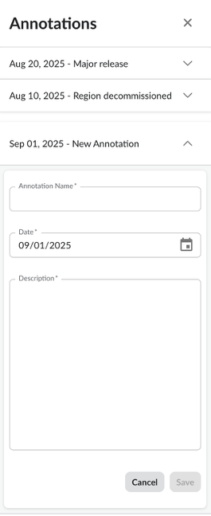
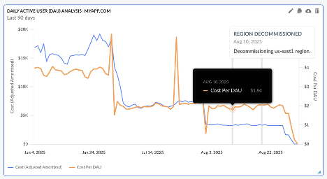

# Anotar en paneles de control

Para comunicar fácilmente los picos en los costes o etiquetar eventos importantes en los widgets, los usuarios pueden decidir añadir «anotaciones» que serán visibles directamente en los widgets.

Al hacer clic en el botón «Anotar», se abrirá un modal en el lado izquierdo que muestra todas las anotaciones configuradas actualmente y permite a los usuarios crear nuevas anotaciones haciendo clic en el botón «Crear nuevo» en la parte inferior del menú Anotaciones. Para crear nuevas anotaciones se necesita permiso de edición en el panel de control.

Las anotaciones solo se pueden crear para un día específico y no pueden abarcar varios días. Además, las anotaciones solo se mostrarán en los gráficos que utilicen «Fecha» como eje X y se representarán mediante una línea vertical gris en el gráfico. Para crear una anotación es necesario especificar su nombre y su descripción.

Al pasar el cursor sobre una anotación, se mostrarán su nombre, la fecha asociada y la descripción.

**Tema principal:** [Ver y configurar paneles de control](../product/view-and-configure-dashboards.html)
