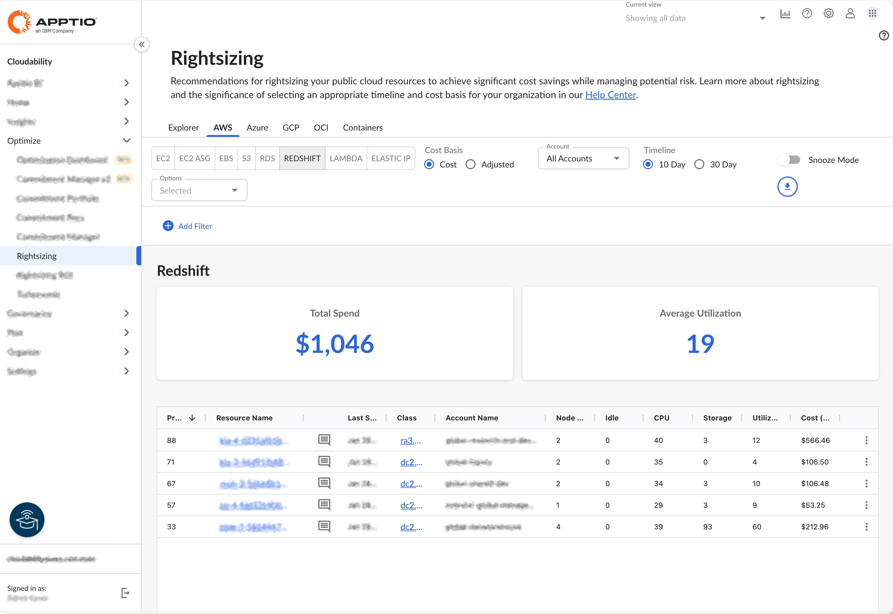
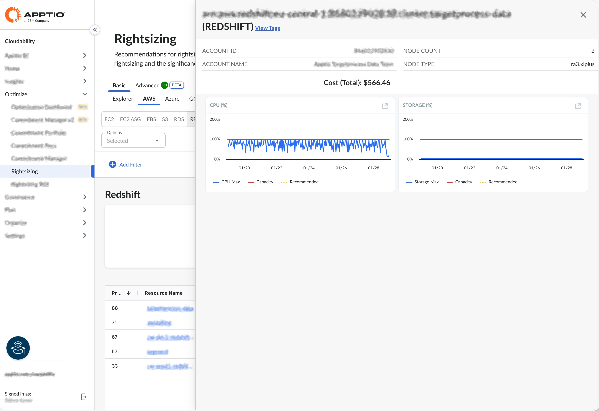

# Amazon Redshift

Puedes utilizar el panel de control «Rightsizing» para consultar información sobre la optimización de recursos en los clústeres de « Amazon Redshift ». El panel de control muestra métricas de utilización e identifica los clústeres con posibles oportunidades de ahorro. Puedes consultar los datos de varias cuentas desde un único panel de control.

[Ajuste de plantilla en Cloudability](get-recommendations-for-scaling-your-cloud-resources-with-rightsizing.html)

Antes de empezar

Para ver el panel de control de « Amazon Redshift », asegúrate de haber vinculado Cloudability a las cuentas de AWS correctas.

[Conexión con AWS - Guía de integración para clientes](../admin/aws-credentialing-standard-enterprise-home.html)

Accede al panel de control de « Amazon Redshift »

Para acceder al panel de control de « Amazon Redshift », abre la página de inicio de Cloudability y, en el menú de navegación de la izquierda, selecciona «Optimizar» > «Rightsizing ». En la página «Rightsizing», selecciona la pestaña « AWS » y, a continuación, selecciona la subpestaña « Redshift ».

Personalizar el panel de control

Puedes configurar las siguientes opciones para personalizar tu panel de control.

Seleccionar cuenta

Por defecto, el panel de control muestra información de todas las cuentas. Para ver los datos analíticos de una cuenta concreta, selecciona el nombre de la cuenta en el menú desplegable «Cuenta ».

Especificar el calendario

Puedes elegir entre consultar el gasto de los últimos 10 días o el de los últimos 30 días. Por defecto, la opción «Línea de tiempo» está configurada en «10 días ». Para la mayoría de los usuarios, el periodo recomendado es de 10 días, ya que refleja las tendencias de rendimiento más recientes y permite predecir con mayor precisión el uso futuro de los recursos.

Aplicar filtros

Puedes añadir filtros para incluir o excluir datos en función de una o varias condiciones. Para añadir un filtro, selecciona «Añadir filtro» en la barra de herramientas y configura la dimensión, el operador y el valor.

Redshift tabla de datos analíticos

El panel de control incluye una tabla de análisis que ofrece una visión general de los clústeres de « Redshift » en los que existen oportunidades de optimización. La tabla incluye las siguientes columnas:

Nota:

De forma predeterminada, los datos se ordenan según la columna «Puntuación de prioridad» para ayudarte a identificar los grupos con mayor potencial de ahorro. Para cambiar el orden de clasificación, selecciona el nombre de la columna.

- Puntuación de prioridad : la clasificación de prioridad de optimización (0-100), en la que 100 representa la mayor oportunidad de ahorro.
- Nombre del recurso : El nombre del clúster de « Redshift ».
- Comentario : Notas o anotaciones proporcionadas por el usuario sobre el clúster.
- Última vez que se vio : la fecha más reciente en la que se detectó el cúmulo.
- Clase : la clasificación del tipo de nodo del clúster.
- Nombre de la cuenta : El nombre de la cuenta de « AWS ».
- Número de nodos : El número de nodos del clúster.
- Inactividad : el porcentaje de tiempo en el que la CPU estuvo por debajo del 2 % durante el periodo seleccionado. Unos porcentajes de inactividad más elevados indican que el clúster rara vez está activo.
- CPU : Porcentaje medio de utilización de la CPU del clúster durante el periodo seleccionado. Un promedio bajo de uso de la CPU con picos mínimos sugiere que el clúster podría estar sobredimensionado.
- Almacenamiento : El porcentaje de espacio en disco asignado que se está utilizando. Una utilización del almacenamiento cercana a cero puede indicar que el clúster contiene pocos datos o ninguno.
- Utilización : La puntuación combinada de utilización de la CPU y el almacenamiento. Las puntuaciones más bajas indican un menor uso y un mayor potencial de optimización.
- Coste : El coste total del clúster para el periodo seleccionado.

Evaluar las oportunidades de optimización

El panel de control de « Redshift » ofrece métricas de utilización que te ayudan a identificar los clústeres con potencial de ahorro. De forma predeterminada, la tabla se ordena según la puntuación de prioridad más alta, con el fin de centrarse en los grupos que presentan mayores oportunidades de optimización. A diferencia de otros tipos de servicios, la página de información de « Redshift » se centra actualmente en recomendaciones sobre la utilización, en lugar de en medidas prescriptivas explícitas. Revisa las métricas y los gráficos de utilización para determinar las medidas adecuadas.

Exportar los datos a un archivo de Excel

Para exportar los datos a un archivo de Excel, selecciona «Exportar ». El archivo de Excel incluye varias columnas adicionales, como la región, la configuración de los nodos y el desglose de costes.

Detalles de la recomendación

Para ver los detalles de utilización de un clúster concreto, selecciona «Ver detalles» en el menú «Más opciones» (tres puntos). El panel de detalles muestra gráficos de utilización de la CPU y del almacenamiento correspondientes a la línea de tiempo seleccionada.

Para consultar las descripciones de las dimensiones y métricas de costes, véase el «[Glosario de dimensiones y métricas de costes](glossary-of-cost-dimensions-and-metrics.html) ».

Para consultar los detalles de la dimensión y las métricas de utilización, consulta el «[Glosario de dimensiones y métricas de utilización](glossary-of-utilization-dimensions-and-metrics.html) ».

**Tema principal:** [Redimensionamiento](../product/get-recommendations-for-scaling-your-cloud-resources-with-rightsizing.html)
