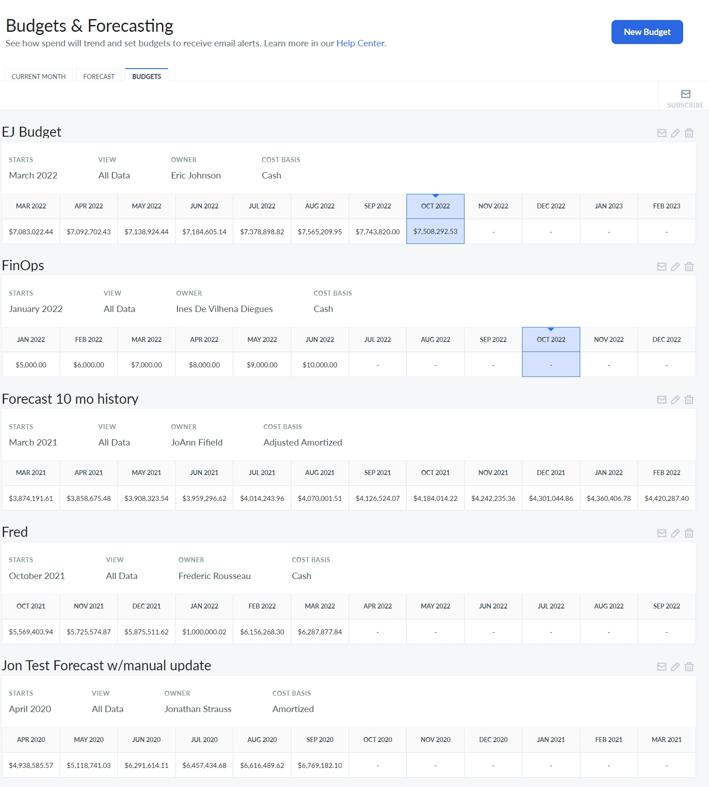
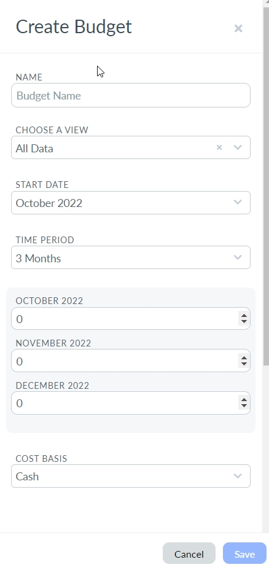

# Presupuestos

Los presupuestos se definen a nivel de vista, lo que facilita el seguimiento independiente de las unidades de negocio. Además, están vinculados a una base de coste concreta. La mayoría de los clientes empezarán pagando en efectivo. Si tu organización adquiere una gran cantidad de RI parciales o con pago por adelantado íntegro, puedes utilizar la opción «Amortizado» para tener una idea más clara de si tu gasto está siguiendo una tendencia diferente. Si tienes la opción «Precios personalizados» configurada en Cloudability, quizá te convenga más elegir «Ajustado» o «Ajustado amortizado».

Caso de uso

Puedes configurar varios conjuntos de vistas: uno para el seguimiento del entorno (por ejemplo, Desarrollo, Pruebas y Producción) y otro para las divisiones a nivel de funciones (planificador de RI, ajuste de capacidad, asignación de cargas de trabajo y automatización). También puedes crear varios presupuestos para una vista determinada; por ejemplo, mostrar tanto el presupuesto anual como el objetivo ambicioso trimestral para los gastos incluidos en la vista «Ingeniería».

Personalizar el panel de control de presupuestos

Ve a Plan > Presupuestos

Para crear un nuevo presupuesto, selecciona el botón «Nuevo presupuesto ».

Introduce los valores correspondientes y haz clic en «Guardar ».

Puedes realizar las siguientes acciones:

- Suscríbete para recibir notificaciones si vas por buen camino para sobrepasar tu presupuesto en el mes actual y si lo has sobrepasado en el mes actual.
- Editar un presupuesto.
- Eliminar un presupuesto.

Configuración de notificaciones por correo electrónico para el presupuesto

Sigue estos pasos para configurar las notificaciones por correo electrónico de alertas presupuestarias:

1. Ve a Plan > Presupuesto > Haz clic en «Suscribirse» en la esquina superior derecha.
2. En el panel de la izquierda, haz clic en «Añadir notificación».
3. Selecciona la vista y el presupuesto para los que deseas recibir la alerta. Selecciona «Se prevé que se supere» y/o «Se ha superado» y guarda los cambios.
4. La frecuencia de las alertas dependerá de las preferencias de correo electrónico del usuario (ya sea diaria, semanal, mensual o trimestral).

**Tema principal:** [Presupuestos y previsiones](../product/plan-and-manage-your-budgets-and-forecasts.html)
