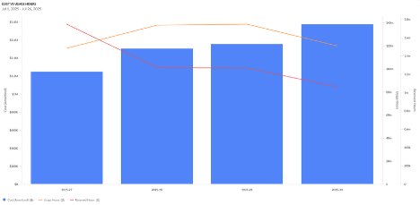

# Widget de gráfico

El widget de gráficos permite a los usuarios de Cloudability visualizar sus datos en forma de gráfico de líneas, gráfico de áreas, gráfico de barras o gráfico de columnas. Este tipo de widget resulta especialmente útil cuando lo más importante son las tendencias generales, los picos o las diferencias entre los valores del gráfico, y no los valores exactos.

Al configurar un widget de gráfico, los usuarios pueden elegir cualquier dimensión, ya sea de la fuente de datos «Coste y uso» o de la fuente de datos «Utilización», para el eje X del gráfico.

Cualquier métrica de la fuente de datos «Coste y uso» o «Utilización» puede utilizarse como eje Y en el gráfico.

A continuación, los datos se pueden desglosar aún más en series de datos independientes mediante la función «Agrupar por», que mostrará una serie de datos independiente para cada dimensión seleccionada.

En los «gráficos de líneas» o «gráficos de áreas», los usuarios pueden seleccionar la opción «Spline», que creará una línea más suave en el gráfico.

Al rellenar el campo «Nombre de la serie», se añadirá un prefijo a cada dimensión que se utilice como leyenda en el gráfico.

La opción «Escala desde el valor más bajo» permite decidir si la escala del gráfico debe comenzar desde el valor más bajo del gráfico o si se debe permitir a los usuarios elegir manualmente el punto de inicio del eje Y. El valor por defecto cuando no se selecciona la opción «Escalar desde el valor más bajo» es que la escala comience en «0».

Por último, los usuarios pueden mostrar varios gráficos en un único widget. Haz clic en el botón «Añadir capa», situado en la parte inferior de la pantalla de configuración, para crear otro tipo de gráfico. Los pasos de configuración de cada capa son los mismos que los de la capa principal.

**Tema principal:** [Crear o editar un widget en un panel de control](../product/create-or-edit-a-widget-in-a-dashboard.html)
