# Guía para el gestor de compromisos heredados

El Commitment Manager de Apptio Cloudability te ayuda a obtener una visión global de cómo los instrumentos de gasto comprometido (por ejemplo, instancias reservadas o planes de ahorro) pueden ayudarte a optimizar tu gasto en la nube. Este artículo describe las funciones de Commitment Manager y su capacidad para ayudar a aprovechar los instrumentos de gasto comprometido como parte de una estrategia global de optimización financiera en la nube.

Guía de inicio

Antes de empezar, es recomendable que te asegures de que se han activado los permisos necesarios.

Nota: Riesgo: Los usuarios de « Cloudability » pueden analizar diferentes niveles de compromiso en función del riesgo

Para comprobar el estado de las credenciales necesarias, sigue estos pasos

1. Ve a «Configuración» > «Credenciales de proveedor ».
2. En la vista de cuentas principales de la pestaña « AWS », cualquier pagador principal o cuenta vinculada que sea titular o que pueda ser el titular previsto de compromisos (instancias reservadas o planes de ahorro) debe mostrar un recuadro verde con un indicador de estado de verificación blanco en la sección «Funciones avanzadas».
3. Si una cuenta presenta algún indicador de estado distinto del recuadro verde con una marca de verificación blanca, haz clic en  para comprobar las credenciales individuales.
4. Cloudability Te permitirá consultar todas tus reservas en AWS, Azure o GCP. Si, por cualquier motivo, no todas tus cuentas cuentan con las credenciales adecuadas, es posible que no puedas ver todos tus compromisos de reserva en el gestor de compromisos.
5. Si los permisos que aparecen en el subtítulo Reservaciones tienen una X roja, deberán actualizarse ( [regenerando y aplicando plantillas CloudFormation](../admin/manage-aws-credentials.html#manage-aws-credentials__Regenerate_a_Cloud_Formation_template) ) antes de que toda la información en el Administrador de compromisos se muestre correctamente.

   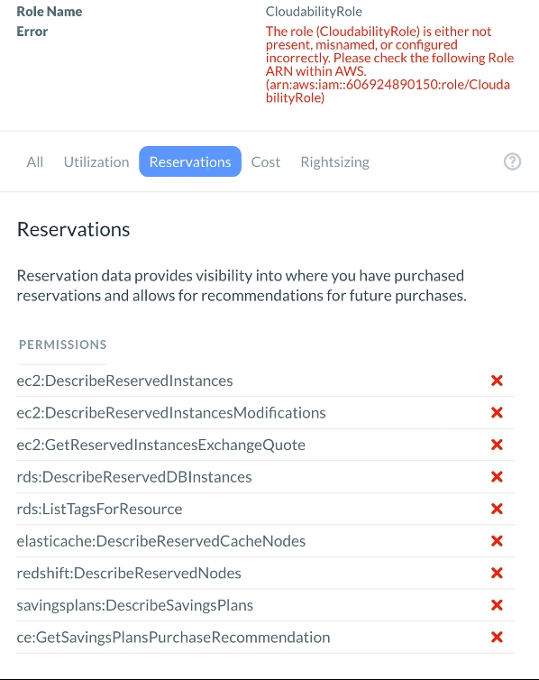

Nota:

Si faltan permisos para los planes de ahorro, los ahorros futuros previstos de los planes existentes no aparecerán en el gráfico principal del Gestor de compromisos. Si faltan los permisos para las instancias reservadas, no se podrán ver ni los ahorros históricos ni los previstos para el futuro.

Cómo acceder al Gestor de compromisos

Para acceder al Gestor de compromisos, ve a Optimizar > Gestor de compromisos.

Opciones de visualización y recomendaciones

La barra de subnavegación del Gestor de compromisos muestra las opciones para personalizar la visualización de los compromisos propios, así como la forma en que se generan las recomendaciones.

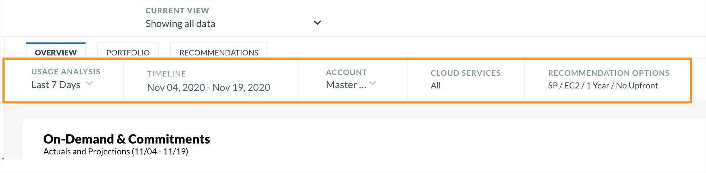

Análisis de uso

La configuración del análisis de uso determina qué parte del historial de uso debe tenerse en cuenta a la hora de generar recomendaciones.

En el menú desplegable, selecciona 7, 30 o 60 días de consumo anterior y el gráfico se ajustará para mostrar el consumo previsto resultante y las recomendaciones correspondientes.

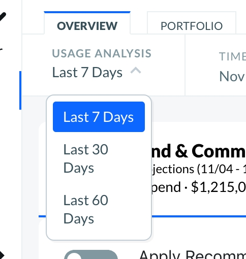

Cronología

La configuración de la línea temporal permite a los usuarios determinar el intervalo de fechas que desean que se muestre en el gráfico, tanto en el pasado como en el futuro.

Para ajustar la línea de tiempo, selecciona la sección «Línea de tiempo» del menú de subnavegación para que aparezca el selector de intervalo de fechas. Selecciona el intervalo de tiempo que desees y, a continuación, actualiza. El área visible del gráfico se ajustará automáticamente para mostrar únicamente el intervalo de fechas seleccionado.

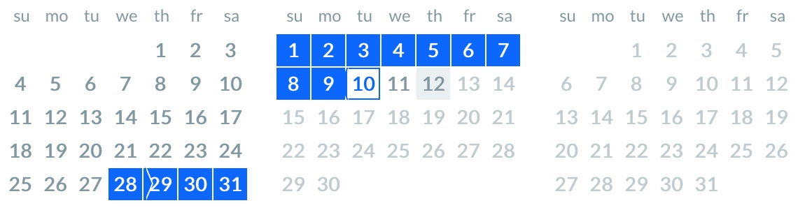

Nota:

No es obligatorio seleccionar un intervalo de fechas que incluya la fecha de hoy, pero si se selecciona un intervalo que abarque únicamente el pasado, se generará un gráfico sin recomendaciones, aunque estas se sigan generando. Del mismo modo, si se selecciona un intervalo de fechas que solo incluya fechas futuras, solo se mostrará la utilización prevista en el futuro de los compromisos existentes.

Cuenta

La configuración de la cuenta permite al usuario consultar y generar recomendaciones a nivel de la cuenta principal. Para maximizar la utilización y el ahorro, las recomendaciones se formulan, por defecto, a nivel del pagador principal. En el Gestor de compromisos solo se permite seleccionar cuentas de pagador principales. Si deseas restringir el uso y la visualización a cuentas vinculadas concretas, puedes hacerlo en las pestañas «Recomendado» de Reserved Instance Planner y Savings Plans. El consumo, las recomendaciones y el gráfico se actualizan automáticamente para la cuenta seleccionada.

Infórmate sobre [los planes de ahorro de AWS](analyze-data-for-your-aws-savings-plans.html)

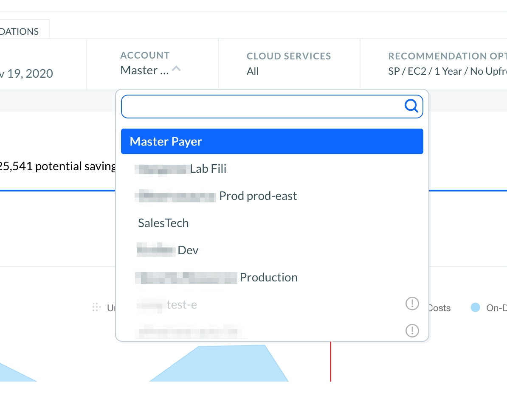

Nota:

La selección «Cuenta» no debe utilizarse como filtro de recomendaciones. Limita el uso que tiene en cuenta el servicio de recomendaciones únicamente al de la cuenta seleccionada a la hora de generar recomendaciones de compra y modificación, partiendo de la base de que el usuario desea que las recomendaciones se refieran exclusivamente al uso de dicha cuenta. Por este motivo, las recomendaciones generadas de esta forma no serán necesariamente un subconjunto de las que se obtienen cuando se selecciona el pagador principal. Probablemente serán recomendaciones totalmente diferentes.

Servicios en la nube

De forma predeterminada, el Gestor de compromisos genera una visión global del uso y la cobertura del gasto comprometido en todos los servicios de AWS acreditados en la plataforma Apptio Cloudability; sin embargo, la selección de servicios en la nube permite a los usuarios visualizar servicios individuales o grupos de servicios según sus preferencias.

En la sección «Servicios en la nube» del menú de subnavegación, al marcar o desmarcar los servicios, estos se añadirán o eliminarán del gráfico, tanto en lo que respecta al uso y la cobertura pasados como al uso y la cobertura previstos para el futuro, así como a las recomendaciones.

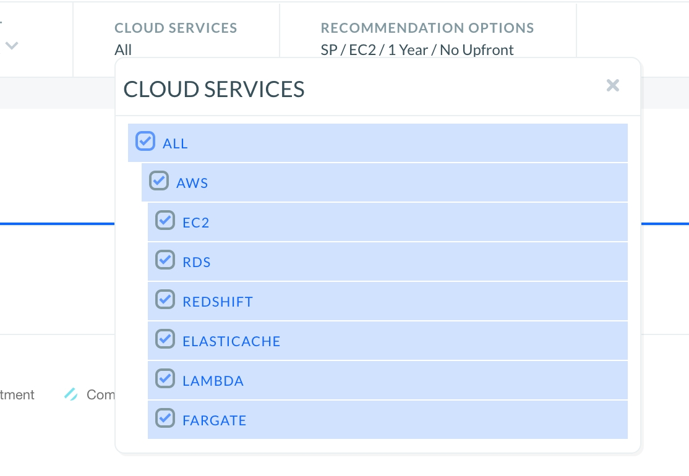

Nota:

Debe seleccionarse al menos un servicio. Si se seleccionan los planes de ahorro en las opciones de recomendación y algunos de los servicios seleccionados no son aplicables a dichos planes, el Gestor de compromisos seguirá generando recomendaciones de instancias reservadas para esos servicios concretos.

Opciones de recomendación

Las opciones de recomendación permiten a los usuarios personalizar sus preferencias en cuanto a recomendaciones de compra, incluyendo el instrumento de compromiso (es decir, planes de ahorro o instancias reservadas), el tipo (por ejemplo, « EC2 » o «Compute» para los planes de ahorro), la duración y el modelo de pago. Las recomendaciones relativas al intercambio y la modificación de instancias reservadas mantendrán las mismas condiciones que el compromiso original, tal y como exige AWS.

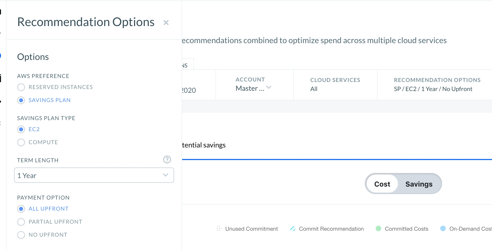

Nota:

En el caso de « AWS », no todos los servicios pueden estar cubiertos por los planes de ahorro. Si se seleccionan los «Savings Plans», el «Commitment Manager» seguirá generando recomendaciones de instancias reservadas para los servicios que no puedan cubrirse mediante los «Savings Plans».

Cómo utilizar el gráfico principal de The Commitment Manager

Base de coste

La configuración predeterminada del Gestor de compromisos muestra el uso bajo demanda, la cobertura de los compromisos y las recomendaciones por coste, sin aplicar las recomendaciones disponibles. En esta vista, la zona sombreada en azul representa el consumo bajo demanda, superpuesta a la zona sombreada en verde, que representa el consumo cubierto por los compromisos.

Una línea vertical roja representa el día más reciente de consumo real registrado; el área situada a la izquierda de la línea roja representa el consumo histórico y la cobertura de los compromisos, mientras que el área situada a la derecha de la línea roja muestra una proyección del consumo futuro con la cobertura de los compromisos ya adquiridos. En esta vista, las recomendaciones se representan mediante un sombreado en líneas diagonales que se superpone al uso futuro previsto bajo demanda.

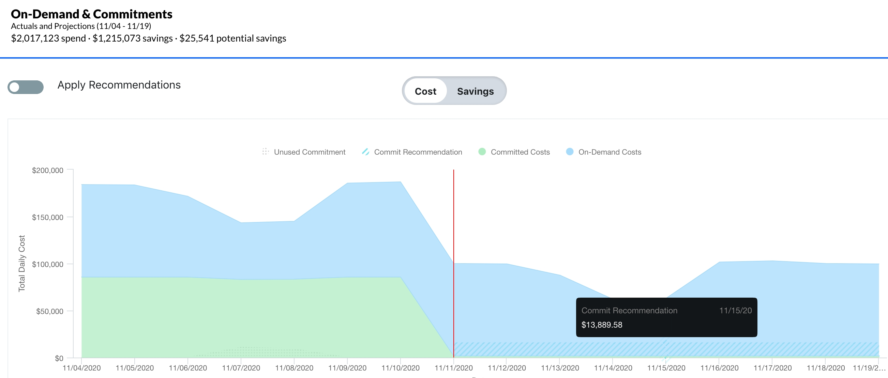

Coste previsto tras aplicar las recomendaciones

Para ver los costes previstos tras aplicar las recomendaciones, desplaza el control deslizante situado en la parte superior izquierda del gráfico hasta la posición «Aplicar recomendaciones» y el gráfico se actualizará para mostrar los costes previstos tras la implementación de las recomendaciones.

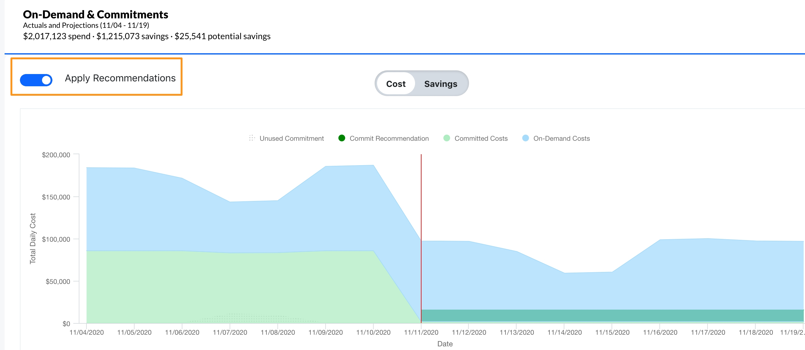

Ahorros

Además de consultar la cobertura histórica y prevista en términos de coste, los usuarios pueden optar por visualizar su cobertura representada gráficamente en términos de ahorro. Para ver los datos por ahorros, selecciona «Ahorros» en el selector situado justo encima del centro del gráfico. Al seleccionar la vista «Ahorros», solo se muestran los ahorros históricos generados por los compromisos propios en el pasado y los ahorros futuros previstos, tanto de los compromisos propios como de los recomendados.

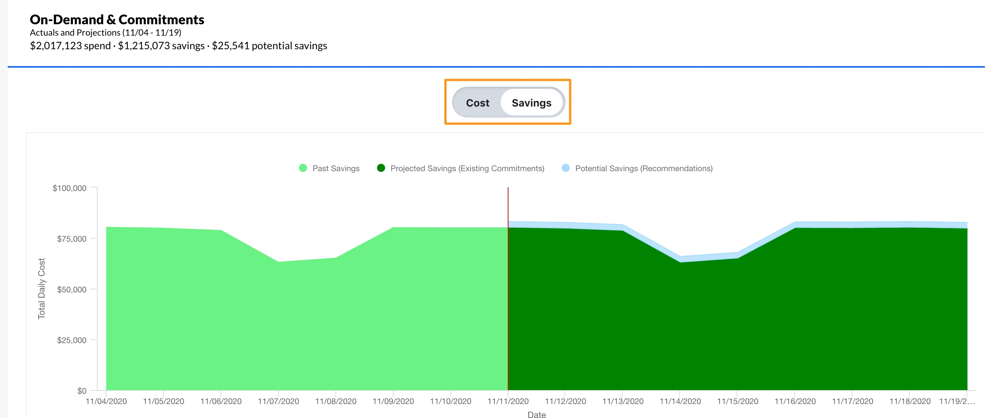

Ver los detalles de las recomendaciones sobre acciones propias y compromisos

Para ver los detalles de los compromisos existentes de los que es titular, seleccione o haga clic en el área sombreada en verde para acceder a la cartera de reservas o al inventario del plan de ahorro.

Para ver los detalles de las recomendaciones basadas en las preferencias definidas, haz clic dentro del área sombreada en azul que forma una línea diagonal, situada a la derecha de la línea roja del gráfico, para acceder al Planificador de reservas o a las Recomendaciones del plan de ahorro.

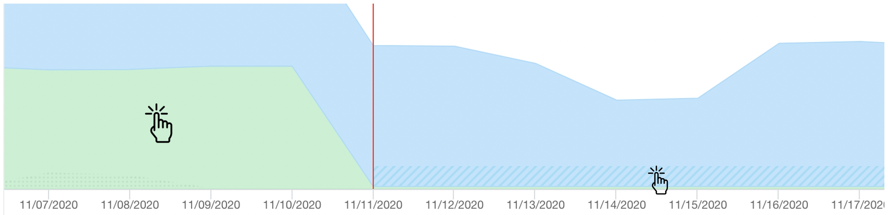

Referencia

Para obtener más información sobre cómo gestionar tus compromisos de « AWS » con « Apptio » Cloudability, consulta:

- [Comprender cómo los planes de ahorro « AWS » afectan a tu factura](understanding-how-aws-plans-affect-your-cloud-bill.html)
- [Qué significan para ti los planes de ahorro « AWS »](https://www.apptio.com/blog/aws-savings-plans/ "(se abre en una pestaña o una ventana nueva)")
- [Instancias reservadas](https://www.cloudability.com/product/features/reservations/ "(se abre en una pestaña o una ventana nueva)")

**Tema principal:** [Guía para la gestión de compromisos](../product/guide_to_commitment_management.html)
