# Configurar tu agente de contenedores

Nota:

**Migración del agente de métricas heredado**

IBM Cloudability está migrando del agente de métricas de contenedores heredado al nuevo agente de IBM FinOps. El agente de métricas heredado está quedando obsoleto y dejará de funcionar el 19 de noviembre de 2026. Siga las instrucciones que figuran a continuación para obtener orientación sobre la migración.

Descripción general

Para recopilar los datos que necesitamos para realizar la asignación de un clúster determinado, tendrá que desplegar el agente IBM FinOps, el agente de recopilación de datos de nueva generación para Cloudability Containers. Para obtener recomendaciones sobre la optimización de contenedores, deberá implementar el agente de Kubeturbo de Turbonomic en cada clúster sobre el que desee generar informes.

Esto se consigue mediante un despliegue de HELM aprovisionado para cada clúster. Estos comandos HELM pueden ser generados siguiendo los siguientes pasos:

Provisión Cloudability Agente de métricas

1. Vaya a **Insights > Contenedores**.
2. Seleccione el botón **Aprovisionar clústeres**.
3. Rellene el formulario con el nombre de su clúster y su versión Kubernetes o su versión OpenShift.
4. 4. Haga clic en Siguiente -> **Generar comando**.

Nota:

Los datos del cluster deberían aparecer en Cloudability al día siguiente. Si tiene algún problema con la implantación, póngase en contacto con el servicio de asistencia Apptio.

Google Kubernetes Engine Instrucciones específicas para GKE

Debes añadir una [etiqueta de clúster](https://cloud.google.com/kubernetes-engine/docs/how-to/creating-managing-labels "(se abre en una pestaña o una ventana nueva)") en cada clúster de la siguiente manera:

- clave: gke-cluster
- valor: El(los) nombre(s) del clúster que establezca en el formulario/YAML. Esto permite a Cloudability asignar los clústeres de GKE a las partidas individuales del archivo de facturación de GCP, y imputar los costes a sus clústeres.

Cloudability tendrá que ingestar un archivo de facturación con las etiquetas de clúster que haya añadido, lo que puede tardar hasta 48 horas. Una vez que Apptio haya procesado el nuevo archivo de facturación, deberá crear una nueva [asignación de etiquetas](build-an-aws-cost-by-tag-report.html) en la aplicación Cloudability. Establezca una dimensión Cloudability como gke-cluster y asígnela a la etiqueta gke-cluster. Se trata de una necesidad puntual, no por clúster.

Asegúrese de que su cuenta tiene el rol de administrador de clúster antes de desplegar el agente de métricas. Por defecto, una cuenta de usuario no tiene el rol cluster-admin. Utiliza el siguiente comando en el clúster de « GKE » para asignar a un usuario el rol de administrador del clúster:

```
"kubectl create clusterrolebinding username-cluster-admin-binding --
clusterrole=cluster-admin --user=username@emailaddress.com"
```

Despliegue del agente

**Requisitos previos:**

**Requisitos de red:**

En el agente de métricas de Cloudability, los requisitos de red se documentaron en el archivo [README](https://github.com/cloudability/metrics-agent#:~:text=Networking%20Requirement%20for%20Metrics%20Agent "(se abre en una pestaña o una ventana nueva)").

El agente unificado ha actualizado los requisitos de red para funcionar correctamente y cargar datos en Cloudability 's S3.

Los **nuevos** requisitos de red para el agente son los siguientes:

> El contenedor que aloja el agente de métricas debe permitir las solicitudes de HTTPS a los siguientes puntos finales:
>
> - https://frontdoor.apptio.com puerto 443
>
>   - https://frontdoor-eu.apptio.com si Cloudability está en la UE
>   - https://frontdoor-au.apptio.com si Cloudability está en AU
>   - https://frontdoor-me.apptio.com si Cloudability está en ME
> - https://api.cloudability.com puerto 443
>
>   - https://api-eu.cloudability.com si Cloudability está en la UE
>   - https://api-au.cloudability.com si Cloudability está en AU
>   - https://api-me.cloudability.com si Cloudability está en ME
>
> El contenedor que aloja el agente de métricas debe tener acceso de escritura a los siguientes buckets Apptio S3 :
>
> - apptio\* (cubo prefijado con apptio)
>
>   - Si necesita información más detallada sobre los requisitos de las listas blancas, póngase en contacto con nuestro equipo de asistencia

**Requisitos de almacenamiento:**

IBM -Finops-Agent admite, de forma opcional, un volumen persistente (PV) configurable (por defecto, 8Gi ). El PV debe utilizarse en entornos en los que la conexión a la red del almacén de objetos de Kubecost o a la API de Cloudability se interrumpa con frecuencia. Esto es poco probable en la mayoría de los entornos. Si el volumen está habilitado, el agente almacenará las muestras en este volumen e intentará recuperarlas tras un reinicio. Esta mejora incrementa enormemente la capacidad del agente para recuperar datos en situaciones de fallo.

**Container Registry cambiar:**

El IBM -Finops-Agent no se almacena en docker como el metrics-agent existente. En su lugar, el IBM -Finops-Agent se almacena en ICR. Así que es posible que tenga que actualizar su lista blanca del registro de contenedores para permitir el despliegue IBM -Finops-Agent para tirar de la imagen ICR. El registro de contenedores IBM -Finops-Agent es:

```
icr.io/ibm-finops/agent:vx.x.x
```

Si necesita extraer la imagen localmente para copiarla en el registro de su contenedor. Puede ejecutar el siguiente comando docker/podman pull:

```
 podman pull icr.io/ibm-finops/agent:v0.0.25 --platform=linux/amd64
```

**Autentificación:**

Es importante señalar que el agente de métricas Cloudability utiliza una clave API específica de Containers. El agente IBM finops **ya no utilizará/soportará esta clave api**. En su lugar, los clientes deben crear una **clave API** para el agente en Frontdoor y reunir su **ID de entorno** de Frontdoor.

**Creación de usuario para gestionar la clave API del contenedor:**

Es necesario que su entorno Frontdoor tiene claves api habilitado en él para la función de contenedores para trabajar

Se recomienda que los clientes creen un usuario de servicio específico para contenedores dentro de su propio dominio para gestionar su clave api en adelante. De esta forma, la clave api de carga no está asociada a un usuario concreto que pueda ser desactivado en el futuro. La persona que crea el nuevo usuario y la clave api necesita ser un usuario administrador en su entorno Frontdoor.

1. Vaya a "Asistente de acceso" en "Administración de acceso", seleccione "Añadir usuario(s)", configure "Cliente" y "Entorno". Por último, pulse "Confirmar"

   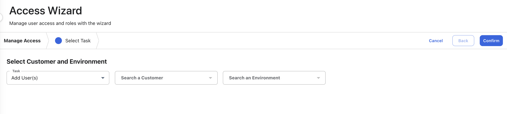
2. Introduzca los datos del usuario y pulse "Siguiente"

   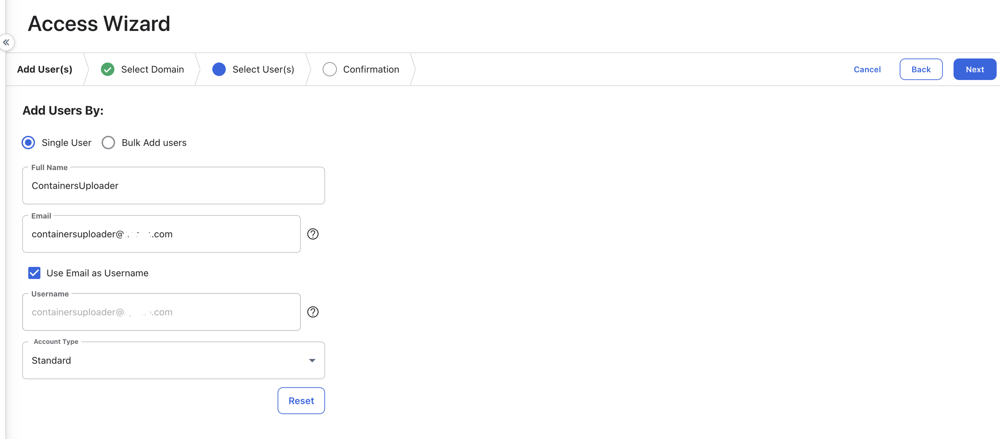
3. Seleccione "Conceder función(es)", "No enviar al usuario un correo electrónico de activación" y pulse "Confirmar" para crear el usuario

   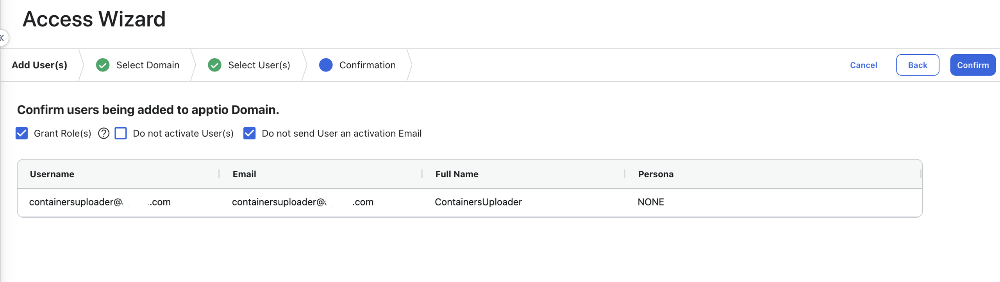
4. Asegúrese de que el usuario está seleccionado para la concesión de funciones

   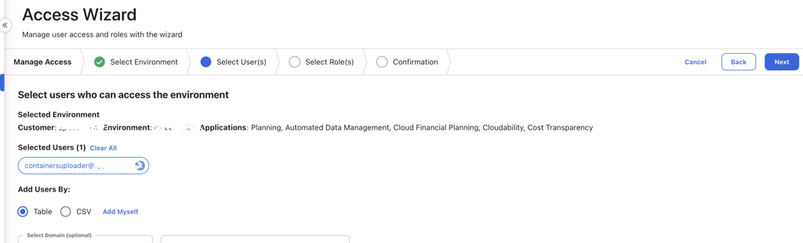
5. Conceda la función “CloudabilityContainerUploader” al usuario y pulse "Siguiente"/"Confirmar".

   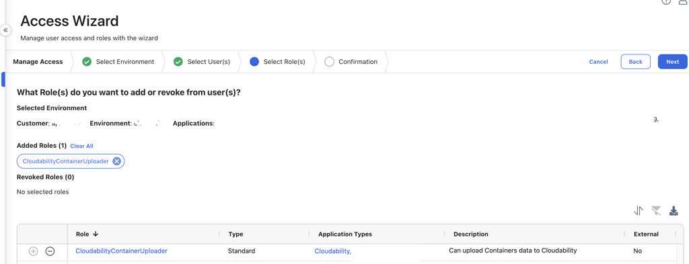

   **Creación de usuario para gestionar la clave API del contenedor:**
6. Vaya a "Inicio", busque el usuario recién creado y haga clic en su "Nombre de usuario"

   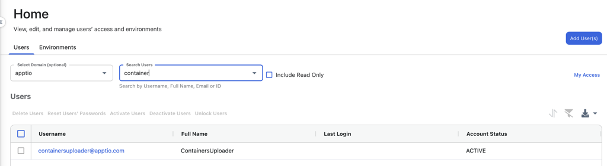
7. Pulse "Ver perfil de usuario"

   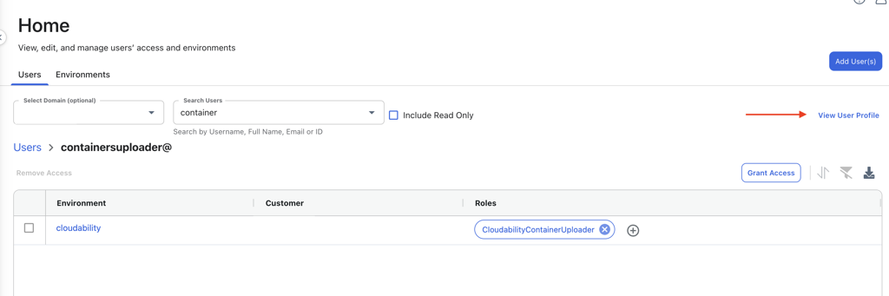
8. Añadir una clave api para el usuario

   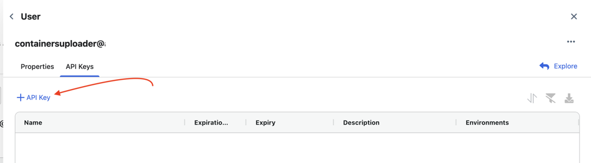
9. Introduzca un nombre para la clave API (por ejemplo: IBM -Finops-agent), configure "Sin caducidad" si no está ya configurado, y pulse confirmar.
10. Almacene las credenciales de la clave API (**clave pública** y **clave privada** ) para utilizarlas posteriormente en la instalación en timón del agente.
11. Pulsa "Conceder acceso"
12. Seleccione su entorno y pulse "Siguiente"

    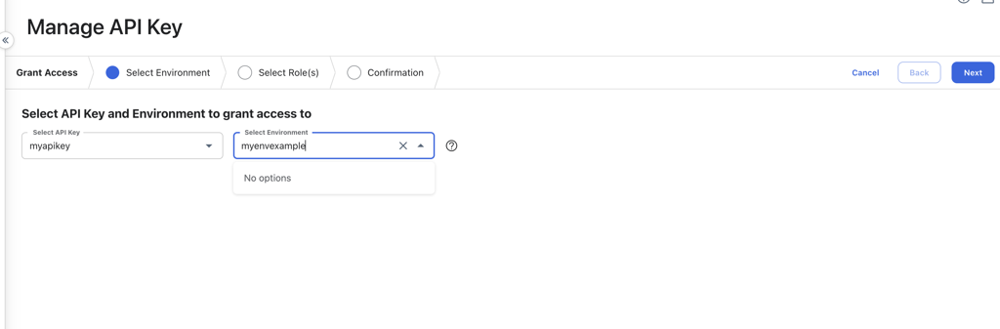
13. Añade el rol “CloudabilityContainerUploader” a la clave y pulsa "Siguiente". Esta función tiene acceso limitado al punto final de carga de contenedores.

    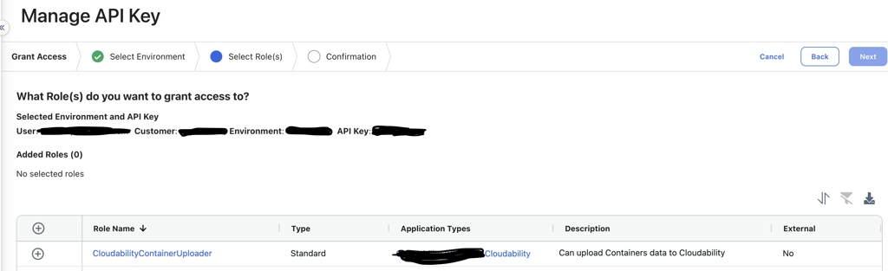
14. Compruebe que su clave se ha creado y tiene la función correcta

    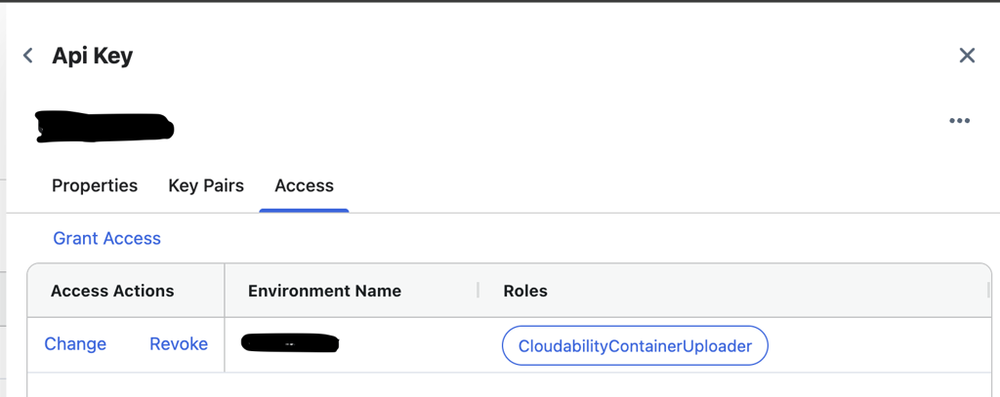

**Identificación del entorno de la puerta de entrada**

1. Navegar hasta la puerta de entrada
2. En la parte superior derecha, seleccione el logotipo Perfil y haga clic en "Cuenta de usuario"

   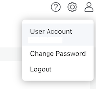
3. Vaya a la pestaña Acceso al entorno
4. Recoge el ID del entorno en la pestaña Entorno de la tabla

   1. Asegurarse de que el entorno es el mismo que el que se utiliza para acceder Cloudability

      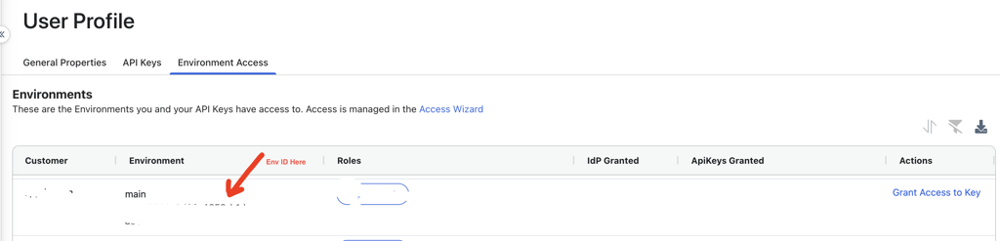
   2. Ejemplo de formato de identificación: **xxxxxxxx-xxxx-xxxx-xxxx-xxxxxxxxxxxx**

Despliegue del agente de métricas con Helm

Requisitos previos:

- Instalación: para poder utilizar los gráficos, es necesario tener instalado « [Helm](https://www.ibm.com/links?url=https%3A%2F%2Fhelm.sh%2F "(se abre en una pestaña o una ventana nueva)") ». Consulta [la documentación](https://www.ibm.com/links?url=https%3A%2F%2Fhelm.sh%2Fdocs%2F "(se abre en una pestaña o una ventana nueva)") de « Helm » para empezar.
- Actualizar las políticas de red del clúster para permitir nuevos requisitos de red (si es necesario)
- Recopilar claves públicas y privadas de la API
- Recopilar la identificación del entorno de la puerta de entrada

Una vez que Helm se haya configurado correctamente, añada el repositorio como se indica a continuación:

```
helm repo add ibm-finops https://kubecost.github.io/finops-agent-chart
```

Si ya había añadido este repositorio anteriormente, actualícelo:

```
helm repo update
```

Instale Helm Repo

```
helm install ibm-finops-agent ibm-finops/finops-agent \   
--set agent.cloudability.enabled=true \
--set agent.cloudability.uploadRegion=<uploadRegion> \      
--set agent.cloudability.parseMetricData=false \
--set agent.cloudability.secret.create=true \
--set agent.cloudability.secret.cloudabilityAccessKey='<AccessKey>' \
--set agent.cloudability.secret.cloudabilitySecretKey='<SecretKey>' \
--set agent.cloudability.secret.cloudabilityEnvId='<EnvID>' \
--set clusterId='<ClusterName> \
--create-namespace -n ibm-finops-agent
```

Para desinstalar Helm Repo:

```
helm uninstall ibm-finops-agent
```

Si su cluster está ejecutando actualmente el antiguo Cloudability metrics-agent, siéntase libre de mantenerlo en ejecución hasta que vea que el nuevo ibm-finops-agent comienza a cargar con éxito durante 24 horas. El agente ibm-finops puede instalarse y ejecutarse en paralelo con el agente de métricas Cloudability, pero se recomienda desactivar el agente de métricas Cloudability una vez que el nuevo agente se haya estabilizado en el clúster.

**UploadRegion** depende de la región en la que se encuentre el entorno Cloudability del cliente. Los valores admitidos son los siguientes

- US: nosotros (o us-west-2 )
- UE: eu (o eu-central-1 )
- AU: au (o ap-southeast-2 )
- ME: yo (o me-central-1 )
- Hybrid EU *(clientes que tienen puerta de entrada en la UE pero cargan los datos de los contenedores en la región de EE.UU.)* : hybrid-eu
- AU híbrida *(clientes que tienen puerta de entrada AU pero cargan los datos de los contenedores en la región de EE.UU.):* hybrid-au
- ME híbrido *(clientes que tienen ME frontdoor pero cargan los datos de los contenedores en la región de EE.UU.)* : hybrid-me

**ClusterName** debe ser el mismo valor que el que está actualmente en el metrics-agent CLOUDABILITY\_CLUSTER\_NAME **para evitar cualquier problema de ingestión de costes**.

Nota:

El agente unificado admite muchas de las mismas configuraciones que el agente de métricas salientes Cloudability. Si tu agente de métricas actual tiene alguna configuración específica **(por ejemplo, configuraciones de PROXY)**, consulta [aquí](https://github.com/kubecost/finops-agent-chart/blob/main/charts/finops-agent/README.md#:~:text=%22%22-,Agent%20Configuration,-Name "(se abre en una pestaña o una ventana nueva)") los parámetros compatibles con Helm.

Puede añadirlas a su comando de instalación, por ejemplo:

```
helm install ibm-finops-agent ibm-finops/finops-agent \   
--set agent.cloudability.enabled=true \
--set agent.cloudability.uploadRegion=<uploadRegion> \      
--set agent.cloudability.parseMetricData=false \
--set agent.cloudability.secret.create=true \
--set agent.cloudability.secret.cloudabilityAccessKey="<PublicKey>" \
--set agent.cloudability.secret.cloudabilitySecretKey="<PrivateKey>" \
--set agent.cloudability.secret.cloudabilityEnvId="<FDEnvID>" \
--set agent.cloudability.outboundProxy="http://x.x.x.x:8080" \
--set agent.cloudability.parseMetricsData="true"
--set clusterId="<ClusterName>" \
--create-namespace -n ibm-finops-agent
```

1. Asegúrese de que el pod ibm-finops-agent se está ejecutando

   ```
   kubectl get pods -n ibm-finops-agent

   ### Example Output Below ###
   NAME                                READY   STATUS    RESTARTS   AGE
   ibm-finops-agent-7bbf99d9fb-kmhh9   1/1     Running   0          1m
   ```
2. Compruebe los registros de los pods para confirmar que el agente está cargando correctamente los datos en Cloudability. **Tardará 10 minutos en ver el primer registro de carga con éxito.**

   ```
   kubectl logs <POD_NAME> -n ibm-finops-agent

   ### Example Output Below ###
   INF Starting IBM Finops Agent...
   DBG HTTP server started on port 9003
   INF Initializing cldy emitter
   INF emitting sample to Cldy 0
   INF added sample to Cldy
   INF emitting sample to Cldy 1
   INF added sample to Cldy
   INF emitting sample to Cldy 2
   INF added sample to Cldy
   INF Attempt 1: performing login request to FrontDoor using KeyAccess and KeySecret
   INF Attempt 1: acquiring presigned URL from Cloudability with acquired Open-token
   INF Attempt 1: uploading sample to Cloudability S3 using presigned URL
   INF successfully uploaded metric sample xxxxx-xxxx-xxxx-xxxx-xxxxxxxxxxxx_xxxx-xx-xx-xx-xx-xx.tgz to cloudability
   ```

**Una vez más, pasarán 10 minutos hasta que aparezca el registro "successfully uploaded metric sample to cloudability". Este es un punto de fallo común en los agentes si no tienen activada la configuración correcta de listas blancas/proxy.**

Después de 24 horas de que el ibm-finops-agent se ejecute y cargue correctamente. Si todavía está ejecutando un despliegue de Cloudability metrics-agent, ahora puede desmontar esa infraestructura y mantener en ejecución sólo el cuadro de mando ibm-finops-agent.

Implementación del agente de optimización de contenedores de Cloudability ( Turbonomic kubeturbo)

1. Vaya a Insights > Contenedores.
2. Seleccione el botón Aprovisionar clústeres.
3. Rellene el formulario con el nombre de su clúster y su versión Kubernetes o su versión OpenShift.
4. Seleccione Generar Script de Agente en la sección Agente de optimización de contenedores.

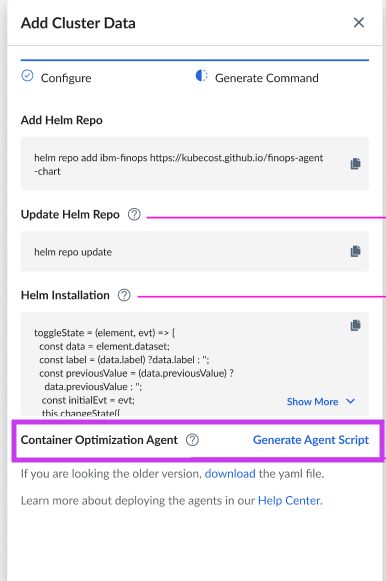

Nota: Cloudability genera un archivo de script de shell para que lo descargue y pueda ejecutar el despliegue del agente una vez conectado al clúster de destino. Una vez completado, Cloudability empezará a recibir datos para el clúster en pocas horas.

Nota:

Los datos del cluster deberían aparecer en Cloudability al día siguiente. Si tiene algún problema con la implantación, póngase en contacto con el servicio de asistencia Apptio.

Pasos de la instalación

Una vez descargado el script, cópielo en la ubicación desde la que desea ejecutarlo, en un entorno en el que esté conectado al clúster de destino en el que desea que se despliegue el agente.

Ejecute el comando utilizando el siguiente ejemplo:

```
chmod +x new-js-aks.sh &&./new-js-aks.sh
```

El resumen de la instalación es el siguiente.

```
Parameter            Value
---------            ---------
Mode                 Create/Update
Kubeconfig           default
Host                 https://20.116.237.9
Namespace            turbo
Target Name          new-js-aks
Target Subtype       Kubernetes
Role                 turbo-cluster-admin
Version              8.14.5
Auto-Update          false
Auto-Logging         false
Proxy Server         false
Private Registry     false
```

Confirme los ajustes anteriores [S/N]: Y

El contexto actual de Kubernetes es el siguiente.

```
NAME                     CLUSTER                  AUTHINFO                                                NAMESPACE
concise-lobster-aks      concise-lobster-aks      clusterUser_concise-lobster-rg_concise-lobster-aks
```

Por favor, confirme si el script debería funcionar en el cluster anterior [S/N]: Y

```
Creating turbo namespace to deploy Kubeturbo operator
namespace/turbo created
secret/turbonomic-credentials created
% Total    % Received % Xferd  Average Speed   Time    Time     Time  Current
Dload  Upload   Total   Spent    Left  Speed
100  159k  100  159k    0     0   920k      0 --:--:-- --:--:-- --:--:--  923k

customresourcedefinition.apiextensions.k8s.io/kubeturbos.charts.helm.k8s.io unchanged
serviceaccount/kubeturbo-operator created
clusterrole.rbac.authorization.k8s.io/kubeturbo-operator unchanged
Skip patching ClusterRoleBinding kubeturbo-operator as the clusterRole has bound to the operator service account already.
deployment.apps/kubeturbo-operator created
namespace/turbo configured
Waiting for deployment 'kubeturbo-operator' to start...
Resource is not ready, re-attempt after 10s ... (1/10)
pod/kubeturbo-operator-857855c6b5-d9x2c condition met
apply Kubeturbo CR ...
kubeturbo.charts.helm.k8s.io/kubeturbo-release created
Waiting for deployment 'kubeturbo-release' to start...
Resource is not ready, re-attempt after 10s ... (1/10)
pod/kubeturbo-release-7d499cf568-cg5sm condition met
Successfully apply Kubeturbo in turbo namespace!

NAME                                SECRETS   AGE
serviceaccount/kubeturbo-operator   0         32s
serviceaccount/turbo-user           0         12s

NAME                                     READY   STATUS    RESTARTS   AGE
pod/kubeturbo-release-7d499cf568-cg5sm   1/1     Running   0          12s

NAME                                 READY   UP-TO-DATE   AVAILABLE   AGE
deployment.apps/kubeturbo-operator   1/1     1            1           30s
deployment.apps/kubeturbo-release    1/1     1            1           12s

NAME                                       DATA   AGE
configmap/turbo-config-kubeturbo-release   2      12s
Done!
```

Ejecute el siguiente comando para verificar que los 2 pods se están ejecutando, como se muestra en el siguiente ejemplo:

```
kubectl get pods -n turbo
```

```
NAME                                  READY   STATUS    RESTARTS   AGE 
kubeturbo-operator-857855c6b5-d9x2c   1/1     Running   0          105s 
kubeturbo-release-7d499cf568-cg5sm    1/1     Running   0          87s
```

La siguiente imagen ilustra la instalación.

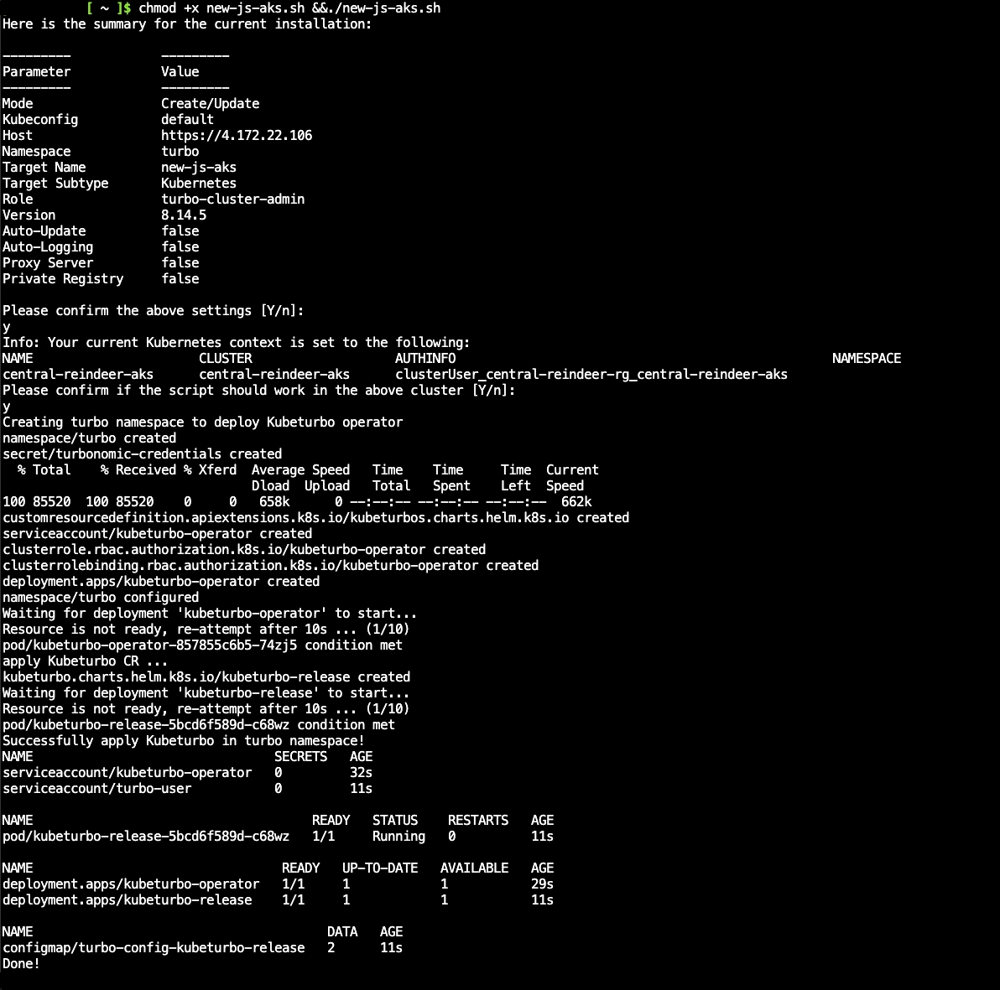

**Tema principal:** [Imputación de costes de contenedores](../product/k8s-cost-allocation.html)
