# Containers Insights: Guía de cuadros de mando y widgets

Descripción general

Containers Insights proporciona un panel de control predeterminado para mostrar un resumen del coste y la eficiencia de todos los clústeres. También admite una potente personalización del cuadro de mandos. Se pueden utilizar widgets personalizados para consultar conjuntos de datos enriquecidos y obtener información más detallada sobre costes, utilización y eficiencia en Kubernetes y OpenShift Clusters.

Por defecto, aparece un panel de control. También puede crear cuadros de mando personalizados.

Cuadro de mandos por defecto

El cuadro de mandos predeterminado incluye widgets de KPI como Coste total, Coste ocioso y Puntuación de eficiencia. También muestra widgets de gráficos de series temporales, que muestran las tendencias de los 10 principales grupos de costes ociosos, y las tendencias de los costes totales de los 10 principales grupos. Cualquier cambio en el panel de control, como añadir o eliminar widgets, actualizar el diseño o ajustar los filtros globales, se guarda automáticamente. Cada usuario tiene su propio panel de control predeterminado que puede personalizarse de forma independiente.

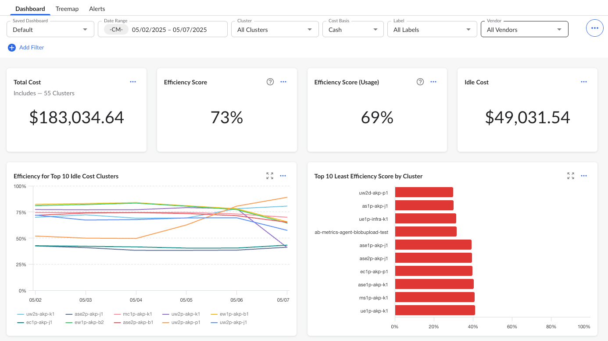

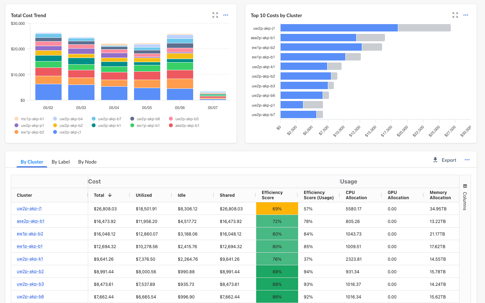

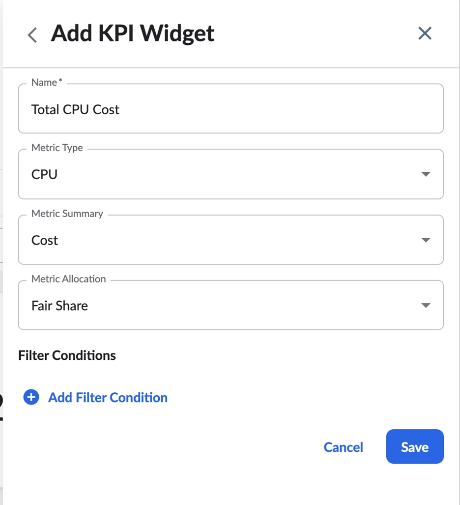

Cuadro de mandos personalizado

Los usuarios pueden crear cuadros de mando personalizados guardando cualquier cuadro de mando existente a su disposición. El diseño del cuadro de mandos está estructurado con widgets de KPI en la parte superior, widgets de gráficos en el centro y un widget de tabla en la parte inferior. Dentro de cada sección (KPI, gráfico), se puede ajustar la colocación de los widgets. Si un usuario elimina todos los cuadros de mando, seguirá recibiendo el cuadro de mando preconfigurado por defecto. Todos los cambios, incluidos los filtros globales y los ajustes de diseño, se guardan automáticamente.

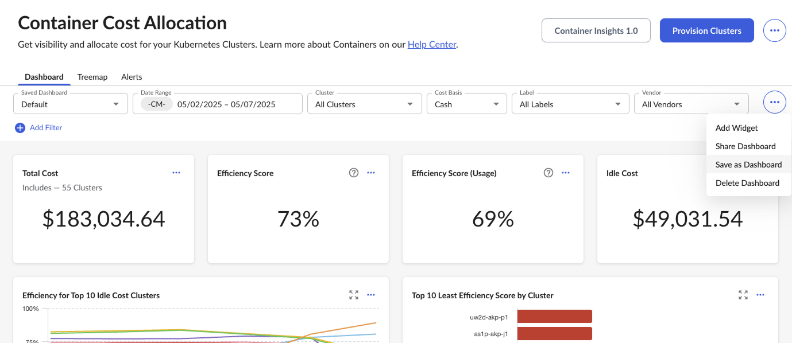

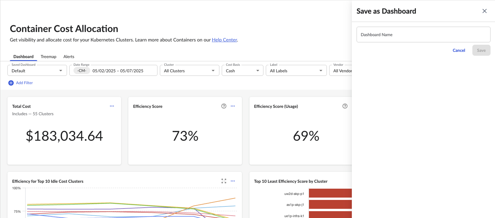

Hay varios widgets que pueden añadirse al salpicadero.

Widgets de KPI preconstruidos

Hay cuatro widgets de KPI preconstruidos: Coste total, Índice de eficiencia, Índice de eficiencia (uso) y Coste de inactividad. Estos widgets aparecen en el panel de control por defecto y pueden añadirse a cualquier panel de control a través del menú desplegable.

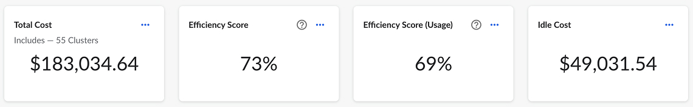

Widget KPI personalizado

Los usuarios pueden añadir widgets KPI personalizados a través del menú desplegable para añadir un widget "KPI personalizado".

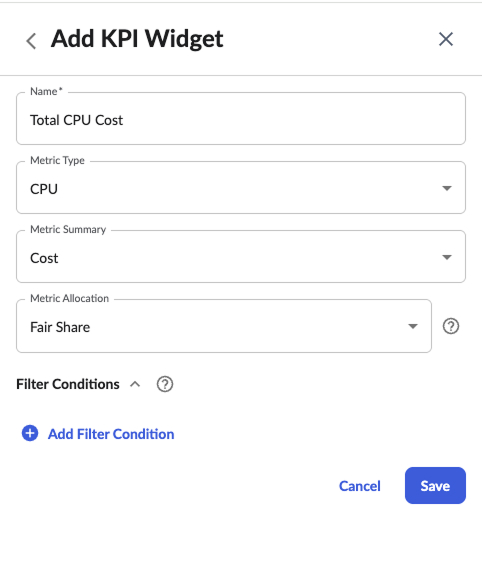

Tipo de métrica : Las opciones incluyen Total, CPU, Memoria, GPU, Network TX, Network RX, FileSystem, y Volumen persistente. Muestra las métricas de determinados tipos de recursos.

Resumen de métricas : Las opciones incluyen Coste y Utilización. Indica si el KPI se basa en métricas de costes o de utilización.

Asignación de métricas : Las opciones incluyen "Reparto equitativo", "Asignado", "Ralentí" y "Eficiencia" Muestra si se trata de reparto equitativo, asignado, ocioso o eficiencia del tipo de métrica y resumen.

- Reparto equitativo : recursos proporcionalmente repartidos entre todos los inquilinos.
- Allocated : Recursos asignados a un contenedor; el mayor de uso y solicitud.
- Idle : Recursos no asignados y repartidos equitativamente entre los inquilinos; la diferencia entre Fair Share y Allocated.
- Eficiencia : Calculada como lo asignado dividido por la parte equitativa.

La combinación de tipo de métrica, resumen y asignación determina el KPI que se va a crear. A continuación, se muestran algunos ejemplos:

| Tipo de métrica | Resumen de métricas | Asignación de métricas | ICR |
| --- | --- | --- | --- |
| Total | Coste | Eficiencia | Puntuación de eficiencia = Coste asignado / Coste justo compartido (o Coste total) |
| CPU | Coste | Eficiencia | Puntuación de eficiencia de la CPU = Coste de CPU asignado / Coste de CPU compartido equitativamente |
| CPU | Coste | Reparto equitativo | Coste del reparto equitativo de CPU = Coste de las unidades CPU del reparto equitativo |
| CPU | Coste | Asignado | Coste de la CPU asignada = Coste de las CPU asignadas |
| CPU | Coste | Desocupado | Coste de inactividad de la CPU = Coste justo compartido de la CPU - Coste asignado de la CPU |
| CPU | Consumo | Eficiencia | Eficiencia de utilización de la CPU = CPUs asignadas / CPUs equitativas |
| CPU | Consumo | Reparto equitativo | Unidades de reparto equitativo de CPU |
| CPU | Consumo | Asignado | Unidades asignadas a la CPU |
| CPU | Consumo | Desocupado | CPU ociosa = CPU justa - CPU asignada |

Estos KPI pueden filtrarse por clústeres, espacios de nombres, carga de trabajo, tipo de carga de trabajo, contenedor, nodo o claves de etiqueta. Los filtros se combinan con operaciones "AND", y sólo se permite el operador "equals".

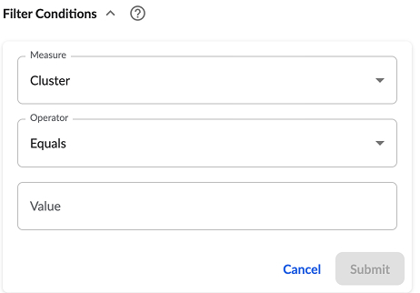

También hay varios widgets de gráficos que se pueden añadir al panel de control.

Widgets de gráficos predefinidos

Hay cuatro widgets de gráficos preconstruidos:

- Eficiencia de los 10 clústeres con mayores costes de inactividad
- Los 10 principales costes por grupos
- Top 10 de puntuación de menor eficiencia por clúster
- Evolución del coste total

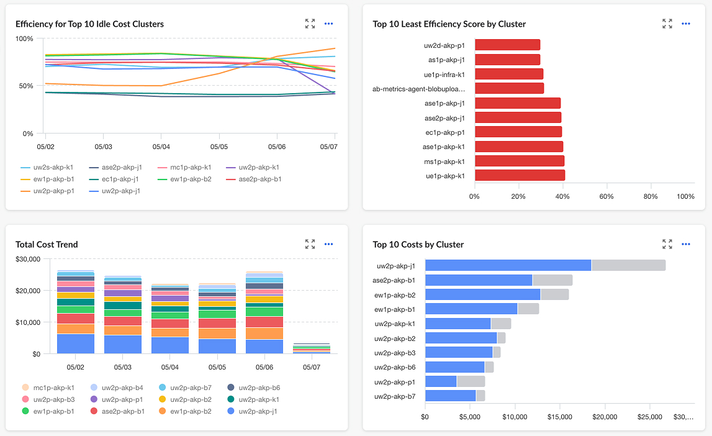

Widgets de gráficos personalizados

Se admiten tres tipos de widgets de gráficos personalizados:

- Series temporales personalizadas: Muestra información de tendencias sobre los conjuntos de datos consultados, basada en cualquier combinación de tipo de métrica, resumen y asignación. Puede agruparse por combinaciones de claves de clúster, espacio de nombres, carga de trabajo, tipo de carga de trabajo, nodo, contenedor o etiqueta. También permite ordenar por los 10 primeros o los 10 últimos.

  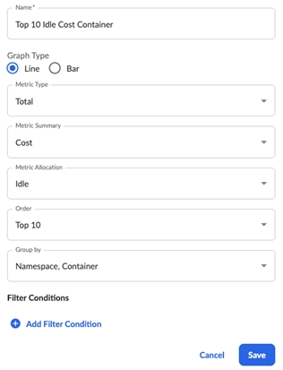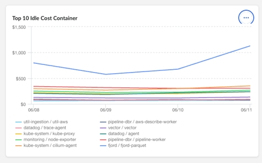
- Widget personalizado Top/Bottom 10 : Muestra los conjuntos de datos consultados en un orden especificado, admitiendo sólo gráficos de barras verticales.

  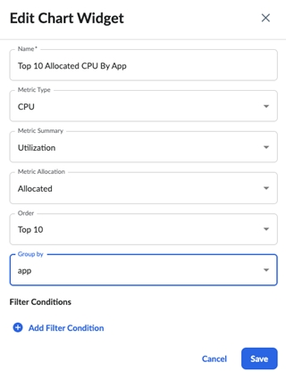

  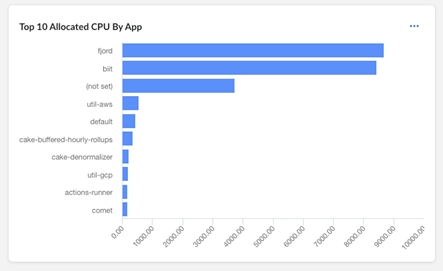
- Asignación personalizada frente a inactividad : Muestra los conjuntos de datos consultados para la comparación de asignación frente a inactividad, utilizable para las métricas de coste y utilización.

  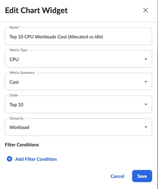

  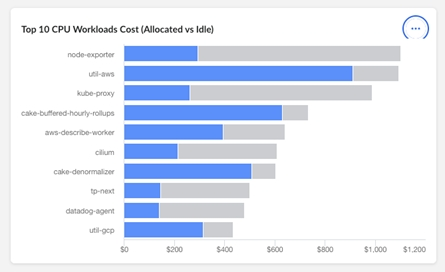

Personalización y diseño

Los usuarios pueden personalizar fácilmente el diseño y el contenido de sus cuadros de mando añadiendo, eliminando y reorganizando widgets. La configuración y los filtros de cada widget pueden ajustarse para satisfacer necesidades de análisis específicas, proporcionando una experiencia de visualización altamente flexible y personalizada.

Esta guía cubre las características esenciales y las opciones de personalización disponibles en el nuevo Containers Insights. Utilizando estos cuadros de mando y widgets, los usuarios pueden obtener una visión más profunda de sus entornos Kubernetes, optimizando costes, utilización y eficiencia.

**Tema principal:** [Imputación de costes de contenedores](../product/k8s-cost-allocation.html)
