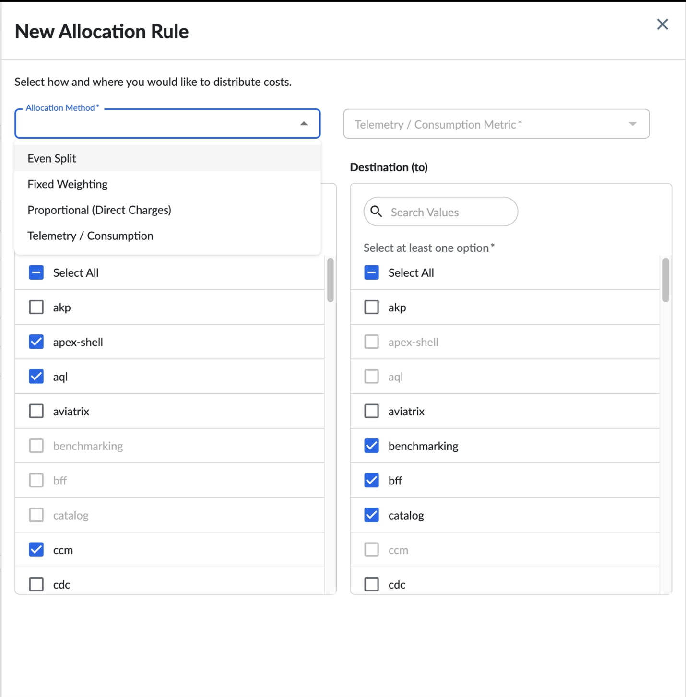
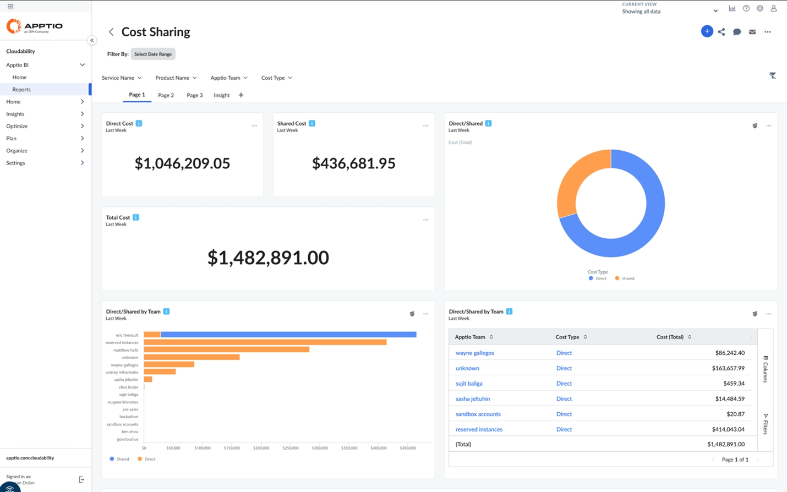

# Reparto de costes en Cloudability

## Introducción

Compartir los costes ayuda a las organizaciones a gestionar el gasto en los procesos de «showback» y «chargeback» de forma más eficiente. Al compartir partidas contables a través de Cloudability, consiguen ahorrar costes.

El reparto de costes consiste en tomar un conjunto de gastos (por ejemplo, los gastos directos de un valor dimensional) y repartir ese valor entre una lista de valores dimensionales de destino. Una forma sencilla de verlo es pensar que cada valor de una dimensión tiene un coste directo en Cloudability. Este coste se ha calculado a partir de los datos brutos sobre el coste de los recursos, a los que se les ha aplicado un etiquetado y, posteriormente, se ha utilizado la lógica condicional de la función de asignaciones empresariales de Cloudability.

Cada valor dimensional está asociado a un coste directo, un coste compartido y un coste total (directo + compartido).

Las normas de asignación de costes se establecen en el marco de una única estructura de organización empresarial. Se pueden configurar varias reglas dentro de una asignación empresarial. Sin embargo, no es posible configurar reglas que abarquen varias asignaciones empresariales.

## Ventajas

Las ventajas del reparto de costes son:

- Atribución precisa de costes : Permite un seguimiento preciso de los recursos y servicios compartidos entre equipos, productos y unidades de negocio.
- Modelo de reversión de cargos justificable : Crea una distribución de costes transparente y basada en normas que respalde las prácticas de facturación internas.
- Estrategias de asignación flexibles : elija entre varios métodos de asignación para adaptarse a los requisitos de reparto de costes de su organización.
- Gestión de costes alineada con el negocio : Relacionar los costes tecnológicos con los resultados empresariales y la estructura organizativa.
- Mayor visibilidad de los costes : Obtén información clara sobre los costes directos y compartidos en todo tu entorno en la nube.

## Conceptos fundamentales

Las organizaciones distribuyen y reparten los costes en distintos escenarios. Teniendo eso en cuenta. En la siguiente sección hemos incluido las estrategias de asignación más habituales.

Los distintos gastos en los que se ha incurrido son:

- Coste directo : costes derivados de la ingesta de datos brutos, el etiquetado sintético o la decoración de mapas empresariales
- Coste compartido : costes recibidos a través de las reglas de reparto de costes a partir de los valores dimensionales de origen
- Coste total : valor combinado de los costes directos y compartidos para cualquier valor dimensional

## Estrategias de asignación

Las distintas estrategias de asignación son:

- La distribución equitativa consiste en repartir los costes directos (s) entre un conjunto de categorías dimensionales, asignándoles el mismo valor a cada una. Los costes directos pueden corresponder a un grupo unidimensional o multidimensional.
- La «ponderación fija» utiliza ponderaciones fijas expresadas en porcentaje. Se trata de un desglose de los costes directos de un grupo unidimensional o multidimensional a partir de una ponderación definida por el usuario.
- El método proporcional (por gastos directos) utiliza el coste directo como coeficiente de ponderación. Esto te permite ponderar dinámicamente la asignación en función de los cargos directos del origen y el destino. El pesaje proporcional tiene en cuenta las cargas directas del cubo de origen a la hora de calcular la proporción de asignación para la distribución seleccionada.
- La asignación basada en telemetría y consumo utiliza datos de telemetría (métricas de uso, llamadas a la API u operaciones de almacenamiento) para crear reglas de asignación más precisas y basadas en datos, y solo está disponible para los clientes de Cloudability Premium.

## Configurar las reglas de reparto de costes

Para configurar las reglas de reparto de costes,

1. En la sección **«Organizar»** del menú principal, selecciona «**Reparto de costes** ».
2. Selecciona «Nueva asignación ». También puedes seleccionar una dimensión empresarial ya existente para editar la regla de asignación. No hay ningún límite en cuanto al número de reglas de asignación que puedes establecer.
3. Especifica una dimensión para la nueva asignación.
4. Para crear una nueva regla, haz clic en «Nueva regla ». Selecciona los buckets de origen con los que deseas compartir los costes, los buckets de destino a los que deseas asignar dichos costes y las estrategias de asignación que se utilizarán para ponderar dichos costes. Las normas de asignación existentes, si las hay, se muestran en la tabla «Normas ».
5. Pulse **Guardar**.
6. Ve a la pestaña **«Explorer»** para ver tus costes compartidos y las reglas de asignación aplicadas.

La pestaña «Explorador» muestra las reglas de asignación creadas con los siguientes detalles:

- Intervalo del informe: el intervalo de fechas seleccionado, desde ayer hasta el año pasado.
- Métrica de costes : el tipo de coste seleccionado.

Haz clic en «+Añadir filtro» para configurar los filtros y mostrar la lista de reglas de asignación de costes.

Puedes alternar entre los botones «Todas» y «Compartidas» para mostrar, respectivamente, la lista de todas las reglas de asignación de costes o las compartidas.

## Informes

Hemos publicado una nueva proyección en Apptio BI para informar sobre los costes compartidos, denominada « Cloudability : Costes y uso (asignados)». Se trata de una proyección independiente debido a la escala y el volumen del conjunto de datos con el que trabajamos al aplicar todas las reglas de asignación de costes. Para generar un informe a partir de este coste compartido, sigue los pasos que se indican a continuación:

1. Accede a « Apptio BI » en el panel de navegación de la derecha.
2. En la pestaña «Informes», selecciona «Crear nuevo informe ».
3. Haz clic en «Añadir visualización» y selecciona la proyección « Cloudability : Costes y uso (asignados) ».
4. Crea tu informe con las mismas dimensiones y métricas de coste que están disponibles en Cloudability Cost and Usage.
5. Selecciona una opción de la lista de vistas de « Cloudability ».

   

## Vistas

La función de reparto de costes respeta la estructura de nuestra vista, ya que muestra las partidas compartidas en el compartimento de destino cuando dicho compartimento se incluye en una vista. Por ejemplo: en el caso de una dimensión empresarial denominada «Producto», que incluye varios productos denominados «A», «B» y «C», nuestra organización distribuye los costes del producto «A» entre los productos «B» y «C» de forma proporcional (mediante cargos directos), lo que da lugar a que los productos «B» y «C» absorban los costes directos del producto «A». Ahora bien, en el caso de una vista configurada con C, cuando se crea un informe en Apptio BI, la vista del producto C mostraría tanto sus gastos directos como el coste que le ha sido imputado desde A.

## Mejores prácticas

Entre las mejores prácticas en materia de reparto de costes se incluyen aspectos relacionados con la configuración de reglas y la gestión de costes.

La configuración de las reglas incluye lo siguiente:

- Empieza con reglas de asignación más sencillas y ve aumentando la complejidad poco a poco
- Documenta la justificación empresarial de cada regla de asignación
- Revisar y validar periódicamente las normas de asignación en función de los cambios en el negocio
- Ten en cuenta el impacto jerárquico de las asignaciones dentro de tu organización
- Las normas de asignación de costes se aplican dentro de una única estructura de asignación empresarial

La gestión de costes incluye lo siguiente:

- Realizar un seguimiento tanto de los costes directos como de los compartidos para identificar tendencias y anomalías
- Verificar mensualmente los resultados de la asignación para garantizar su exactitud
- Mantener una documentación clara de las decisiones y metodologías de asignación
- Ten en cuenta las variaciones estacionales a la hora de establecer las reglas de asignación

## Funcionalidad de importación y exportación para las reglas de asignación de costes

Ofrecemos funciones de importación y exportación de reglas de asignación de costes para agilizar la configuración y mejorar la flexibilidad:

- CSV Importación : Puedes cargar reglas de asignación de costes a través de CSV, lo que elimina la necesidad de configurarlas manualmente en la interfaz de usuario o mediante programación a través de la API.
  - Esto resulta ideal para la creación masiva de reglas de asignación.
  - En la parte inferior de este documento encontrará una plantilla CSV que sirve como ejemplo para importar reglas. Por otra parte, si ya dispones de un conjunto de reglas, estas se exportarán con los encabezados de columna correctos y los valores compatibles para la carga.
  - La lista de columnas que necesitamos es la siguiente:
    - ID de la regla : un identificador único de la regla en cuestión. Si estás creando varias instrucciones en una misma regla (por ejemplo, si estás distribuyendo varios buckets de origen entre varios destinos), deberás incluir el mismo ID de regla en todas las instrucciones
    - Método de asignación (debe ser uno de los siguientes): Even\_split, proportional\_fixed\_weighting, proportional\_metric o telemetry\_consumption. Ten en cuenta que la telemetría solo está disponible en las versiones « Cloudability Standard » y «Premium».
    - Fuente : El conjunto de depósitos de origen desde los que deseas asignar el coste
    - Destino : el conjunto de grupos de destino a los que deseas asignar el coste
    - Peso del destino : debe ser el peso de la asignación a este destino concreto
    - Identificador de telemetría : Debe configurarse como «personalizado»
    - Nombre de la métrica de telemetría : El nombre de la métrica que se utiliza para ponderar la asignación. Por ejemplo, podría tratarse del número de llamadas a la API.
- Exportar reglas existentes : Puedes exportar el conjunto actual de reglas de asignación de costes dentro de una dimensión empresarial.

## Plantilla de normas de asignación de costes

Tabla 1. Plantilla de normas de asignación de costes

| ID de regla | Método de asignación | Origen | Destino | Peso en destino | Telemetría de identificadores | Nombre de métrica |
| --- | --- | --- | --- | --- | --- | --- |
| 2310fe9f-6535-474b-a153-27719a485168 | even\_split | nube | facturación | 0.5 |  |  |
| 2310fe9f-6535-474b-a153-27719a485168 | even\_split | nube | acme | 0.5 |  |  |
| 2 | consumo\_de\_telemetría | cálculo |  | 0 | personalizado | Número de solicitudes de SQS |
| 3 | métrica\_proporcional | datos | vanguardia | 0 |  |  |
| 3 | métrica\_proporcional | datos | nimbus | 0 |  |  |
| 3 | métrica\_proporcional | datos | billmx | 0 |  |  |
| 3 | métrica\_proporcional | interconexión | vanguardia | 0 |  |  |
| 3 | métrica\_proporcional | interconexión | nimbus | 0 |  |  |
| 3 | métrica\_proporcional | interconexión | billmx | 0 |  |  |
| 4 | ponderación\_proporcional\_fija | datos de facturación | ccm | 0.4 |  |  |
| 4 | ponderación\_proporcional\_fija | datos de facturación | seguridad de la información | 0.6 |  |  |
| 4 | ponderación\_proporcional\_fija | lago de datos | ccm | 0.4 |  |  |
| 4 | ponderación\_proporcional\_fija | lago de datos | seguridad de la información | 0.6 |  |  |
| 4 | ponderación\_proporcional\_fija | operaciones técnicas | ccm | 0.4 |  |  |
| 4 | ponderación\_proporcional\_fija | operaciones técnicas | seguridad de la información | 0.6 |  |  |
| 5 | even\_split | Operaciones de | ccm | 0.5 |  |  |
| 5 | even\_split | Operaciones de | Vedas | 0.5 |  |  |

## Exportación de datos de la página del Explorador

Hemos añadido la posibilidad de exportar datos desde la página «Explorador ». Ahora puedes descargar informes detallados sobre:

- Costes directos
- Costes compartidos
- Total de costes

## Reparto de costes según indicadores empresariales

Estamos ampliando la potencia y la precisión de «Cost Sharing» con nuevas funciones de compatibilidad con métricas empresariales personalizadas.

Distribuir los costes entre cualquier indicador empresarial basado en divisas

Anteriormente, « Cloudability » solo admitía el reparto de costes en un conjunto predefinido de métricas de costes predeterminadas. Con esta actualización, ya puedes distribuir los costes compartidos entre cualquier métrica empresarial basada en divisas de tu entorno.

Esta mejora ofrece una mayor flexibilidad a la hora de definir y aplicar la lógica de asignación de costes, lo que permite:

- Asignaciones de costes más relevantes desde el punto de vista contextual y adaptadas al modelo financiero específico de tu empresa
- Mayor justificación de la distribución de costes compartidos al alinearla con los indicadores que más importan a tus equipos
- Funciones de generación de informes ampliadas mediante métricas que van más allá de las predeterminadas

Actualmente, solo se admiten métricas empresariales basadas en divisas.

Dónde lo verás

- Página del Explorador : Al configurar o revisar las reglas de reparto de costes, verás todas las métricas empresariales elegibles que puedes seleccionar
- Apptio BI : Al crear informes, también puedes elegir entre el conjunto completo de métricas compatibles, lo que permite obtener una visión más detallada y facilitar la coordinación entre las partes interesadas

Esta actualización está disponible para todos los clientes de Cloudability y no requiere ninguna configuración adicional para empezar a utilizarla.

Guía de configuración para el usuario: Lineage en los informes de « ApptioBI »

Esta guía ayuda a los usuarios a incluir la dimensión «Fuente de asignación» en sus informes de « Apptio BI » para obtener información detallada sobre el origen de los costes compartidos.

Requisitos previos:

- Acceso a Apptio BI y a la proyección de costes y uso (asignados) de Cloudability
- Normas establecidas en el programa « Cloudability » sobre reparto de costes

Configuración paso a paso

1. Apptio BI abierto:
   - Inicia sesión en tu cuenta de Cloudability y accede a Apptio BI.
2. Seleccionar proyección:
   - Accede a un panel de control y selecciona «Nuevo widget» para crear un nuevo widget.
   - Selecciona la proyección «Coste y consumo (asignado)».
3. Añadir dimensión de origen de la asignación:
   - En el panel de configuración del widget, haz clic en «Dimensiones».
   - Busca y selecciona «Fuente de asignación».
   - Arrastra o haz clic para añadir la dimensión «Fuente de asignación» a tu widget.
4. Personaliza tu widget:
   - Añade cualquier otra dimensión o métrica necesaria.
   - Confirma y aplica la configuración de tu widget.
5. Validar y publicar:
   - Previsualiza el widget para asegurarte de que los datos sean precisos y claros.
   - Haz clic en «Guardar» para finalizar y publicar tu informe.

Nota:

- La fuente de asignación proporciona detalles a nivel de fila sobre los costes compartidos y aumentará el número de filas de tus informes.
- Evita utilizar la «Fuente de asignación» con varias dimensiones de negocio activadas simultáneamente para el reparto de costes, ya que esto generará errores.

## Solución de problemas conocidos

- Error: «No se puede mostrar la fuente de asignación»:
  - Causa: La fuente de asignación se está utilizando con varias dimensiones que tienen reparto de costes.
  - Solución: Asegúrate de que la fuente de asignación solo se combine con una dimensión compartida a la vez en cada widget.

- **[Reparto de costes de los informes y los paneles de control](../product/cost-sharing-for-reports-and-dashboards.html)**
- **[Reparto de costes: asignaciones basadas en la telemetría y el consumo](../product/cost-sharing-telemetry.html)**
