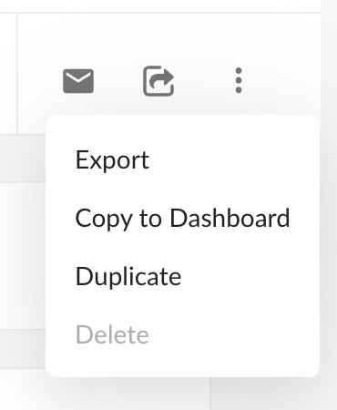
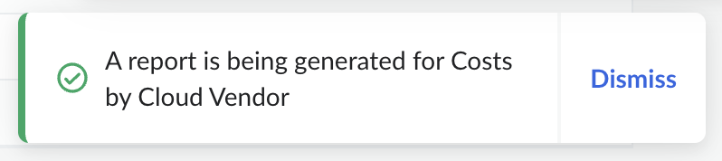
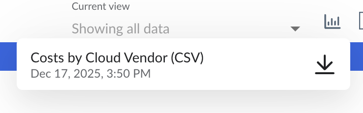

# Exportar un informe

Para extraer los datos sin procesar de un informe, los usuarios pueden exportarlos a un archivo « CSV » seleccionando la opción «Exportar» en el menú de puntos:

Al hacer clic en la opción de menú «Exportar», se iniciará la generación del informe. La preparación del informe para su descarga puede tardar varios minutos, dependiendo del tamaño del conjunto de datos que se vaya a exportar. En la esquina inferior derecha de la página aparecerá la siguiente ventana emergente para confirmar que se está generando el informe:

Los informes que se están generando se pueden encontrar en el menú de la parte superior de la página, junto al selector «Ver»:

**Tema principal:** [Crear o editar un informe](../product/create-or-edit-a-report.html)
