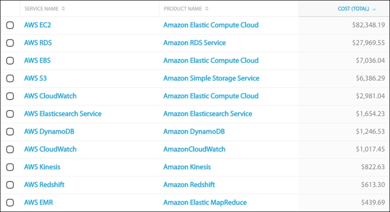
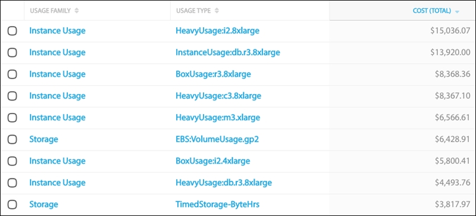
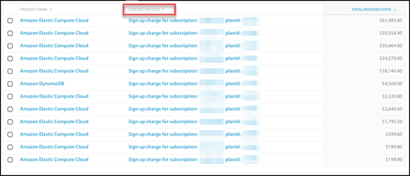
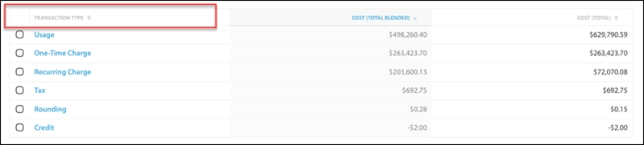
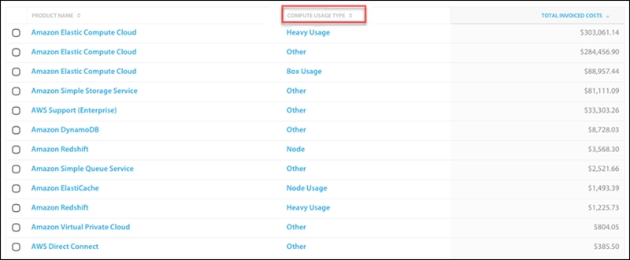
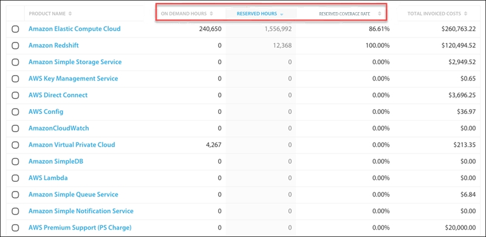
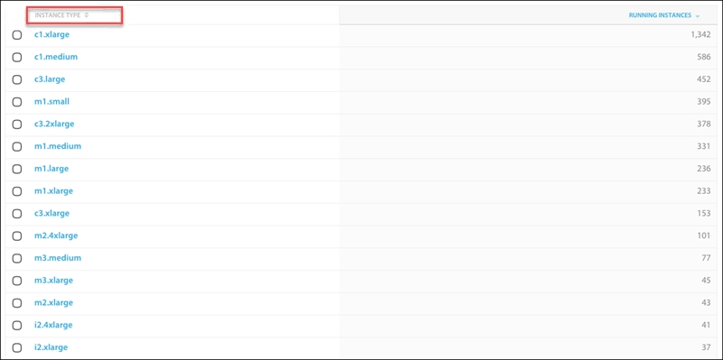

# Aprovechar al máximo las dimensiones y métricas populares en Cloudability

Hay un gran número de dimensiones y métricas disponibles en Cloudability. A continuación enumeramos algunas de las más populares y útiles. Para obtener una lista completa, consulte nuestro [Glosario de Dimensiones y Métricas](glossary-of-cost-dimensions-and-metrics.html).

Nombre del servicio (frente a nombre del producto)

Cloudability creó Service Name para estandarizar las convenciones de nomenclatura mixta de AWS y el campo Product Name de Azure :

- AWS EBS se convierte en su propio producto de primer nivel.
- Datos unificados que estaban mezclados en varios productos:
- AWS rastrea Cloudwatch parcialmente como producto y como EC2; esto separa Cloudwatch en su propio servicio.
- AWS realiza un seguimiento parcial de Glacier como producto y en S3; consolida todos los Glacier y S3.
- AWS tiene un servicio de importación y exportación, así como un servicio Snowball; Service Name los consolida.
- En algunos casos, los datos de AWS y Azure muestran múltiples productos para los mismos servicios:
  - AWS tiene varios nombres para Soporte, esto los consolida todos en una sola partida de AWS Support.
  - AWS tiene muchos cargos administrativos listados como productos de nivel superior como: Amazon Partner Network, re:Invent Tickets, etc. Se consolidan en una única partida: AWS.
  - Azure tiene Compute, Microsoft.Compute, y Virtual Machines; todos ellos son lo mismo y están consolidados bajo Azure Compute.
- AWS los archivos de facturación tienen esquemas de nomenclatura incoherentes para los productos, a veces Amazon frente a AWS; siglas frente a nombres deletreados. El nombre del servicio sigue un patrón único de un prefijo de AWS seguido del nombre que se ve en el menú de la consola AWS : EC2, S3, RDS, Kinesis, Lambda, etc. Del mismo modo, Azure es el prefijo de todos los servicios Microsoft Azure.

Todos los informes guardados deben utilizar Nombre de servicio.

Familia de uso (frente a tipo de uso)

El tipo de uso es una dimensión muy granular que expone detalles operativos específicos de cada partida. Esta dimensión puede proporcionar una gran utilidad cuando se combina con contains y no contiene parámetros de filtrado.

Los valores típicos que se devuelven son BoxUsage:c3.xlarge para indicar el uso bajo demanda, o HeavyUsage:m2.4xlarge para indicar un uso intensivo/reservado, o EBS:VolumeP-IOPS.piops para indicar un uso de IOPS provisionadas.

Un tipo de uso de Desconocido es representativo de cosas como el cargo de inscripción de una compra de RI.

Familia de Uso, a su vez, es una dimensión estandarizada creada por Cloudability para consolidar valores similares de Tipo de Uso en una única familia de alto nivel, por ejemplo, Uso de Instancia, Transferencia de Datos, Almacenamiento o Solicitud de API. Es un buen lugar para empezar a desglosar sus gastos más allá de Cuentas y Servicios.

Descripción del artículo

La descripción de la partida es una dimensión aún más granular que puede exponer aún más detalles operativos de cada partida. Esta dimensión también puede proporcionar una gran utilidad cuando se combina con contains y no contiene parámetros de filtrado.

Los valores típicos que se suelen obtener son 0.105 por hora de instancia de On Demand Linux c3.large, para indicar el uso bajo demanda, o 0.070 por GB —hasta los siguientes 100 TB/mes de transferencia de datos saliente—, para indicar la transferencia de datos, o 0.5589 por hora por cada instancia de Linux /UNIX, i2.4xlarge para indicar las horas de uso de RI, o 0.0290 por GB —los siguientes 450 TB al mes de almacenamiento utilizado— para indicar los costes de S3, o 0.850 por cada hora (o fracción de hora) de nodo de cómputo de Redshift Dense Storage Extra Large ( DW1.XL ) para indicar los costes de Redshift.

Una descripción de los cargos por suscripción: ####, planId: ### (donde ### son cifras reales) es representativa de los gastos de suscripción de una compra de RI. Esto le permite crear un filtro para el artículo description\_does not contain\_sign up para ver sus costes de cálculo sin la cuota inicial incluida.

Tipo de transacción

Esta dimensión fue creada por Cloudability para desglosar de forma discreta los cargos recurrentes como AWS Support y las cuotas mensuales de RI, los cargos únicos como los pagos de inscripción a RI, los créditos, los impuestos y los costes de uso. Puede ser tremendamente útil para determinar la eficiencia y el despilfarro de su RI, y también ayuda a mostrar cómo los costes mixtos y no mixtos pueden variar por partida, incluso cuando alcanzan el mismo total a final de mes.

Tipo de uso informático

Esta dimensión desglosa muy claramente qué instancias se están ejecutando bajo demanda, puntuales, reservadas, un nodo RDS, etc. Si ejecuta un informe de Análisis de costes con Tipo de uso del cálculo y Descripción del artículo como únicas dimensiones, obtendrá una vista detallada completa.

Para ver sólo sus costes de computación, añada un filtro para compute usage type\_not equals\_other ya que el otro tipo de uso representa costes como transferencia de datos, mapeo IP elástico, meses de alarma, horas de lectura/escritura, GB de almacenamiento, LoadBalancer GB procesados, shard-hours, PIOPS, almacenamiento magnético y otros.

- Para consultar los costes de tu Redshift, añade un filtro para compute usage type\_equals\_node.
- Para ver sus ElastiCache costes, añada un filtro para compute usage type\_equals\_node usage.
- Para ver sus RDS costes, añada un filtro para compute usage type\_equals\_instance usage.
- Para ver sus costes de RI pesada, añada un filtro para compute usage type\_equals\_heavy usage.
- Para ver sus costes bajo demanda, añada un filtro para el tipo de uso de cálculo\_equals\_box usage.

Horas a la carta, horas reservadas, tarifa de cobertura reservada

Estas métricas tienen un valor incalculable para determinar exactamente qué cuentas, servicios, etiquetas o recursos aprovecharon sus instancias reservadas. El Informe detallado de facturación se rellena con la resolución horaria de todos estos parámetros, lo que permite a nuestra plataforma de análisis agrupar por cualquier Dimensión y mostrar cómo se aprovecharon las horas de RI durante cualquier periodo de informe elegido.

Añadir un filtro para tasa de cobertura reservada\_mayor que\_X% (donde X% es un número sin el símbolo de porcentaje) es una buena forma de ver qué áreas de su infraestructura podrían beneficiarse de una cobertura RI adicional.

Tipo de instancia

Esta dimensión combina las dimensiones Familia de Instancias y Tamaño de Instancia y presenta el identificador completo de la instancia, por ejemplo, c3.large.

En Análisis de Costes, para ver sólo sus costes de computación, añada un filtro para instance type\_not equals\_none, ya que el tipo de instancia none representa transferencia de datos, mapeo IP elástico, meses de alarma, horas de lectura/escritura, GB de almacenamiento, LoadBalancer GB procesados, shard-hours, PIOPS, almacenamiento magnético, peticiones GET/PUT/POST/COPY/LIST, y otros.

En Usage Analytics esta dimensión devolverá sólo sus instancias de EC2.

�

Instancias en ejecución y media de instancias en ejecución por hora

La métrica Instancias en ejecución es un recuento de todos los ID de instancia únicos que estaban en ejecución en un momento dado durante la ventana del informe. No se trata necesariamente de un recuento de las instancias activas o en ejecución en el momento en que se ejecuta el informe. Más bien, es la suma de los ID de instancia únicos que se estaban ejecutando.

Promedio de instancias en ejecución por hora es un promedio del número de instancias que estuvieron en ejecución cada hora de la ventana del informe.
