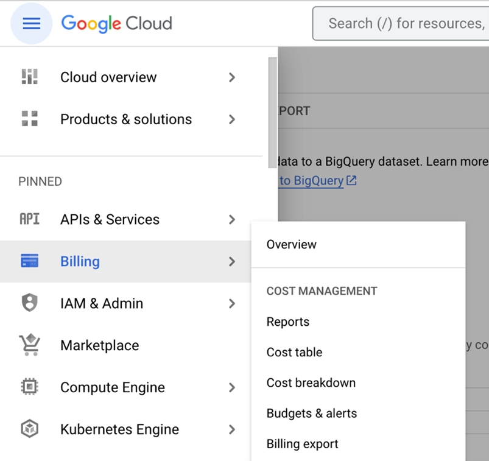
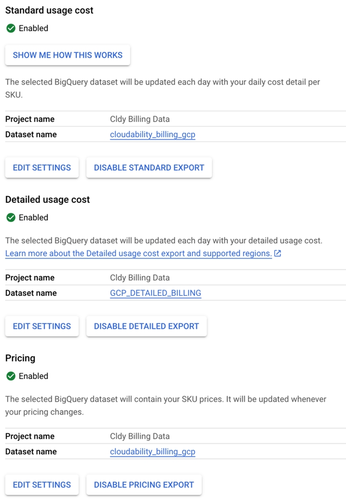

# Configuración de la asistencia para precios personalizados para GCP

El servicio de precios personalizados se ha ampliado ahora a GCP para Cloudability, de modo que los descuentos contractuales y otras tarifas específicas para cada cliente se apliquen a las recomendaciones de ajuste de recursos de GCP y **a la planificación de cargas de trabajo**.

Sigue los pasos que se indican a continuación para habilitar la exportación de datos de precios personalizados para las cuentas de GCP.

1. Accede a la cuenta de facturación de GCP.
2. Seleccione **Facturación** > **Exportar facturación**.

   
3. En **Precios**, haga clic en " **Activar exportación de precios** ".
4. Seleccione **Precios > Editar configuración**.
5. En función de la opción de **facturación GCP** elija ( **facturación estándar** o **facturación detallada** ), debe asegurarse de lo siguiente:
   - Seleccione el **nombre del proyecto** y el **nombre del conjunto de datos** tal y como se ha **seleccionado** para " **Coste de uso estándar** " si está utilizando **la facturación estándar**.

   

   - Seleccione el **nombre del proyecto** y el **nombre del conjunto de datos** igual que el **seleccionado** para " **Coste de uso detallado** " si está utilizando **la facturación detallada**.

**Tema principal:** [Conectar Google Cloud](../admin/connect-google-cloud-premium.html)
