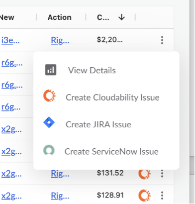
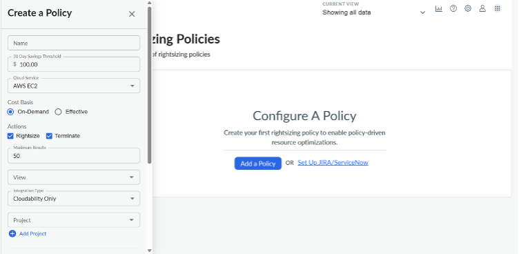
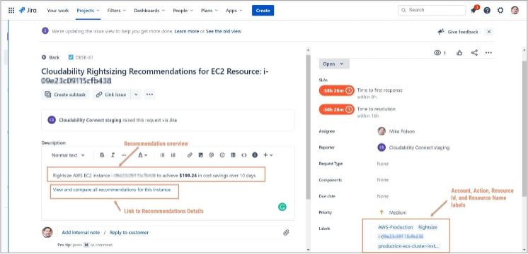

# ROI de dimensionamiento correcto

Rightsizing ROI le permite realizar un seguimiento de las recomendaciones de rightsizing desde la oportunidad hasta la finalización e informar sobre el impacto de sus esfuerzos de rightsizing. Puede crear tickets manualmente o mediante políticas automatizadas que le permitan hacer un seguimiento de esas recomendaciones, revisar las oportunidades abiertas y cerradas, comentar esas oportunidades e informar sobre los ahorros conseguidos como resultado.

Rightsizing ROI le permite configurar políticas para crear automáticamente incidencias y solicitudes a la vez que realiza un seguimiento de las recomendaciones. También puede utilizarlo para visualizar el ahorro real derivado de la aplicación de estas recomendaciones de optimización de recursos.

Rightsizing ROI tiene tres opciones de entradas:

- Una integración de Jira Cloud que utiliza la extensión de gestión de servicios de Jira para crear incidencias y solicitudes de Jira, y utilizar la sincronización bidireccional del estado de los tickets de Jira para mantener sus proyectos sincronizados.

- Una integración de ServiceNow que utiliza un script generado por Cloudability para ServiceNow incidentes y solicitudes, utilizando también la sincronización bidireccional del estado de los tickets ServiceNow para mantener sus proyectos sincronizados.

- Funcionalidad autónoma de seguimiento de tickets incluida en la propia Cloudability.

## Antes de empezar

**Si desea utilizar las funciones de emisión de tickets en la nube de ServiceNow o Jira, tendrá que configurar primero esas integraciones. Para más información, consulte las siguientes guías de instalación**

Integración con Jira

- Más información sobre [la integración con Jira: configuración](../admin/connect-jira-cloud.html)

ServiceNow integración

- Aprenda sobre [la integración ServiceNow - Configuración](../admin/connect-servicenow-integration.html)

Uso del ROI de Rightsizing: Creación de entradas

Los tickets se pueden crear en Rightsizing ROI de dos maneras.

Creación manual de tickets - Al ver cualquier recomendación de las páginas de recomendaciones de Rightsizing, puede crear un ticket directamente a través de la interfaz de usuario haciendo clic en el botón de más opciones situado a la derecha de la recomendación.

A partir de ahí, puede seleccionar el sistema de tickets que desea aprovechar y se creará un ticket de ROI de rightsizing y se vinculará al sistema que elija con los detalles pertinentes.

**Creación de tickets a través de políticas automa** tizadas: las políticas automatizadas ofrecen una forma escalable de crear tickets para las oportunidades que surgen de Cloudability Rightsizing engine. Las políticas pueden ejecutarse a intervalos establecidos y crear tickets para las oportunidades hasta el número de resultados seleccionado, de modo que sus equipos sólo se centren en las oportunidades más grandes.

## Cómo configurar una política

1. Vaya a **Configuración > Políticas de cambio de tamaño**.

1. Seleccione el botón **Añadir una política**. Se abre **el** panel «Crear una política».

1. Introduzca los criterios de su política:

- **Nombre** : Introduzca un nombre para su póliza.

- **umbral de ahorro en 30 días** : Introduzca el ahorro mínimo que necesita en 30 días.

- **Servicio en la nube** : Seleccione el recurso Cloud que desea incluir.

- **Base de costes** : Elija la base de coste que se utilizará al calcular el umbral.

- **Acciones** : Marque las casillas para incluir acciones de redimensionamiento.

- **Resultados máximos** :introduzca los resultados máximos añadidos de cada ejecución programada.

- **Ver** : Seleccione el filtro para sus recursos.

- **Tipo de Integración** : Seleccione el tipo de integración ROI para esta política.

- **Proyecto** : Para Jira, seleccione el proyecto donde se muestran los tickets creados.

- **Tarea** : Para ServiceNow, seleccione el tipo de tarea donde se muestran los tickets creados.

- Tipo de solicitud: Para Jira, seleccione el tipo de incidencia (Jira) o el tipo de solicitud (Jira Service Management).

- **Calendario** : Seleccione la periodicidad.

- **Días de la semana:** Si la política se ejecuta semanalmente, seleccione el día en que desea que se ejecute.

- **Finalizar después de** : Elige la fecha de finalización de la póliza.

1. Seleccione el botón **Crear** para crear la política, o seleccione el botón **Crear y ejecutar** para crear una política y ejecutarla.

Para activar la creación automática de tickets, debe crear y configurar una política.

## Reducción del ROI: Comprender y clasificar sus incidencias y tickets

Los problemas, solicitudes o tickets de incidencias creados por la política son visibles en la vista de tabla Rightsizing Dashboard en Rightisizing ROI, así como directamente en el proyecto JIRA configurado o en la cola ServiceNow.

Cada billete contiene:

- Una visión general de la recomendación.

- Enlace a los detalles de la recomendación en Cloudability.

- Etiquetas de los atributos clave de los recursos.

## Ver las recomendaciones en el panel de Rightsizing

En Cloudability, los tickets creados por la política se muestran en el panel Rightsizing ROI. Muestra los siguientes indicadores clave de rendimiento (KPI) agregados:

- **Ahorro potencial:** Posibles oportunidades de ahorro de todos los tickets sin resolver.

- **Ahorro realizado** : Ahorro realizado para todos los tickets resueltos, normalizado a una tasa de ahorro de 30 días.

- **Gráfico de ahorros realizados :** El gráfico muestra un desglose de los tickets procesados y los ahorros realizados asociados por fecha en la que se procesaron. Rightsizing ROI no intenta acumular ahorros a lo largo del tiempo, sino que muestra la tasa de ahorro de 30 días para las acciones en las fechas para que pueda ver la tasa a la que los equipos están implementando cambios/resoluciones.

**Entradas individuales**

El panel de Rightsizing también muestra los detalles de cada ticket creado por su política:

- **Servicio en la nube** : El proveedor y el servicio Cloud.

- **Nombre del recurso** : El nombre del recurso de la Nube.

- **ID de recurso** : identificador único de un recurso específico de AWS.

- **Billete** : El ticket asociado a este recurso.

- **Tipo** : Jira, ServiceNow, o Cloudability.

- **Estado** : El estado actual del ticket.

- **Asignado** a: El propietario del billete.

- **Creado** : La fecha de creación del ticket.

- **Cerrado :** La fecha en que se resolvió el ticket o "N/A" si el ticket sigue activo.

- **Resolución** : El estado de resolución del ticket.

- **Ahorro potencial:** Ahorro potencial para el billete identificado por la recomendación.

- **Ahorro realizado:** Ahorro realizado basado en el nuevo tipo de instancia.

- **Detalles** : Los detalles de la recomendación.

**Nota** : Revise las recomendaciones de Rightsizing para cada servicio utilizando la vista de 30 días. A partir de aquí, fíjese en las oportunidades de ahorro de costes para obtener información sobre cómo establecer el importe del umbral.

**Nota** : La detección de cambios en los recursos está actualmente soportada para los tipos de recursos Compute, Storage y Database.

## Borrar tickets de Rightsizing ROI

Para eliminar un ticket en Rightsizing ROI, haga clic en el panel de detalles del ticket que desea eliminar. Selecciona el botón de más opciones en la parte superior derecha y selecciona eliminar. Confirme su intención de eliminar el billete. **La eliminación de tickets de Rightsizing ROI no se puede deshacer.**

## Preguntas frecuentes sobre el ROI

**¿Hay alguna forma de ver quién le asignó un ticket de Rightsizing?**

No, si el billete se asigna a través de la interfaz Cloudability.

**¿En cuánto tiempo aparecerá el ahorro realizado en el ROI de la adaptación? ¿Desaparece o se queda ahí para siempre?**

Los datos de ahorro realizados en la función Rightsizing ROI no se borran; permanecen en Cloudability para siempre. Es un registro histórico del cambio que se hizo y del dinero que se ahorró.

**¿Cómo se calcula el ahorro realizado?**

En el momento en que se rastrea la recomendación por primera vez, Cloudability almacena información sobre el recurso en su estado actual. Cuando se produce un cambio en el recurso, el importe del ahorro realizado se calcula sobre la base de los costes de 30 días del estado original del recurso menos los costes de 30 días del nuevo estado del recurso. Dado que se desconoce el uso futuro, el valor del ahorro realizado se calcula como (tipo de recurso actual \* tarifa \* 24 horas \* 30 días) - (tipo de recurso anterior \* tarifa \* 24 horas \* 30 días) como estimación del uso. El valor del ahorro realizado refleja el cambio que se hizo realmente y no está directamente influido por lo que se haya podido recomendar.

**¿Cuál es el número máximo de políticas que se pueden crear?**

Hasta 30 pólizas. Sin embargo, si utiliza una integración de terceros (como Jira Cloud o Service Now), es posible que pueda eludir este límite utilizando esos servicios para clasificar los tickets y las solicitudes en función de la información de recursos proporcionada. Por ejemplo, las etiquetas de recursos se incluyen en los tickets creados.

**¿Cuál es el número máximo de tickets que se pueden crear por ejecución de política?**

Hasta 100 entradas por tirada. Sin embargo, el límite está limitado por el número de tickets abiertos. Un ticket "abierto" se define actualmente como cualquier ticket que no tiene un valor de "ahorro realizado".

**¿Soporta Cloudability vistas con filtros basados en Business Mapping en el ROI?**

No, Rightsizing no soporta el filtrado por Business Mapping.
