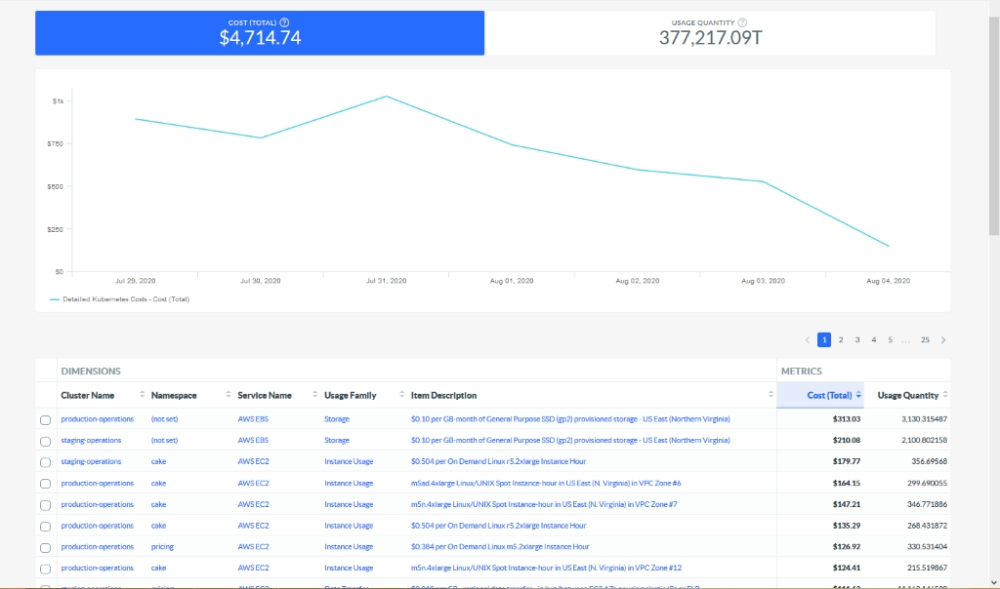
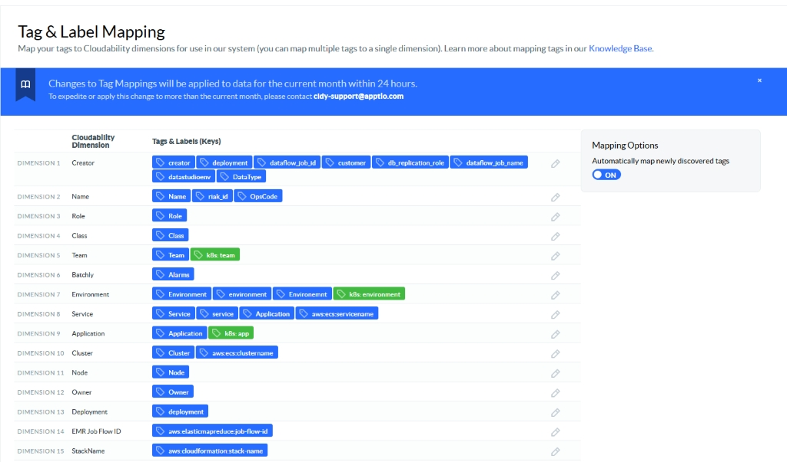

# Imputación de los costes de los contenedores

Puede integrar los datos de los contenedores de Kubernetes ( k8s ) o OpenShift ( ROSA ) en Cloudability para obtener visibilidad de la parte de su gasto en nube debida a los costes de los contenedores, y asegurarse de que se asigna adecuadamente.

Ver los datos de coste y uso de los contenedores

Puede ver los datos de Kubernetes o OpenShift en la página Contenedores o a través de Cloudability en herramientas como Informes, TrueCost Explorador y Explorador de etiquetas.

Para obtener una visión global de los datos de costes y utilización de sus Contenedores, utilice la página de Contenedores.

Para investigar los costes de los contenedores en relación con el gasto total en la nube, utilice Informes, TrueCost Explorer y Tag Explorer.

Analizar los datos de los contenedores mediante informes y otras herramientas

Los costes de los contenedores pueden verse junto con otros costes de la nube en un único informe. Mediante el uso de etiquetas kubernetes y asignaciones empresariales, puede combinar los costes fuera del clúster (por ejemplo, balanceadores de carga y bases de datos, entre otros) con los costes de los contenedores en un único informe.

Para que cada dimensión aparezca como una partida en su informe (sujeta a filtrado), seleccione esa dimensión como dimensión de coste.

Hay dos dimensiones predefinidas para los informes de costes:

- Nombre de clúster
- Espacio de nombres

Puede utilizar estas dimensiones para crear nuevos informes de costes o mejorar los existentes.

Utilice la dimensión Nombre del clúster

Para que cada nombre de cluster Kubernetes ( k8s ) o OpenShift aparezca como partida en su informe (sujeto a filtrado), seleccione Nombre de Cluster como dimensión de coste. La métrica Coste (total) representa el coste total atribuido a ese clúster, incluidos los recursos ociosos, los costes utilizados y ociosos de los nodos de cálculo subyacentes y, en AWS, EBS volúmenes de almacenamiento.

También habrá un valor (no establecido) para Nombre del clúster, que representa todos los costes dentro de la cuenta que no forman parte de ningún clúster de k8s o OpenShift. También está disponible el soporte para métricas de coste adicionales, como Coste (Amortizado), Coste (Ajustado) y Coste (Ajustado Amortizado).

Utilizar la dimensión Namespace

Para que cada espacio de nombres único aparezca como una partida en su informe (sujeto a filtrado), seleccione Espacio de nombres como dimensión de coste. La métrica Coste (Total) representa los costes de k8s atribuidos a ese espacio de nombres. También está disponible el soporte para métricas de coste adicionales, como Coste (Amortizado), Coste (Ajustado) y Coste (Ajustado Amortizado).

Notas:

- Cuando se incluye Namespace como dimensión en un informe, los costes que representan los recursos asignados pero no utilizados dentro de un cluster aparecen por defecto como una partida separada etiquetada como 'RECURSOS IDLE'. Para desglosar o repartir equitativamente esos RECURSOS OCIOSOS entre cada espacio de nombres, y para ver detalles más granulares sobre los costes ociosos y asignados dentro de los análisis centrales de Cloudability (informes y cuadros de mando), utilice la categoría de métricas "Contenedores", que introduce seis métricas adicionales.
- Cuando añada otras dimensiones a un informe, como Familia de uso o Nombre de servicio, verá detalles de costes adicionales en torno a cada nombre de clúster o espacio de nombres (sujeto a filtrado).

Para ver sólo los recursos y costes asociados a un espacio de nombres o nombre de clúster específico, utilice la función de filtro incorporada.

Para ver detalles más granulares sobre los costes ociosos y asignados dentro de Cloudability core analytics (informes y cuadros de mando) en la dimensión cluster, Namespace, utilice la categoría métrica "Containers", que introduce seis métricas adicionales. Estas métricas permiten a los usuarios ver por separado los costes utilizados, ociosos y de reparto equitativo sobre una base de efectivo o amortizada. Para los clientes con precios personalizados activados, estas métricas se representarán como métricas "ajustadas".

La función de asignación de costes de contenedores evalúa la utilización de recursos en cada nodo y la correlaciona con los datos de facturación para calcular el coste de cada clúster. Asocia un "coste utilizado" directo a los valores de espacio de nombres y etiquetas de Kubernetes. Esto ha estado disponible dentro de los informes básicos utilizando el espacio de nombres o una dimensión de etiqueta. Con esta mejora, también puede informar sobre el coste de inactividad a través de la nueva métrica, que se asigna a los valores de espacio de nombres y etiqueta proporcionalmente en función de su contribución directa al coste de cada nodo. El Coste Justo es la combinación del Coste Utilizado y el Coste Ocioso, que representa el coste total.

Consideraciones e ideas de informes para estas nuevas métricas:

- En el caso de los costes no relacionados con los contenedores, estas métricas se devolverán como 0 $. Para filtrar a datos de sólo contenedor, pruebe un filtro como "Nombre de clúster no es igual a (no establecido)"
- Utilice estas métricas con diferentes dimensiones para visualizar fácilmente los costes utilizados frente a los costes ociosos. Por ejemplo, lista por nombre de clúster o ID de recurso.
- Por primera vez, puede utilizar conjuntamente las bases de efectivo y de coste amortizado para elaborar informes detallados sobre el coste de los contenedores.

Definir dimensiones adicionales a partir de las etiquetas K8s

Muchas organizaciones utilizan etiquetas en sus despliegues de k8s de forma similar a como aprovechan las etiquetas de recursos en sus entornos de nube. Para que estos pares clave/valor de etiqueta aparezcan en su entorno Cloudability, puede asignar estas claves de etiqueta a dimensiones del mismo modo que se asignan las etiquetas de recursos. En la página Asignación de etiquetas y rótulos puede definir nuevas dimensiones (y editar las existentes) y asignar rótulos de recursos o rótulos k8s a cada dimensión.

Si decide asignar tanto las etiquetas k8s como las etiquetas de recursos a la misma dimensión, debe tener en cuenta un par de elementos clave.

- K8s Las etiquetas solo deben asignarse a dimensiones con etiquetas de recursos cuando los valores tanto de las etiquetas como de las etiquetas de recursos sean homogéneos. Del mismo modo que la asignación de etiquetas de recursos no relacionadas a la misma dimensión puede causar confusión, la asignación de etiquetas y etiquetas de recursos no relacionadas a la misma dimensión sólo agravará esa confusión.
- En caso de que una etiqueta de recurso y una etiqueta k8s (ambas asignadas a la misma dimensión) difieran en valor, se seleccionará y utilizará el valor de la etiqueta k8s y se descartará el valor de la etiqueta de recurso.

Puede asignar hasta 20 claves de etiquetas únicas de k8s en la página de asignación de etiquetas. Tenga en cuenta que cuando añada o edite estas asignaciones, empezará a ver los valores en los informes la próxima vez que ingiramos un nuevo archivo de facturación de proveedor. Actualizaremos la asignación de etiquetas a lo largo de este mes.

Importante:

En los informes y paneles, un valor **«(no establecido)»** para una etiqueta de Kubernetes representa los costes incurridos cuando el pod, el despliegue u otro objeto de Kubernetes no tenía un valor para esa etiqueta.

**(sin definir)** también aparecerá en las partidas de costes que hayan sido importadas y procesadas por Cloudability *antes de que* la etiqueta se asignara a una dimensión.

Cloudability Actualmente no admite el rellenado retroactivo de las etiquetas de « Kubernetes »

Utilizar el explorador de etiquetas

Al igual que con cualquier otro mapeo de negocio, los mapeos que defina utilizando dimensiones específicas de contenedor pueden utilizarse en el Explorador de Etiquetas. Esto puede ayudar a comprender los costes asociados a sus clústeres y espacios de nombres k8s.

Utilice el explorador TrueCost

Al igual que con cualquier otra asignación empresarial, las asignaciones que defina utilizando dimensiones específicas de contenedor pueden utilizarse en el explorador TrueCost. Esto puede ayudar a comprender cómo fluyen los costes a través de sus clústeres y espacios de nombres de k8s.

Crear asignaciones empresariales

Puede crear una nueva asignación empresarial (o editar una existente) y utilizar dimensiones específicas de contenedor. La inclusión de estas dimensiones en una cartografía es una poderosa herramienta que permite combinar distintos costes en un único constructo. Puede reunir los costes del clúster k8s con otros costes fuera del clúster para obtener una visión global de sus costes informáticos totales en k8s.

Crear vistas

Puede crear una nueva vista (o editar una existente) y utilizar una asignación creada a partir de dimensiones específicas de un contenedor. Tenga en cuenta que en la página Contenedores no se admite el uso de vistas basadas en mapeos de negocio, independientemente de si se utilizan dimensiones específicas del contenedor en la definición de la vista.

Al igual que con otras dimensiones asignadas a partir de etiquetas de recursos, puede utilizar dimensiones con etiquetas k8s en Business Mappings, Views, TrueCost Explorer, Tag Explorer e Reports.

Nota:

Al comparar la imputación de costes entre la página Contenedores y un informe, es posible que se observen diferencias. Mientras que el coste a nivel de clúster de k8s será muy similar (dentro de una fracción de un porcentaje), los costes asignados a espacios de nombres individuales pueden diferir.

Nota:

En las cuentas de AWS, los costes de EBS se gestionan de forma diferente. En la página Contenedores, los costes de EBS se asignan a cada espacio de nombres en función de su proporción de uso de recursos. En un informe, sin embargo, estos costes de EBS se agrupan y se dejan en manos de la agrupación. Por lo tanto, verá un cubo (no configurado) de costes EBS con el clúster k8s.Lo mismo ocurre con cualquier recurso que no sea un nodo en Azure. En un futuro próximo asignaremos todos los recursos del clúster en función de su uso.

- **[Analice los datos de sus contenedores Kubernetes](../product/analyze-data-for-your-containers.html)**
- **[Configurar tu agente de contenedores](../product/container-metrics-agent-provisioning.html)**
- **[Costes de contenedores asignados por proveedor](../product/container-costs-by-vendor.html)**
- **[VM coeficientes correctores por motivos familiares](../product/instance-type-weighting-container-cost.html)**
- **[Containers Insights: Guía de cuadros de mando y widgets](../product/containers-insight-2-dashboard-widget-guide.html)**
- **[Asignación de costes compartidos - Container Insights UI](../product/shared-cost-allocation-container-insights-ui.html)**
- **[Container Insights: Guía de configuración de alertas basadas en umbrales](../product/container-insights-threshold-based-alerting-configuration-guide.html)**
- **[Herramienta del Observatorio de Agentes](../product/agent-observatory-tool.html)**
- **[Cloudability Contenedores avanzados](../product/advanced-containers.html)**
