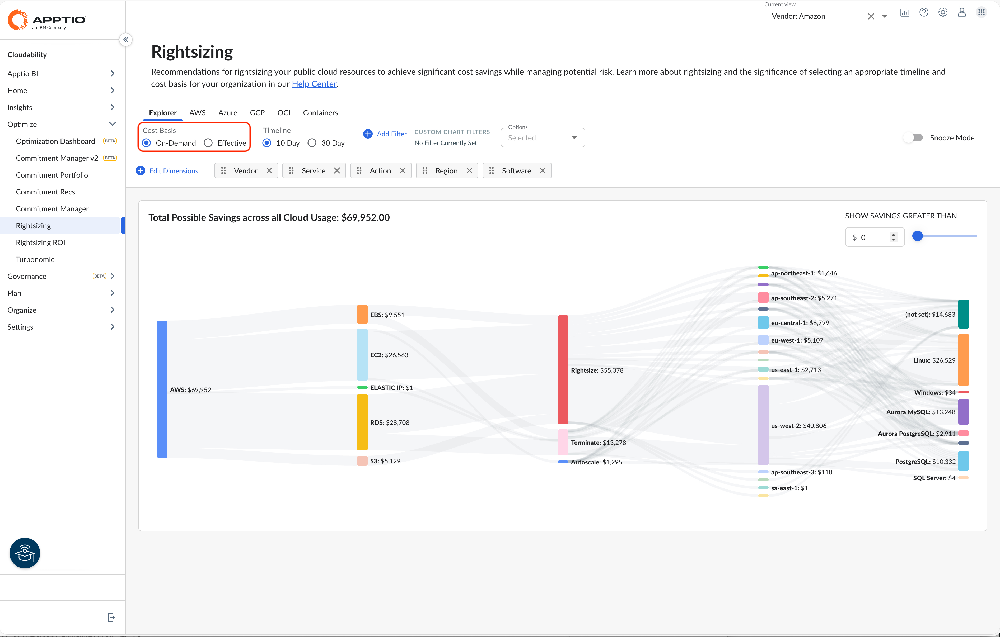

# Explorador de redimensionamiento

El panel Rightsizing Explorer le permite agrupar, filtrar y navegar por todas sus recomendaciones de rightsizing, lo que le permite comprender mejor sus oportunidades y centrar sus esfuerzos para maximizar los beneficios.

El Explorador de redimensionamiento se encuentra en Optimizar > Redimensionamiento > Explorador, y es la página predeterminada para el redimensionamiento.

Nota:

Las preferencias de tamaño se aplican cuando se generan las recomendaciones. El Rightsizing Explorer trabaja con las recomendaciones una vez generadas. Debido a la agrupación, Cloudability recomienda que ajuste la cantidad mínima de ahorro a un valor inferior si utiliza el Explorador de Derechos.

Servicios compatibles

Los servicios que se admiten actualmente son:

- AWS : EC2, EBS, S3, RDS, Lambda

  Nota:Cloudability solo genera recomendaciones de 30 días para AWS S3. Cuando se selecciona un periodo de tiempo de « 10day » (Ajustar el tamaño de la base de datos) en Rightsizing Explorer, se muestran recomendaciones de 30 días para « S3 » (Ajustar el tamaño de la base de datos).
- Azure : Ordenadores, discos, SQL
- GCP o: GCE, GPD
- OCI: VM

Navegar por el Explorador de redimensionamiento

La forma más eficaz de utilizar el Explorador de derechos es filtrar primero, buscar y, a continuación, centrarse:

1. Aplique filtros para eliminar primero la mayor cantidad de resultados, como Cuentas, Proveedores, Servicios. Puedes seleccionar nodos Sankey para añadir filtros rápidamente
2. Elimine las dimensiones innecesarias del menú. Añada dimensiones adicionales de una en una para profundizar y descubrir tendencias adicionales.
3. Seleccione un nodo para ver las recomendaciones individuales que coinciden con los atributos del nodo.
4. Filtre aún más la tabla seleccionando valores específicos en las columnas.

Dimensiones

Las dimensiones se utilizan en el diagrama de Sankey para dividir y agrupar las recomendaciones de dimensionamiento. Cuando se añade una dimensión al diagrama de Sankey, se crea un conjunto de nodos con los valores de esa dimensión. El tamaño del nodo corresponde a la cantidad total de ahorro de las recomendaciones individuales con ese valor de dimensión.

Las dimensiones se ajustan a través de la barra de menú situada en la parte superior del diagrama Sankey.

- Añadir: Seleccione Editar dimensiones y utilice la casilla situada junto a la dimensión que desee añadir. Por motivos de rendimiento, Cloudability recomienda no añadir varias dimensiones con demasiada rapidez, ya que podría encontrarse con una limitación de velocidad.
- Eliminar: Seleccione Editar Dimensiones y utilice la casilla de verificación situada junto a la dimensión deseada, o seleccione el botón eliminar situado junto a la dimensión.
- Reordenar: El orden de las dimensiones puede cambiarse en el diagrama de Sankey cambiando el orden en el menú. Mantenga pulsados los puntos situados junto al nombre de la cota y arrástrela hasta la nueva posición.

[Glosario de dimensiones y métricas de costes](glossary-of-cost-dimensions-and-metrics.html)

Información

[Glosario de dimensiones y métricas de utilización](glossary-of-utilization-dimensions-and-metrics.html)

Recomendaciones

Ver recomendaciones

Cuando desee centrarse en un nodo concreto y ver las recomendaciones individuales para esa dimensión:

1. Seleccione el nodo en el diagrama de Sankey.
2. Seleccione Ver recomendaciones.

   La tabla de recomendaciones se muestra debajo del diagrama Sankey, enumerando las recomendaciones para el nodo que haya seleccionado.

   Para descargar una copia de estos datos, seleccione  .

Configurar la tabla

- Para ordenar las columnas de la tabla como desee, seleccione y mantenga pulsado el título de la columna y arrástrela a la ubicación deseada.
- Para ordenar los datos en función de una columna, seleccione la cabecera de la columna.

Ver detalles de la recomendación

1. Seleccione los tres puntos a la derecha de la recomendación
2. Seleccione Abrir detalles o Crear billete.

Puede ver los detalles de las recomendaciones y crear tickets para actuar sobre ellas.

Caso de uso

Un cliente que utiliza muchas instancias de Windows tiene un gran número de recomendaciones de dimensionamiento de discos. Todos son pequeños ahorros y no tendría sentido redimensionar ninguno de ellos individualmente. Agrupando los resultados por tamaño de disco se observa que todos son exactamente de 100 gigabytes, que es el volumen de arranque por defecto. El cliente realiza un cambio en su imagen de arranque y recibe los beneficios a lo largo del tiempo. Al cambiar la plantilla por defecto a un tamaño inferior, todos los entornos de nueva construcción no tienen recomendaciones.

Preguntas frecuentes sobre el redimensionamiento

¿Por qué se excluyen las instancias spot de las recomendaciones de ajuste de tamaño?

Nuestro motor de redimensionamiento tiene en cuenta su carga de trabajo (métricas de utilización) y el coste de ejecutarla (tipo de instancia actual y precio bajo demanda) y genera una lista de recomendaciones entre las que puede elegir para ayudarle a ahorrar dinero. Por otro lado, las instancias puntuales ya se ofrecen con grandes descuentos, por lo que aplicar la reducción de tamaño en estas situaciones supone un ahorro insignificante. Por esta razón, hemos optado por excluir las Spot Instances de la redimensión.

¿Con qué frecuencia se actualizan las recomendaciones?

Actualizamos a diario nuestras recomendaciones. Puede acceder a las recomendaciones para los recursos 24 horas después de la creación del recurso, siempre que haya suficientes datos de utilización.

**Tema principal:** [Redimensionamiento](../product/get-recommendations-for-scaling-your-cloud-resources-with-rightsizing.html)
