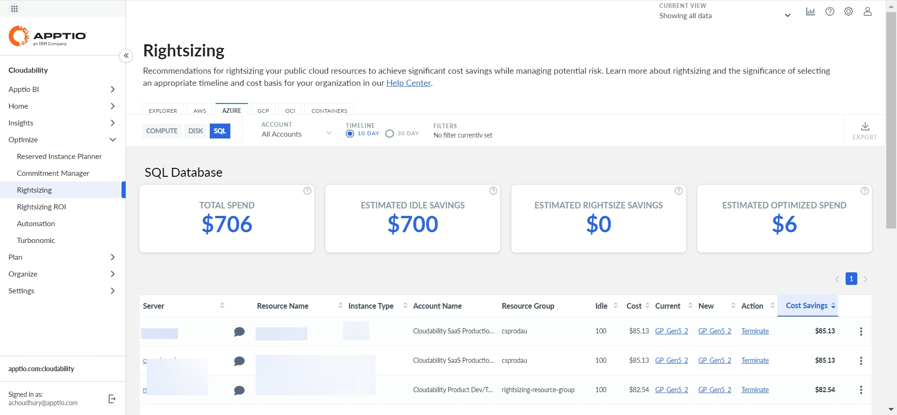
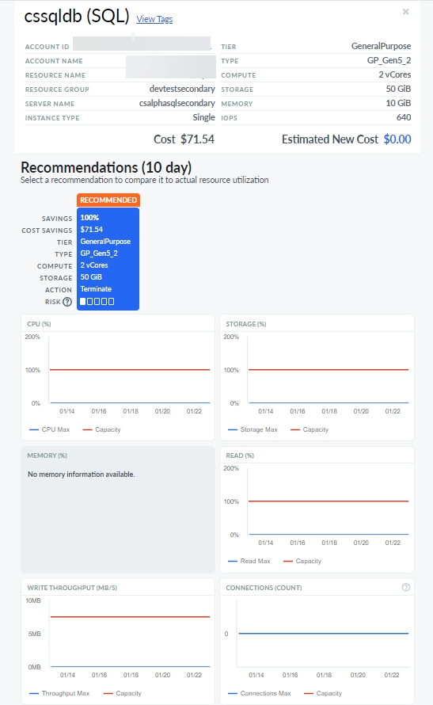

# Azure SQL

Puede utilizar el Rightsizing dashboard para ver las recomendaciones de optimización de recursos para Azure SQL. El cuadro de mandos muestra tanto las recomendaciones de ampliación como las de inactividad (finalización). Puede ver las recomendaciones en varias cuentas desde un único panel de control.

[Redimensionamiento en Cloudability](get-recommendations-for-scaling-your-cloud-resources-with-rightsizing.html)

Antes de empezar

Para ver el panel SQL de Azure, asegúrese de que ha conectado Cloudability a las cuentas Azure correctas.

[Conectar Microsoft Azure](../admin/azure-cm-setup.html)

Acceda al cuadro de mandos de Azure SQL

Para acceder al panel de control de Azure SQL, abra la página de inicio de Cloudability y, en el menú de navegación de la izquierda, seleccione Optimizar > Redimensionamiento. En la página Redimensionamiento, seleccione la pestaña Azure y, a continuación, seleccione la subpestaña SQL.

Personalizar el salpicadero

Puedes configurar las siguientes opciones para personalizar tu panel de control.

Seleccionar cuenta

Por defecto, el panel muestra recomendaciones para todas las cuentas. Para ver las recomendaciones de una cuenta concreta, seleccione el nombre de la cuenta en el desplegable Cuenta.

Especifique el plazo

Puede elegir entre revisar los gastos de los últimos 10 días o de los últimos 30 días. Por defecto, la opción Plazo está fijada en 10 días. Para la mayoría de los usuarios, 10 días es el periodo de tiempo recomendado porque captura las tendencias de rendimiento más recientes y es más predictivo del uso futuro de los recursos.

Aplicar filtros

Puede añadir filtros para incluir o excluir datos en función de una o varias condiciones.

Añadir un filtro

Para añadir un filtro:

1. Seleccione Añadir filtro en la barra de herramientas.
2. En el menú Añadir filtro, elija una dimensión.
3. Seleccione un Operador para proporcionar una condición lógica.
4. Elija un valor para afinar el filtro.
5. Seleccione Añadir filtro para aplicar el nuevo filtro a la página.

Aplicar filtros con enlaces

También puede añadir filtros seleccionando los valores hipervinculados en azul en la tabla principal. La regla de filtrado se aplica automáticamente al campo Filtros. Sólo puede seleccionar un valor o parámetro de cada columna a la vez.

Eliminar un filtro

Para quitar un filtro:

1. Seleccione el icono de filtro .
2. Seleccione X junto al filtro que desea eliminar.

Indicadores clave de rendimiento

Puede ver los siguientes Indicadores Clave de Rendimiento (KPI) en su panel de Rightsizing :

- Total de gastos : Muestra el total de gastos asignados actuales.
- Ahorro estimado por inactividad : Muestra el ahorro total estimado para todas las recomendaciones de Terminar.
- Ahorro estimado de Rightsize : Muestra el ahorro potencial total estimado que se puede conseguir con todas las recomendaciones de Rightsize.
- Gastos optimizados estim ados: Muestra el gasto total estimado después de aplicar las recomendaciones.

Tabla de recomendaciones de redimensionamiento

El cuadro de mandos contiene una tabla de recomendaciones de dimensionamiento, que ofrece una visión general de los recursos SQL para los que se han identificado recomendaciones. La tabla incluye las siguientes columnas:

Nota:

Por defecto, los datos se ordenan por la columna Ahorro de costes. Para cambiar el orden de clasificación, sólo tiene que seleccionar el nombre de la columna.

- Servidor : El nombre del servidor.
- Nombre del recurso : El nombre del recurso SQL.
- Tipo de instancia : El tipo de solución SQL.
- Nombre de cuenta : El nombre de la cuenta Azure.
- Grupo de recursos : El grupo al que pertenece el recurso SQL.
- Idle : Basado en el número de conexiones/sesiones de base de datos activas en un momento dado.
- Coste : El coste total de la solución SQL para el plazo seleccionado.
- Actual : El tipo de recurso actual.
- Nuevo : El tipo de recurso más recomendado
- Acción : Recomendación para el recurso. La recomendación puede ser una de las siguientes

  | Recomendación | Descripción |
  | --- | --- |
  | Redimensionar | Cambia el tamaño al tipo de recurso especificado en la columna Nuevo. |
  | Terminar | Dar de baja su recurso porque está predominantemente ocioso. |
  | Ninguna acción | Por defecto no se recomienda ninguna acción, pero en el panel de detalles puede haber recomendaciones adicionales con niveles de riesgo más altos. |
- Ahorro de costes : La cantidad estimada de ahorro de costes a 10 o 30 días.

Exportar recomendaciones a un archivo Excel

Para exportar las recomendaciones a un archivo Excel, seleccione Exportar. Tenga en cuenta que el archivo Excel incluirá varias columnas adicionales, como región, sistema operativo, precio unitario y otros.

Detalles de la recomendación

Para ver los detalles de la recomendación de un recurso concreto, seleccione Ver detalles en el menú Más opciones (3 puntos).

La siguiente figura muestra un panel de detalles de la recomendación.

Para ver descripciones de las dimensiones y métricas de costos, consulte [Glosario de dimensiones y métricas de costos](glossary-of-cost-dimensions-and-metrics.html).

Para ver detalles de la dimensión y las métricas de utilización, consulte [Glosario de dimensiones y métricas de utilización](glossary-of-utilization-dimensions-and-metrics.html).

**Tema principal:** [Redimensionamiento](../product/get-recommendations-for-scaling-your-cloud-resources-with-rightsizing.html)
