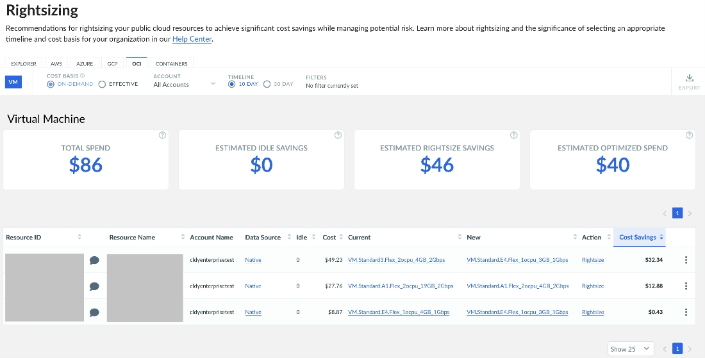

# Máquinas virtuales OCI (VM)

Puedes utilizar el panel de control de Rightsizing para consultar las recomendaciones de optimización de recursos para los recursos de máquinas virtuales de Oracle Cloud Infrastructure (OCI) ( VM ). El cuadro de mandos muestra tanto las recomendaciones de ampliación como las de inactividad (finalización).

[Redimensionamiento en Cloudability](get-recommendations-for-scaling-your-cloud-resources-with-rightsizing.html)

Antes de empezar

Para ver el panel de control de OCI « VM », asegúrate de haber conectado Cloudability a las instancias de OCI correctas. Es necesario validar las credenciales tanto para las tenencias padre como para las tenencias hijo.

[Conectar Oracle Cloud](../admin/connect-oracle-cloud.html)

Accede al panel de control de OCI « VM »

Para acceder al panel de control de la máquina virtual OCI, abra la página de inicio Cloudability y, en el menú de navegación de la izquierda, seleccione Optimize > Rightsizing. En la página «Rightsizing», selecciona la pestaña «OCI » y, a continuación, selecciona la subpestaña « VM ».

Personalizar el salpicadero

Puedes configurar las siguientes opciones para personalizar tu panel de control.

Actualmente, todos los costes de las máquinas virtuales sólo se muestran utilizando la base de costes bajo demanda.

Seleccionar cuenta

Por defecto, el panel muestra recomendaciones para todas las cuentas/arrendamientos. Para ver las recomendaciones de una cuenta concreta, seleccione el nombre de la cuenta en el desplegable Cuenta.

Especifique el plazo

Puede elegir entre revisar los gastos de los últimos 10 días o de los últimos 30 días. Por defecto, la opción Plazo está fijada en 10 días. Para la mayoría de los usuarios, 10 días es el periodo de tiempo recomendado porque captura las tendencias de rendimiento más recientes y es más predictivo del uso futuro de los recursos.

Aplicar filtros

Puede añadir filtros para incluir o excluir datos en función de una o varias condiciones.

Añadir un filtro

Para añadir un filtro:

1. Seleccione Añadir filtro en la barra de herramientas.
2. En el menú Añadir filtro, elija una dimensión.
3. Seleccione un Operador para proporcionar una condición lógica.
4. Elija un valor para afinar el filtro.
5. Seleccione Añadir filtro para aplicar el nuevo filtro a la página.

Aplicar filtros con enlaces

También puede añadir filtros seleccionando los valores hipervinculados en azul en la tabla principal. La regla de filtrado se aplica automáticamente al campo Filtros. Sólo puede seleccionar un valor o parámetro de cada columna a la vez.

Eliminar un filtro

Para quitar un filtro:

1. Seleccione el icono de filtro .
2. Seleccione X junto al filtro que desea eliminar.

Aplicar opciones

También puede establecer opciones a nivel de página para incluir o excluir determinadas recomendaciones.

Indicadores clave de rendimiento

Puede ver los siguientes Indicadores Clave de Rendimiento (KPI) en su panel de Rightsizing:

- Total de gastos : Muestra el total de gastos asignados actuales.
- Ahorro estimado por inactividad : Muestra el ahorro total estimado para todas las recomendaciones de Terminar.
- Ahorro estimado de Rightsize : Muestra el ahorro potencial total estimado que se puede conseguir con todas las recomendaciones de Rightsize.
- Gastos optimizados estim ados: Muestra el gasto total estimado después de aplicar las recomendaciones.

Tabla de recomendaciones de redimensionamiento

El panel de control incluye una tabla de recomendaciones de ajuste de recursos, que ofrece una visión general de tus recursos de VM. La tabla incluye las siguientes columnas:

Nota:

Por defecto, los datos se ordenan por la columna Ahorro de costes. Para cambiar el orden de clasificación, sólo tiene que seleccionar el nombre de la columna.

- ID del recurso : El ID del recurso « VM ».
- Nombre del recurso : El nombre del recurso « VM ».
- Nombre de la cuenta : El nombre de la cuenta de VM.
- Fuente de datos : La base de datos « VM »
- Idle : El tiempo que pasa por debajo del 2% de CPU en una escala de 1-100.
- Coste : El coste total del recurso « VM » para el periodo seleccionado.
- Actual : El tipo de recurso actual VM.
- Novedad : El recurso más recomendado sobre « VM »
- Acción : Recomendación para el recurso. La recomendación puede ser una de las siguientes

  | Recomendación | Descripción |
  | --- | --- |
  | Redimensionar | Cambia el tamaño al tipo de recurso especificado en la columna Nuevo. |
  | Terminar | Dar de baja su recurso porque está predominantemente ocioso. |
  | Ninguna acción | Por defecto no se recomienda ninguna acción, pero en el panel de detalles puede haber recomendaciones adicionales con niveles de riesgo más altos. |
- Ahorro de costes : La cantidad estimada de ahorro de costes a 10 o 30 días.

Exportar recomendaciones a un archivo Excel

Para exportar las recomendaciones a un archivo Excel, seleccione Exportar. Tenga en cuenta que el archivo Excel incluirá varias columnas y datos adicionales.

Detalles de la recomendación

Para ver los detalles de la recomendación de un recurso concreto, seleccione Ver detalles en el menú Más opciones (3 puntos).

Para ver descripciones de las dimensiones y métricas de costos, consulte [Glosario de dimensiones y métricas de costos](glossary-of-cost-dimensions-and-metrics.html).

Para ver los detalles de la dimensión y las métricas de utilización, consulte [el Glosario de dimensiones y métricas de utilización](glossary-of-utilization-dimensions-and-metrics.html).

**Tema principal:** [Redimensionamiento](../product/get-recommendations-for-scaling-your-cloud-resources-with-rightsizing.html)
