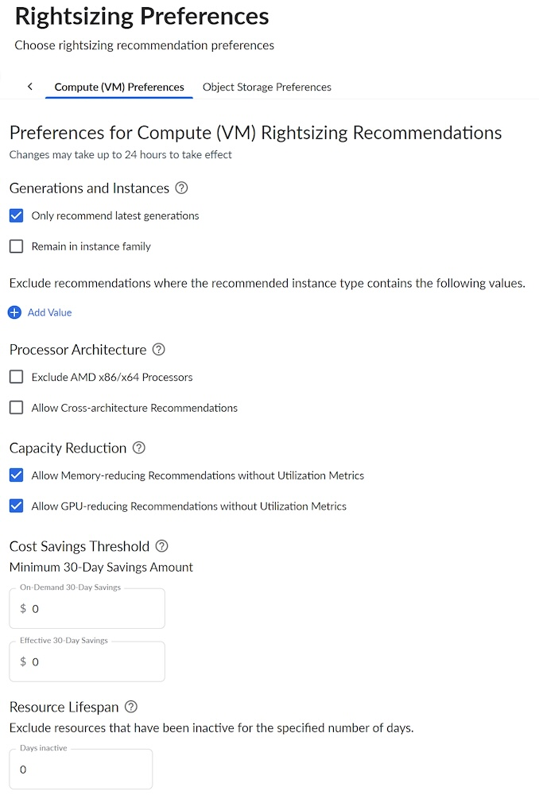
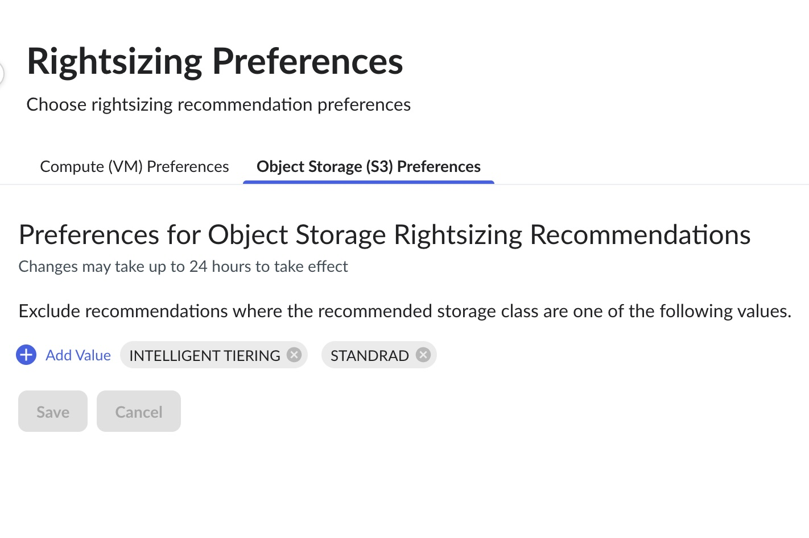

# Preferencias de dimensionamiento correcto

Vaya a Configuración > Preferencias de tamaño.

Preferencias de «Compute» ( VM )

Esta pestaña de preferencias le permite establecer preferencias globales para las recomendaciones de redimensionamiento.

| Nombre de campo | Descripción |
| --- | --- |
| Generaciones e instancias | Opciones para excluir tipos de instancia no actuales o para recomendar sólo dentro de la familia de instancia existente (por ejemplo, para garantizar la cobertura continua con compromisos / reservas existentes) al generar recomendaciones de dimensionamiento. |
| Arquitectura del procesador | Seleccione si desea excluir determinados tipos de procesadores de las recomendaciones de dimensionamiento y permitir recomendaciones para distintas arquitecturas. Asegúrese de la compatibilidad con la carga de trabajo antes de cambiar el tipo de procesador. |
| Reducción de la capacidad | Opciones para incluir recomendaciones que darían lugar a una reducción de la capacidad de los recursos (por ejemplo, reducir la memoria total disponible) si no se proporcionan métricas de utilización para la dimensión. |
| Umbral de ahorro | Ajuste opcional para determinar el ahorro mínimo que deben prever alcanzar las recomendaciones para ser incluidas en las que se muestran.  Importe mínimo de ahorro a 30 días - Un valor de cero indica que se ignorará el ajuste. |
| Vida útil de los recursos | Configuración opcional para eliminar las recomendaciones para los recursos que han estado inactivos durante un periodo de tiempo especificado. Un valor de cero indica que el ajuste se ignorará. |

Introduzca los datos en los campos correspondientes y seleccione el botón Guardar. Aparece el mensaje *Preferencias guardadas correctamente*.

Múltiples formas de filtrar las recomendaciones de dimensionamiento

En Cloudability, hay muchas formas de filtrar las recomendaciones de redimensionamiento. En primer lugar, puede filtrar las recomendaciones utilizando las preferencias globales disponibles en la página Configuración > Preferencias de redimensionamiento. Otra forma de filtrar es utilizar las opciones disponibles en las propias páginas de redimensionamiento en Optimizar > Redimensionamiento. Existen opciones de filtrado adicionales en el panel de "detalles" para las propias recomendaciones.

Object Storage ( S3 ) Preferencias

Esta pestaña de preferencias le permite excluir clases específicas para Object Storage para Recomendaciones de Redimensionamiento.

Para excluir una clase de almacenamiento:

1. seleccione el botón "Añadir valor".
2. Añadir un valor (clase de almacenamiento) al campo de entrada
3. Continúe añadiendo tantos valores para excluir como sea necesario

S3 clases de almacenamiento:

- Standard
- Clasificación inteligente por niveles
- Estándar Acceso poco frecuente
- Una vez Zona Acceso poco frecuente
- Glaciar Recuperación Instantánea
- Recuperación flexible de glaciares
- Archivo Glacier Deep

**Tema principal:** [Redimensionamiento](../product/get-recommendations-for-scaling-your-cloud-resources-with-rightsizing.html)
